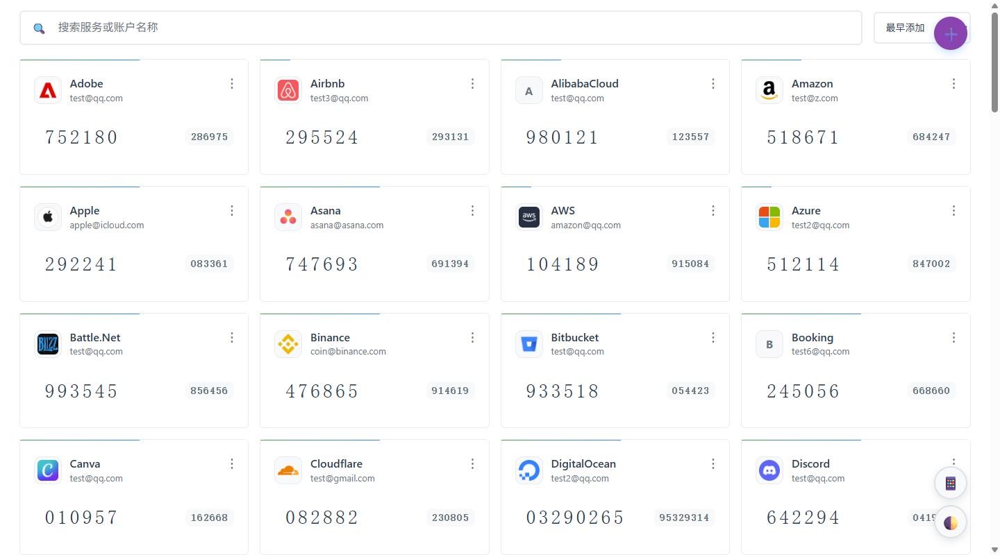
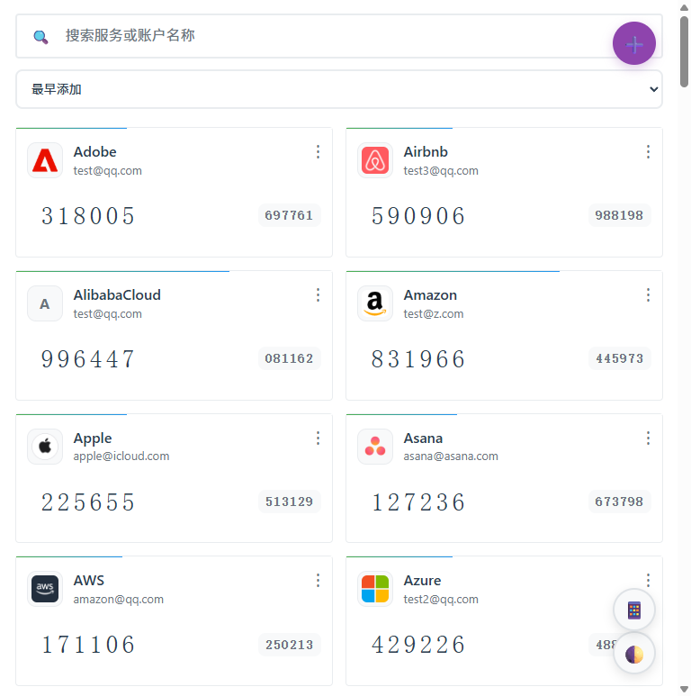
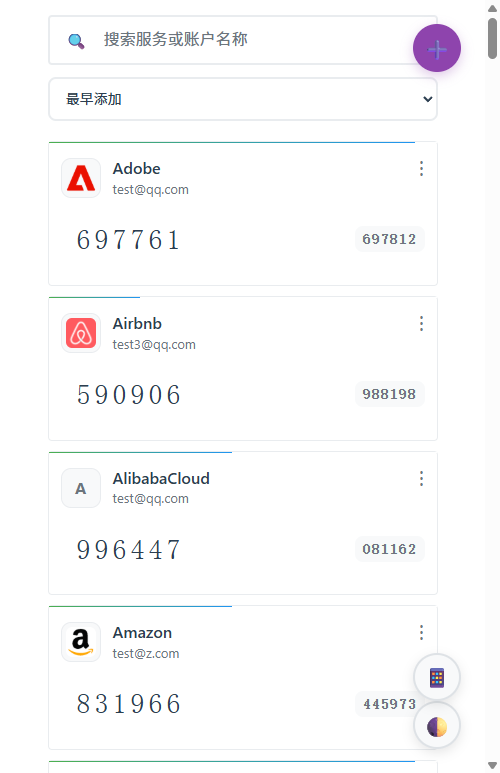

# 🔐 2FA

基于 Cloudflare Workers 的两步验证密钥管理系统。免费部署、全球加速、支持 PWA 离线使用。


**主要特性：** TOTP/HOTP 验证码自动生成 · 二维码扫描/图片识别添加密钥 · AES-GCM 256 位加密存储 · 从 Google Authenticator、Aegis、2FAS、Bitwarden 等应用批量导入 · 多格式导出（TXT/JSON/CSV/HTML/Google 迁移二维码） · 自动备份与还原 · 深色/浅色主题 · 响应式设计适配手机/平板/桌面

## 📸 截图预览

|                    桌面端                     |                    平板端                    |                    手机端                    |
| :-------------------------------------------: | :------------------------------------------: | :------------------------------------------: |
|  |  |  |

## 🚀 快速部署

### 在线体验

访问演示站点（密码 `2fa-Demo.`）：**[https://2fa-dev.wzf.workers.dev](https://2fa-dev.wzf.workers.dev)**

### 一键部署（推荐）

[](https://deploy.workers.cloudflare.com/?url=https://github.com/wuzf/2fa)

1. 点击上方按钮，使用 GitHub 登录并授权
2. 登录 Cloudflare 账户，点击 **Deploy** 等待部署完成（KV 存储自动创建）
3. 打开 Cloudflare 给你的 Workers 链接，**设置管理密码**即可开始使用

#### 推荐：启用数据加密

部署后，在 **Cloudflare Dashboard → Worker → Settings → Variables** 中添加 Secret `ENCRYPTION_KEY`：

```bash
# 生成加密密钥（任选一种）
openssl rand -base64 32
node -e "console.log(require('crypto').randomBytes(32).toString('base64'))"
```

> 不配置也可正常使用，但建议配置以加密保护 2FA 密钥数据。

## 📖 使用指南

### 添加密钥

点击右下角 **➕** 悬浮按钮：

- **扫二维码** — 摄像头扫描 2FA 二维码，自动填入
- **选择图片** — 上传二维码截图，自动识别
- **手动添加** — 输入服务名称和 Base32 密钥（可展开高级设置调整位数/周期/算法）

### 日常使用

- **复制验证码**：直接点击验证码数字
- **管理密钥**：点击卡片右上角 **⋯** → 编辑 / 删除 / 查看二维码
- **搜索**：顶部搜索框按服务名或账户名实时搜索
- **排序**：按添加时间或名称排序
- **主题**：右下角 🌓 切换浅色/深色/跟随系统

### 批量导入

点击悬浮按钮 → **📥 批量导入**，支持文件导入或文本粘贴。

**兼容格式：**

| 来源                   | 格式                                    |
| ---------------------- | --------------------------------------- |
| 通用                   | `otpauth://` URI 文本（TXT）、CSV、HTML |
| Google Authenticator   | 迁移二维码（`otpauth-migration://`）    |
| Aegis                  | JSON 导出文件                           |
| 2FAS                   | `.2fas` 导出文件                        |
| Bitwarden              | JSON 导出文件                           |
| LastPass Authenticator | JSON 导出文件                           |
| andOTP                 | JSON 导出文件                           |
| Ente Auth              | 导出文件                                |

### 批量导出

点击悬浮按钮 → **📤 批量导出**，支持 TXT、JSON、CSV、HTML 格式，以及生成 **Google Authenticator 迁移二维码**（可直接扫码导入）。

### 备份与还原

系统自动备份（数据变化后自动触发 + 每天定时检查），保留最近 100 个备份。

点击悬浮按钮 → **🔄 还原配置** 查看备份列表、预览内容、还原或导出。

### 安装为手机应用（PWA）

- **iOS**：Safari 打开 → 分享按钮 → 添加到主屏幕
- **Android**：Chrome 打开 → 菜单（⋮）→ 添加到主屏幕

安装后可像原生应用一样全屏使用，支持离线访问。

## 🔒 安全

- **密码**：PBKDF2-SHA256（100,000 次迭代）加盐哈希，JWT 存储在 HttpOnly + Secure + SameSite=Strict Cookie 中
- **数据加密**：配置 `ENCRYPTION_KEY` 后所有密钥和备份使用 AES-GCM 256 位加密
- **传输**：全程 HTTPS，TLS 1.2+
- **隐私**：OTP 在客户端生成，不收集使用数据，完全开源
- **登录有效期**：30 天，活跃使用自动续期（剩余 < 7 天时自动延长 30 天）

## 🔗 公开 OTP API

无需登录，通过 URL 直接生成验证码：

```
https://your-worker.workers.dev/otp/YOUR_SECRET_KEY
https://your-worker.workers.dev/otp/YOUR_SECRET_KEY?digits=8&period=60
https://your-worker.workers.dev/otp/YOUR_SECRET_KEY?type=hotp&counter=5
```

参数：`type`（totp/hotp）、`digits`（6/8）、`period`（30/60/120）、`algorithm`（sha1/sha256/sha512）、`counter`（HOTP 用）

## 📚 更多文档

| 文档                              | 说明                            |
| --------------------------------- | ------------------------------- |
| [部署指南](docs/DEPLOYMENT.md)    | 手动部署、KV 配置、Secrets 管理 |
| [API 参考](docs/API_REFERENCE.md) | 完整 API 端点文档               |
| [架构设计](docs/ARCHITECTURE.md)  | 系统架构与技术实现              |
| [开发指南](docs/DEVELOPMENT.md)   | 本地开发、测试、代码规范        |
| [PWA 指南](docs/PWA_GUIDE.md)     | PWA 安装与离线功能              |

## 🤝 参与贡献

欢迎提交 [Issue](https://github.com/wuzf/2fa/issues) 和 [Pull Request](https://github.com/wuzf/2fa/pulls)。开发相关请参考 [开发指南](docs/DEVELOPMENT.md)。

## 📄 许可证

[MIT License](LICENSE)

## 🌟 Star History

[](https://www.star-history.com/#wuzf/2fa&type=date&legend=top-left)

---

<div align="center">

**如果这个项目对您有帮助，请给一个 ⭐**

Made with ❤️ by [wuzf](https://github.com/wuzf)

</div>
