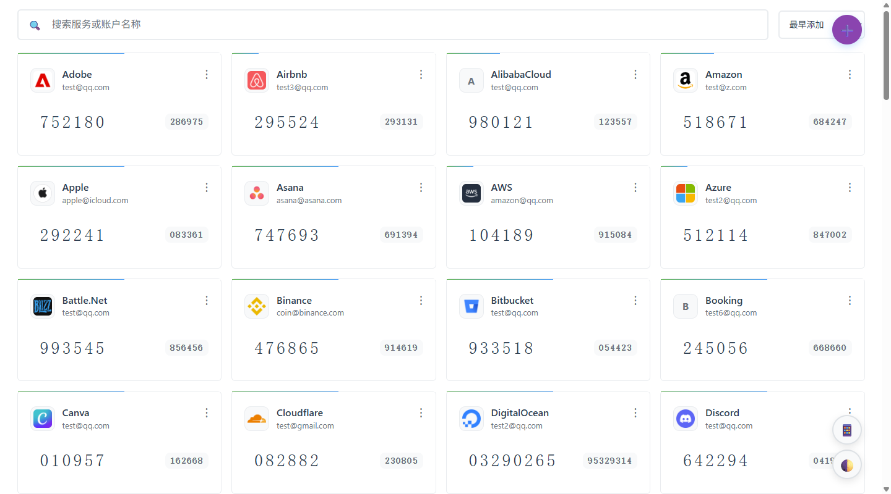
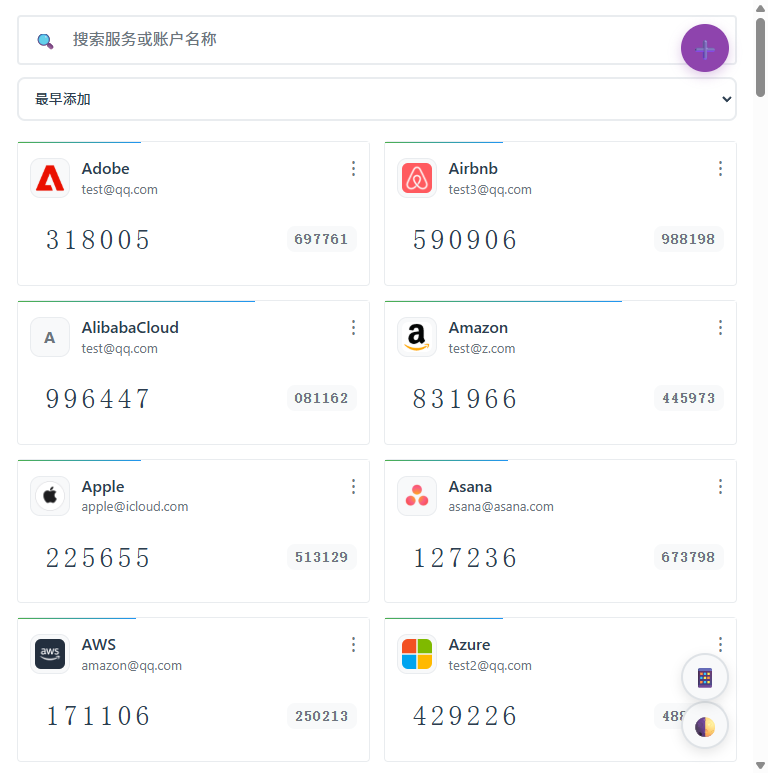
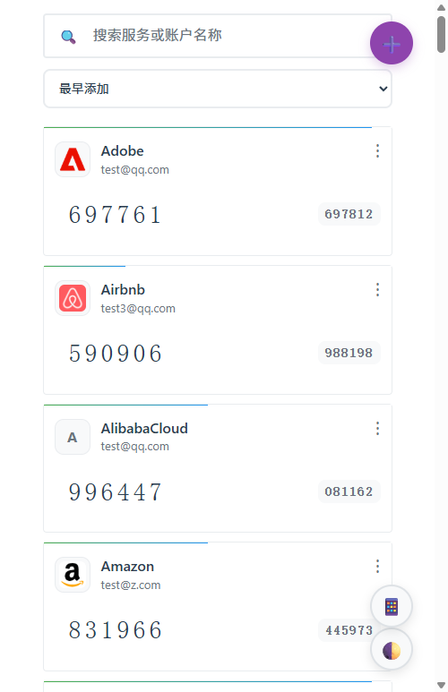

# 🔐 2FA

基于 Cloudflare Workers 的两步验证密钥管理系统。免费部署、全球加速、支持 PWA 离线使用。


**主要特性：** TOTP/HOTP 验证码自动生成 · 二维码扫描/图片识别/粘贴截图/拖拽图片添加密钥 · AES-GCM 256 位加密存储 · 从 Google Authenticator、Aegis、2FAS、Bitwarden 等应用批量导入 · 多格式导出（TXT/JSON/CSV/HTML/Google 迁移二维码） · 自动备份与还原 · WebDAV/S3 远程备份同步 · 设置面板（密码修改/备份配置） · 深色/浅色主题 · 响应式设计适配手机/平板/桌面

## 📸 截图预览

|                    桌面端                     |                    平板端                    |                    手机端                    |
| :-------------------------------------------: | :------------------------------------------: | :------------------------------------------: |
|  |  |  |

## 🚀 快速部署

### 在线体验

访问演示站点（密码 `2fa-Demo.`）：**[https://2fa-dev.wzf.workers.dev](https://2fa-dev.wzf.workers.dev)**

### 一键部署（推荐）

[](https://deploy.workers.cloudflare.com/?url=https://github.com/wuzf/2fa)

> 推荐一键部署；所有用户统一通过 **Sync Upstream** 原地升级，禁止通过删除 Worker、删除仓库或重装方式升级。

1. 点击上方按钮，使用 GitHub 登录并授权
2. 登录 Cloudflare 账户，点击 **Deploy** 等待部署完成（KV 存储自动创建）
3. 打开 Cloudflare 给你的 Workers 链接，**设置管理密码**即可开始使用

> Git 自动构建会直接使用仓库中的 `wrangler.toml` 部署；当前配置已显式声明 `SECRETS_KV`，Wrangler 会在首次部署时自动创建所需 KV，并在后续部署中继续复用当前 Worker 已绑定的资源。
> 如果你在 Cloudflare Dashboard 中手动配置 Git 构建命令，**部署命令请使用 `npm run deploy`，不要直接写 `npx wrangler deploy`**，这样会保留项目里的版本注入流程，并和仓库默认部署入口保持一致。

#### 推荐：启用数据加密

部署后，在 **Cloudflare Dashboard → Worker → Settings → Variables** 中添加 Secret `ENCRYPTION_KEY`：

```bash
# 生成加密密钥（任选一种）
openssl rand -base64 32
node -e "console.log(require('crypto').randomBytes(32).toString('base64'))"
```

> `ENCRYPTION_KEY` 是解密现有数据的主密钥。**推荐设置**，前提是你会把原始值立即保存到密码管理器、离线备份或其他安全位置。
>
> 如果你无法确保保存原值，**宁可暂时不设置，也不要设置后丢失**：
>
> - 设置后：密钥列表、自动备份、WebDAV/S3 凭据都会加密存储
> - 丢失后：Cloudflare 不会再次显示原值，已有加密数据和加密备份将无法读取或恢复
> - 当前程序行为：检测到已有加密数据但缺少 `ENCRYPTION_KEY` 时，会直接锁定读取和修改，避免误覆盖旧数据

#### 版本更新

一键部署生成的是独立仓库（非 Fork），升级统一使用 **Sync Upstream** 工作流原地完成。

> ⚠️ **升级前务必先备份数据**：在执行版本更新前，请先通过 **批量导出** 或 **还原配置 → 导出备份** 将当前数据导出到本地，以防操作失败导致数据丢失。

> ⚠️**首次升级前需要添加工作流文件**：一键部署创建的仓库如果不包含 `.github/workflows/` 目录。请先在自己的仓库中新增文件 `.github/workflows/sync-upstream.yml`，内容复制自上游仓库文件：<https://github.com/wuzf/2fa/blob/main/.github/workflows/sync-upstream.yml>，并提交一次。之后就都按下面步骤原地升级。

1. 打开一键部署时在你 GitHub 上生成的 2fa 仓库
2. 进入 **Actions** → **Sync Upstream**
3. 点击 **Run workflow**
4. 等待工作流把上游最新代码同步到当前仓库
5. 工作流会自动以最新上游配置为基础，合并你当前仓库里的 Worker 名称、KV 绑定和常见部署配置
6. Cloudflare 会基于当前仓库重新部署**同一个 Worker**

这种方式不会动现有 Worker、KV 绑定或 Secrets。**如果你已经设置了 `ENCRYPTION_KEY`，升级时无需重新填写；如果你没设置，也照样用这套流程升级。**

> ⚠️ `ENCRYPTION_KEY` 是解密现有数据的主密钥，请务必在首次创建时保存到密码管理器。Cloudflare Secret 保存后不会再次显示原值；正常升级不需要重新填写，但如果你把它删了又没保存原值，已有加密数据将无法恢复。

#### 如果你想检查合并结果

`Sync Upstream` 的设计目标是始终在**同一仓库、同一 Worker**上完成升级。现在工作流会自动合并 `wrangler.toml`，并在摘要中展示与上游的差异，便于你确认哪些值来自本地部署配置：

1. 在 GitHub Actions 的运行摘要里查看 `wrangler.toml` diff
2. 打开当前仓库里的 `wrangler.toml`
3. 确认 Worker 名称、KV 绑定、路由和现有部署设置仍然正确
4. 如果你自己维护了非常特殊的 `wrangler.toml` 配置，再按需要补充提交

> 如果 Cloudflare 没有自动开始重新部署，也是在 **Deployments** 页面重新部署当前仓库的最新提交，而不是删除后重装。

## 📖 使用指南

### 添加密钥

点击右下角 **➕** 悬浮按钮：

- **扫二维码** — 摄像头扫描 2FA 二维码，自动填入
- **选择图片** — 上传二维码截图，自动识别
- **粘贴截图** — Ctrl+V 粘贴剪贴板中的二维码截图（适合无摄像头的 PC 用户）
- **拖拽图片** — 直接将二维码图片拖入弹窗，自动识别
- **手动添加** — 输入服务名称和 Base32 密钥（可展开高级设置调整位数/周期/算法）

### 日常使用

- **复制验证码**：直接点击验证码数字
- **管理密钥**：点击卡片右上角 **⋯** → 编辑 / 删除 / 查看二维码
- **搜索**：顶部搜索框按服务名或账户名实时搜索
- **排序**：按添加时间或名称排序
- **主题**：右下角 🌓 切换浅色/深色/跟随系统

### 批量导入

点击悬浮按钮 → **📥 批量导入**，支持文件导入或文本粘贴。

**兼容格式：**

| 来源                   | 格式                                    |
| ---------------------- | --------------------------------------- |
| 通用                   | `otpauth://` URI 文本（TXT）、CSV、HTML |
| Google Authenticator   | 迁移二维码（`otpauth-migration://`）    |
| Aegis                  | JSON 导出文件                           |
| 2FAS                   | `.2fas` 导出文件                        |
| Bitwarden              | JSON 导出文件                           |
| LastPass Authenticator | JSON 导出文件                           |
| andOTP                 | JSON 导出文件                           |
| Ente Auth              | 导出文件                                |

### 批量导出

点击悬浮按钮 → **📤 批量导出**，支持 TXT、JSON、CSV、HTML 格式，以及生成 **Google Authenticator 迁移二维码**（可直接扫码导入）。

### 备份与还原

系统自动备份（数据变化后自动触发 + 每天定时检查），保留最近 100 个备份（可在设置中调整）。

点击悬浮按钮 → **🔄 还原配置** 查看备份列表、预览内容、还原或导出。

#### 远程备份

支持将备份同步到远程存储，数据变更时自动推送，可配置多个备份目标：

- **WebDAV** — 支持标准 WebDAV 协议的网盘或自建服务（⚠️ 不支持经 Cloudflare 代理的服务如坚果云，会触发 520 回环错误）
- **S3 兼容存储** — 支持 AWS S3、Cloudflare R2、MinIO、阿里云 OSS 等 S3 兼容服务

在 **设置 → 备份配置** 中添加和管理远程备份目标。

### 设置

点击悬浮按钮 → **⚙️ 设置**：

- **修改密码** — 更改管理密码
- **登录有效期** — 自定义 JWT 过期时间
- **备份保留数量** — 调整自动备份保留份数
- **远程备份** — 配置 WebDAV/S3 备份目标

### 安装为手机应用（PWA）

- **iOS**：Safari 打开 → 分享按钮 → 添加到主屏幕
- **Android**：Chrome 打开 → 菜单（⋮）→ 添加到主屏幕

安装后可像原生应用一样全屏使用，支持离线访问。

## 🔒 安全

- **密码**：PBKDF2-SHA256（100,000 次迭代）加盐哈希，JWT 存储在 HttpOnly + Secure + SameSite=Strict Cookie 中
- **数据加密**：配置 `ENCRYPTION_KEY` 后所有密钥、备份以及 WebDAV/S3 凭据使用 AES-GCM 256 位加密；请务必保存原始密钥，丢失后无法解密已有数据
- **传输**：全程 HTTPS，TLS 1.2+
- **隐私**：OTP 在客户端生成，不收集使用数据，完全开源
- **登录有效期**：默认 30 天，可在设置中自定义，活跃使用自动续期（剩余 < 7 天时自动延长）

## 🔗 公开 OTP API

无需登录，通过 URL 直接生成验证码：

```
https://your-worker.workers.dev/otp/YOUR_SECRET_KEY
https://your-worker.workers.dev/otp/YOUR_SECRET_KEY?digits=8&period=60
https://your-worker.workers.dev/otp/YOUR_SECRET_KEY?type=hotp&counter=5
```

参数：`type`（totp/hotp）、`digits`（6/8）、`period`（30/60/120）、`algorithm`（sha1/sha256/sha512）、`counter`（HOTP 用）

## 📚 更多文档

| 文档                              | 说明                            |
| --------------------------------- | ------------------------------- |
| [部署指南](docs/DEPLOYMENT.md)    | 手动部署、KV 配置、Secrets 管理 |
| [API 参考](docs/API_REFERENCE.md) | 完整 API 端点文档               |
| [架构设计](docs/ARCHITECTURE.md)  | 系统架构与技术实现              |
| [开发指南](docs/DEVELOPMENT.md)   | 本地开发、测试、代码规范        |
| [PWA 指南](docs/PWA_GUIDE.md)     | PWA 安装与离线功能              |

## 🤝 参与贡献

欢迎提交 [Issue](https://github.com/wuzf/2fa/issues) 和 [Pull Request](https://github.com/wuzf/2fa/pulls)。开发相关请参考 [开发指南](docs/DEVELOPMENT.md)。

## 📄 许可证

[MIT License](LICENSE)

## 🌟 Star History

[](https://www.star-history.com/#wuzf/2fa&type=date&legend=top-left)

---

<div align="center">

**如果这个项目对您有帮助，请给一个 ⭐**

Made with ❤️ by [wuzf](https://github.com/wuzf)

</div>
