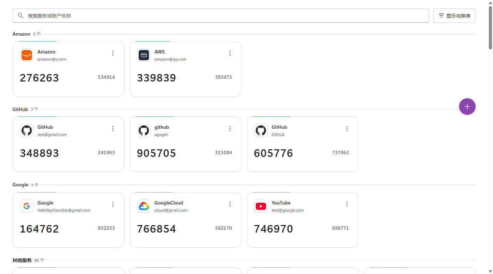
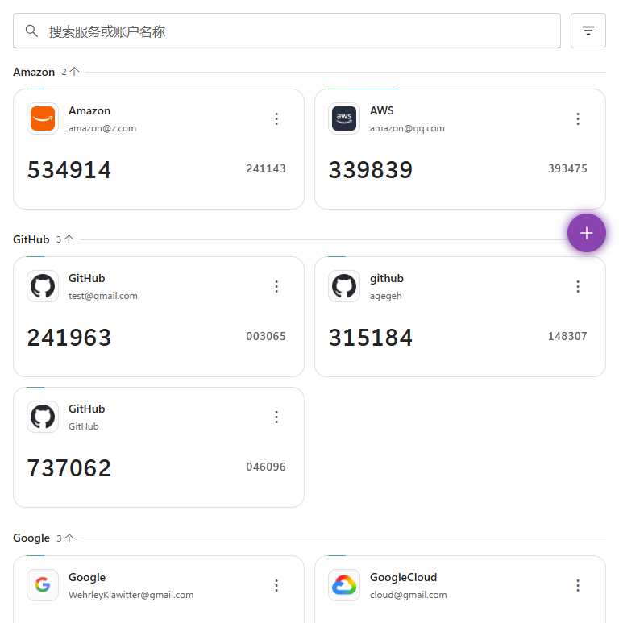
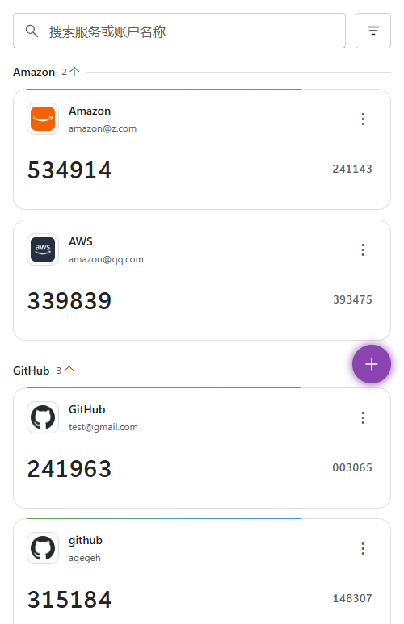

# 🔐 2FA

Cloudflare Workers 기반의 2단계 인증 키 관리 시스템입니다. 무료로 배포할 수 있으며, 전 세계에서 빠르게 접속하고 PWA로 오프라인에서도 사용할 수 있습니다.


<!-- README_LANGUAGE_NAV_START -->

[简体中文](README.md) · [繁體中文](README_TC.md) · [English](README_EN.md) · [日本語](README_JA.md) · **[한국어](README_KO.md)** ·
[Deutsch](README_DE.md) · [Français](README_FR.md) · [Español](README_ES.md) · [Português (Brasil)](README_PT_BR.md) · [Italiano](README_IT.md) ·
[Русский](README_RU.md) · [Türkçe](README_TR.md) · [Bahasa Indonesia](README_ID.md) · [Tiếng Việt](README_VI.md) · [ไทย](README_TH.md)

<!-- README_LANGUAGE_NAV_END -->

**주요 기능:** TOTP/HOTP 코드 자동 생성 · QR 코드 스캔/이미지 인식/스크린샷 붙여넣기/이미지 끌어놓기로 키 추가 · AES-GCM 256비트 암호화 저장 · Google Authenticator, Aegis, 2FAS, Bitwarden 등에서 일괄 가져오기 · 다양한 형식으로 내보내기(TXT/JSON/CSV/HTML/Google 이전용 QR 코드) · 자동 백업 및 복원 · WebDAV/S3/OneDrive/Google Drive 원격 백업 동기화 · 보안/동기화/환경 설정 · 프로젝트 전반에 걸친 15개 언어 지원(자동 감지/직접 선택) · 밝게/어둡게/시스템 설정에 따르는 테마 · Fluent 2에서 영감을 받은 반응형 UI

웹 앱, 브라우저 확장 프로그램, 초기 설정, 공개 OTP 페이지, API 메시지, 백업 문서는 중국어 간체, 중국어 번체, 영어, 일본어, 한국어, 독일어, 프랑스어, 스페인어, 포르투갈어(브라질), 이탈리아어, 러시아어, 튀르키예어, 인도네시아어, 베트남어, 태국어를 지원합니다. 인터페이스는 브라우저 언어 또는 직접 선택한 언어를 따르며, 지원하지 않는 브라우저 언어에는 영어를 사용합니다. CSV/HTML 백업은 생성 시점과 다른 인터페이스 언어에서도 가져올 수 있습니다.

## 🧩 브라우저 확장 프로그램

2FA Verification Assistant 설치: **[Chrome Web Store](https://chromewebstore.google.com/detail/2fa-%E9%AA%8C%E8%AF%81%E5%8A%A9%E6%89%8B/lifeiloiefdlbohelpjajdbopeocalhl)** · **[Microsoft Edge Add-ons](https://microsoftedge.microsoft.com/addons/detail/kmchncmoddhdlbpfoejeahdjhieghklm)** · **[Firefox Add-ons](https://addons.mozilla.org/zh-CN/firefox/addon/2fa-%E9%AA%8C%E8%AF%81%E5%8A%A9%E6%89%8B/)**.

해당 브라우저에서 설치 링크를 여세요. 설치 후 확장 프로그램 설정에 직접 호스팅한 2FA 인스턴스 URL을 입력하고 같은 브라우저에서 해당 인스턴스에 로그인하면 TOTP 코드를 확인, 복사, 입력할 수 있습니다. 자동 입력에는 인증 페이지별로 별도의 권한이 필요합니다. 확장 프로그램을 사용하려면 이 프로젝트의 배포된 인스턴스가 있어야 하며, 인터페이스는 위의 15개 언어를 지원합니다. Firefox는 데스크톱 버전 153 이상에서 기본 컨테이너의 일반 탭을 사용해야 합니다. 컨테이너 탭, 사생활 보호 창, Android는 지원하지 않습니다.

[설치 및 사용 가이드](docs/BROWSER_EXTENSION.md) · [Chrome / Edge 개인정보 처리방침](extension/PRIVACY.md) · [Firefox 개인정보 처리방침](extension/PRIVACY_FIREFOX.md) (중국어)

## 📸 스크린샷

|                    데스크톱                     |                    태블릿                    |                    모바일                    |
| :---------------------------------------------: | :------------------------------------------: | :------------------------------------------: |
|  |  |  |

## 🚀 빠른 배포

### 라이브 데모

데모 사이트 방문(비밀번호 `2fa-Demo.`): **[https://2fa-dev.wzf.workers.dev](https://2fa-dev.wzf.workers.dev)**

### 원클릭 배포(권장)

[](https://deploy.workers.cloudflare.com/?url=https://github.com/wuzf/2fa)

> 원클릭 배포를 권장합니다. 모든 사용자는 **Sync Upstream** 워크플로로 기존 환경을 업그레이드해야 합니다. 업그레이드를 위해 Worker나 저장소를 삭제하거나 재설치하지 마세요.

1. 위 버튼을 클릭하고 GitHub로 로그인한 뒤 권한을 부여합니다
2. Cloudflare 계정에 로그인하고 **Deploy**를 클릭한 뒤 배포가 완료될 때까지 기다립니다(KV 저장소가 자동 생성됩니다)
3. Cloudflare가 제공한 Workers URL을 열고 **관리자 비밀번호를 설정**한 뒤 사용합니다

> Git 자동 빌드는 저장소의 `wrangler.toml`을 그대로 사용합니다. 현재 설정에는 `SECRETS_KV`가 명시적으로 선언되어 있으며, Wrangler는 첫 배포 때 필요한 KV를 자동 생성하고 이후 배포에서는 현재 Worker에 바인딩된 리소스를 계속 사용합니다.
> Cloudflare Dashboard에서 Git 빌드 명령을 직접 설정하는 경우, 버전 정보 주입 과정을 유지하고 저장소의 기본 배포 방식과 일치시키려면 **배포 명령으로 `npm run deploy`를 사용하고 `npx wrangler deploy`를 직접 사용하지 마세요**.

#### 권장: 데이터 암호화 활성화

배포 후 **Cloudflare Dashboard → Worker → Settings → Variables**에서 Secret `ENCRYPTION_KEY`를 추가하세요.

```bash
# Generate encryption key (choose one)
openssl rand -base64 32
node -e "console.log(require('crypto').randomBytes(32).toString('base64'))"
```

> `ENCRYPTION_KEY`는 기존 데이터를 복호화하는 마스터 키입니다. **설정을 권장하지만**, 설정 즉시 원래 값을 비밀번호 관리자, 오프라인 백업 등 안전한 곳에 보관해야 합니다.
>
> 원래 값을 확실히 보관할 수 없다면, **설정한 뒤 잃어버리는 것보다 처음부터 설정하지 않는 편이 낫습니다**.
>
> - 설정 후: 인증 키 목록, 자동 백업, WebDAV/S3/OneDrive/Google Drive 인증 정보가 모두 암호화됩니다
> - 분실 시: Cloudflare에서 원래 값을 다시 표시할 수 없으며, 기존 암호화 데이터와 암호화 백업을 읽거나 복원할 수 없습니다
> - 현재 동작: 암호화된 데이터가 있는데 `ENCRYPTION_KEY`가 없으면, 기존 데이터를 실수로 덮어쓰지 않도록 읽기와 쓰기를 잠급니다

#### 버전 업데이트

원클릭 배포는 Fork가 아닌 독립 저장소를 생성합니다. **Sync Upstream** 워크플로를 사용해 기존 환경을 유지하면서 업그레이드합니다.

> ⚠️ **업그레이드 전에 반드시 데이터를 백업하세요**: 버전을 업데이트하기 전에 **일괄 내보내기** 또는 **설정 복원 → 백업 내보내기**로 현재 데이터를 내보내 업데이트 실패 시 발생할 수 있는 데이터 손실에 대비하세요.

1. 원클릭 배포 시 본인 GitHub 계정에 생성된 2fa 저장소를 엽니다
2. **Actions** → **Sync Upstream**으로 이동합니다
3. **Run workflow**를 클릭하고 업스트림 브랜치를 기본값 `main`으로 유지한 채 새 실행을 시작합니다
4. 동기화와 Cloudflare의 자동 배포가 완료되면 앱을 새로고침합니다

워크플로는 저장소의 Worker 이름, KV 바인딩, 일반 배포 설정을 자동으로 보존하고 **동일한 Worker**에 다시 배포합니다. 저장소에 이미 있는 워크플로 파일도 보존됩니다.

> **Sync Upstream이 없는 경우**: 원클릭 배포로 생성한 저장소에는 워크플로가 없을 수 있습니다. 이 경우에만 저장소에 `.github/workflows/sync-upstream.yml`을 추가하고, <https://github.com/wuzf/2fa/blob/main/.github/workflows/sync-upstream.yml>의 내용을 복사해 한 번 커밋하세요. 그런 다음 위 업그레이드 절차를 따르세요.

> **이전 업그레이드가 `without workflows permission` 오류로 실패한 경우**: 수정 사항이 업스트림 `main`에 반영된 후에는 배포 설정 자동 병합 단계가 포함된 기존 **Sync Upstream** 워크플로로 위 절차에 따라 업그레이드할 수 있습니다. YAML을 수정하거나 PAT를 설정할 필요가 없습니다. `main`으로 새 실행을 시작하세요. 이전 릴리스 태그에는 수정 사항이 포함되어 있지 않습니다. 그 외의 경우는 [업그레이드 문제 해결](docs/DEPLOYMENT.md#升级故障排查)(중국어)을 참고하세요.

이 방식은 기존 Worker, KV 바인딩, Secrets에 영향을 주지 않습니다. **이미 `ENCRYPTION_KEY`를 설정했다면 업그레이드 중 다시 입력할 필요가 없습니다. 아직 설정하지 않았더라도 같은 방식으로 업그레이드할 수 있습니다.**

> ⚠️ `ENCRYPTION_KEY`는 기존 데이터를 복호화하는 마스터 키입니다. 처음 생성할 때 반드시 비밀번호 관리자에 보관하세요. Cloudflare Secrets는 저장 후 값을 확인할 수 없습니다. 일반적인 업그레이드에는 재입력이 필요하지 않지만, 원래 값을 보관하지 않은 채 삭제하면 기존 암호화 데이터를 복구할 수 없습니다.

> ⚠️ **1.8.0 이전 버전으로 롤백**: 1.8.0부터 HOTP 카운터 증가분은 주 데이터와 별도로 저장됩니다. 롤백하기 전에 compaction 엔드포인트를 한 번 호출해 카운터를 주 데이터에 다시 기록하세요. 그렇지 않으면 HOTP 카운터가 업그레이드 당시의 값으로 돌아갑니다. [롤백 절차](docs/DEPLOYMENT.md#回滚到-180-之前的版本)(중국어)를 참고하세요. TOTP만 사용하는 배포에는 영향이 없습니다.

#### 병합 결과 확인

`Sync Upstream` 워크플로는 항상 **같은 저장소와 같은 Worker**에서 업그레이드를 완료하도록 설계되었습니다. 현재 워크플로는 `wrangler.toml`을 자동 병합하고 실행 요약에 업스트림과의 차이를 표시하므로, 로컬 배포 설정에서 유지된 값을 확인할 수 있습니다.

1. GitHub Actions 실행 요약에서 `wrangler.toml`의 차이를 확인합니다
2. 저장소에서 `wrangler.toml`을 엽니다
3. Worker 이름, KV 바인딩, 라우트, 기존 배포 설정이 여전히 올바른지 확인합니다
4. `wrangler.toml`에 특수한 설정을 유지하고 있다면 필요에 따라 추가 커밋을 합니다

> Cloudflare가 자동으로 재배포를 시작하지 않으면 **Deployments** 페이지에서 현재 저장소의 최신 커밋을 다시 배포하세요. 삭제 후 재설치하지 마세요.

## 📖 사용 가이드

### 키 추가

오른쪽 아래의 **➕** 플로팅 버튼을 클릭하세요.

- **QR 코드 스캔** — 카메라로 2FA QR 코드를 스캔해 자동 입력합니다
- **이미지 선택** — QR 코드 스크린샷을 업로드해 자동 인식합니다
- **스크린샷 붙여넣기** — Ctrl+V로 클립보드의 QR 코드 스크린샷을 붙여넣습니다(카메라가 없는 PC에서 편리합니다)
- **이미지 끌어놓기** — QR 코드 이미지를 대화상자에 직접 끌어놓으면 자동 인식합니다
- **수동 추가** — 서비스 이름과 Base32 시크릿을 입력합니다(고급 설정을 펼쳐 자릿수/주기/알고리즘을 조정할 수 있습니다)

### 일상적인 사용

- **코드 복사**: 코드 숫자를 직접 클릭합니다
- **키 관리**: 카드 오른쪽 위의 **⋯** → QR 코드 보기 / URI 복사 / 페이지 링크 복사 / 편집 / 삭제
- **검색**: 상단 검색창에서 서비스 이름이나 계정 이름으로 실시간 검색합니다
- **스마트 그룹화**: 관련 서비스와 여러 계정을 자동으로 그룹화합니다. 일반 목록으로 전환할 수도 있습니다
- **정렬**: 추가 시간 또는 이름으로 정렬합니다
- **테마**: 플로팅 버튼 → **설정 → 환경 설정 → 테마 모드**에서 밝게, 어둡게, 시스템 설정 따르기 중 선택합니다

### 일괄 가져오기

플로팅 버튼 → **📥 일괄 가져오기**를 클릭하세요. 파일 가져오기와 텍스트 붙여넣기를 지원합니다.

**지원 형식:**

| 원본                   | 형식                                    |
| ---------------------- | --------------------------------------- |
| 범용                   | `otpauth://` URI 텍스트(TXT), CSV, HTML |
| Google Authenticator   | 이전용 QR 코드(`otpauth-migration://`)  |
| Aegis                  | JSON 내보내기 파일                      |
| 2FAS                   | `.2fas` 내보내기 파일                   |
| Bitwarden              | JSON 또는 Authenticator CSV 내보내기    |
| LastPass Authenticator | JSON 내보내기 파일                      |
| andOTP                 | JSON 내보내기 파일                      |
| Ente Auth              | 내보내기 파일                           |

### 일괄 내보내기

플로팅 버튼 → **📤 일괄 내보내기**를 클릭하세요. TXT, JSON, CSV, HTML 형식과 **Google Authenticator 이전용 QR 코드** 생성을 지원합니다(QR 코드를 스캔해 바로 가져올 수 있습니다).
표준 TXT / JSON / CSV / HTML 내보내기는 온라인일 때 통일된 백엔드 형식을 우선 사용하며, 오프라인이거나 요청 본문이 너무 크면 호환되는 로컬 내보내기로 자동 전환합니다.

### 백업 및 복원

데이터 변경 시와 매일 예약된 점검 시 자동으로 백업하며, 최신 백업 100개를 보관합니다(보관 수는 설정에서 변경할 수 있습니다).
새 백업 파일은 **설정 → 기본 내보내기 형식**을 따릅니다. 원격 자동 백업도 동일한 확장자(`txt`, `json`, `csv`, `html`)를 사용합니다.

플로팅 버튼 → **🔄 설정 복원**에서 백업 목록 확인, 내용 미리보기, 복원, 내보내기를 할 수 있습니다. WebDAV/S3/OneDrive/Google Drive에서 내려받은 `backup_*.(txt|json|csv|html)` 파일을 업로드해 미리 보고 복원할 수도 있습니다.

#### 원격 백업

원격 저장소로 백업을 동기화할 수 있으며, 데이터 변경 시 자동으로 전송합니다. 여러 백업 대상을 설정할 수 있습니다.

- **WebDAV** — 표준 WebDAV 프로토콜을 사용하는 클라우드 드라이브 또는 자체 호스팅 서비스를 지원합니다(⚠️ Nutstore/jianguoyun처럼 Cloudflare 프록시를 거치는 서비스는 520 루프 오류를 발생시키므로 지원하지 않습니다)
- **S3 호환 저장소** — AWS S3, Cloudflare R2, MinIO, Alibaba Cloud OSS 및 기타 S3 호환 서비스를 지원합니다
- **OneDrive** — Microsoft OAuth 인증 후 OneDrive의 앱 전용 폴더 안에 있는 하위 폴더에 백업을 기록합니다
- **Google Drive** — Google OAuth 인증 후 설정한 Google Drive 폴더에 백업을 기록합니다

**설정 → 동기화 설정**에서 원격 백업 대상을 추가하고 관리하세요.

원격 백업에는 앱이 생성한 백업과 동일한 내용이 저장됩니다. 백업 생성 시 `ENCRYPTION_KEY`가 설정되어 있었다면 원격 파일도 암호문으로 저장됩니다. 복원하려면 Worker에 동일한 `ENCRYPTION_KEY`가 유지되어 있어야 합니다.

자세한 설정 절차: [클라우드 드라이브 설정](docs/CLOUD_DRIVE_SETUP.md)(현재 중국어).

### 설정

플로팅 버튼 → **⚙️ 설정**을 클릭하세요.

- **비밀번호 변경** — 관리자 비밀번호를 변경합니다
- **테마 모드** — 밝게, 어둡게, 시스템 설정 따르기 중 선택합니다
- **코드 전환 애니메이션** — 애니메이션을 끄거나 흐름, 뒤집기, 스포트라이트 효과를 선택합니다
- **로그인 유효 기간** — JWT 만료 시간을 설정합니다
- **기본 내보내기 형식** — 내보내기 기본 선택값과 새 백업 및 원격 자동 백업의 확장자를 설정합니다
- **백업 보관 수** — 자동 백업 보관 수를 조정합니다
- **원격 백업** — WebDAV/S3/OneDrive/Google Drive 백업 대상을 설정합니다
- **로그아웃** — 한 번의 클릭으로 현재 세션 쿠키와 로컬 캐시를 지웁니다. 서버에 연결할 수 없어도 로컬 삭제는 동작합니다

### 모바일 앱으로 설치(PWA)

- **iOS**: Safari에서 열기 → 공유 버튼 → 홈 화면에 추가
- **Android**: Chrome에서 열기 → 메뉴(⋮) → 홈 화면에 추가

설치 후 네이티브 앱처럼 전체 화면으로 사용할 수 있으며, 오프라인 접속도 지원합니다.

### Chrome / Edge / Firefox에서 TOTP 입력

확장 프로그램을 클릭해 계정을 선택하거나 `Ctrl+Shift+U`를 눌러 미리 연결한 계정의 현재 TOTP를 입력하세요. 인증 페이지별 권한을 부여하면 확장 프로그램이 인증 입력란을 감지해 자동으로 채울 수 있습니다. 일치하는 계정이 여러 개면 계정 선택기를 표시합니다. 단일 입력란과 6자리/8자리 분할 입력란을 지원하며, 양식을 제출하지는 않습니다.

같은 브라우저 프로필에서 2FA 인스턴스에 로그인하고 인스턴스 접근 권한을 부여한 후에는 인스턴스 탭을 닫아도 됩니다. 기본적으로 확장 프로그램은 유효한 세션을 통해 시크릿을 읽고 각 작업에서 백그라운드 메모리로 코드를 계산합니다. 세션이 만료되면 다시 로그인하세요. 오프라인 사용을 명시적으로 켜면 별도의 로컬 시크릿 캐시를 저장하므로 네트워크 연결이나 열린 인스턴스 탭 없이도 코드를 사용할 수 있습니다. 이 캐시에는 추가 비밀번호 암호화가 적용되지 않습니다. 권한을 부여받은 확장 프로그램 코드는 전체 시크릿 목록을 읽을 수 있지만, 시크릿 자체는 팝업이나 대상 사이트로 전송되지 않습니다. 열린 Shadow DOM과 동일 출처 iframe의 입력란을 지원합니다. HOTP, 교차 출처 iframe, 닫힌 Shadow DOM, 사생활 보호 모드는 지원하지 않습니다.

[설치 및 사용 가이드](docs/BROWSER_EXTENSION.md), [Chrome / Edge 개인정보 안내](extension/PRIVACY.md), [Firefox 개인정보 안내](extension/PRIVACY_FIREFOX.md)(현재 중국어)를 참고하세요.

## 🔒 보안

- **비밀번호**: 솔트를 적용한 PBKDF2-SHA256 해시(100,000회 반복)를 사용하고, JWT는 HttpOnly + Secure + SameSite=Strict 쿠키에 저장합니다
- **데이터 암호화**: `ENCRYPTION_KEY`를 설정하면 모든 시크릿, 백업, WebDAV/S3/OneDrive/Google Drive 인증 정보를 AES-GCM 256비트로 암호화합니다. 원래 키를 반드시 보관하세요. 분실하면 암호화된 데이터를 복호화할 수 없습니다
- **통신**: 모든 통신에 HTTPS, TLS 1.2+를 사용합니다
- **개인정보**: OTP는 클라이언트에서 생성하며 사용 데이터를 수집하지 않습니다. 전체 소스가 공개되어 있습니다
- **로그인 유효 기간**: 기본 30일이며 설정에서 변경할 수 있습니다. 사용 중 자동으로 갱신됩니다(남은 기간이 7일 미만이면 자동 연장)

## 🔗 공개 OTP API

로그인 없이 URL로 인증 코드를 직접 생성할 수 있습니다.

```
https://your-worker.workers.dev/otp/YOUR_SECRET_KEY
https://your-worker.workers.dev/otp/YOUR_SECRET_KEY?digits=8&period=60
https://your-worker.workers.dev/otp/YOUR_SECRET_KEY?type=hotp&counter=5
```

매개변수: `type`(totp/hotp), `digits`(6/8), `period`(30/60/120), `algorithm`(sha1/sha256/sha512), `counter`(HOTP용)

TOTP 페이지는 현재 코드와 다음 코드를 모두 표시하고 각각 복사할 수 있으며, 주기가 끝나면 페이지 안에서 갱신됩니다. HOTP 페이지는 링크에 지정된 카운터를 사용하며, 복사해도 카운터가 증가하지 않습니다.

## 📚 추가 문서

| 문서                                                | 설명                                               |
| --------------------------------------------------- | -------------------------------------------------- |
| [배포 가이드](docs/DEPLOYMENT.md)                   | 수동 배포, KV 설정, Secrets(중국어)                |
| [클라우드 드라이브 설정](docs/CLOUD_DRIVE_SETUP.md) | OneDrive / Google Drive 설정 절차(중국어)          |
| [API 참조](docs/API_REFERENCE.md)                   | 전체 API 엔드포인트 문서(중국어)                   |
| [아키텍처](docs/ARCHITECTURE.md)                    | 시스템 아키텍처 및 기술 설계(중국어)               |
| [개발 가이드](docs/DEVELOPMENT.md)                  | 로컬 개발, 테스트, 코드 스타일(중국어)             |
| [PWA 가이드](docs/PWA_GUIDE.md)                     | PWA 설치 및 오프라인 기능(중국어)                  |
| [브라우저 확장 프로그램](docs/BROWSER_EXTENSION.md) | Chrome / Edge / Firefox 설치, 사용법, 권한(중국어) |

## 🤝 기여하기

[Issue](https://github.com/wuzf/2fa/issues)와 [Pull Request](https://github.com/wuzf/2fa/pulls)를 환영합니다. 개발에 관한 자세한 내용은 [개발 가이드](docs/DEVELOPMENT.md)(중국어)를 참고하세요.

## 📄 라이선스

[MIT License](LICENSE)

## 🌟 스타 기록

<p align="center">
  <a href="https://github.com/wuzf/2fa/tree/star-history">
    
  </a>
</p>

---

<div align="center">

**이 프로젝트가 도움이 되었다면 ⭐를 눌러 주세요**

[wuzf](https://github.com/wuzf)가 ❤️를 담아 제작

</div>
