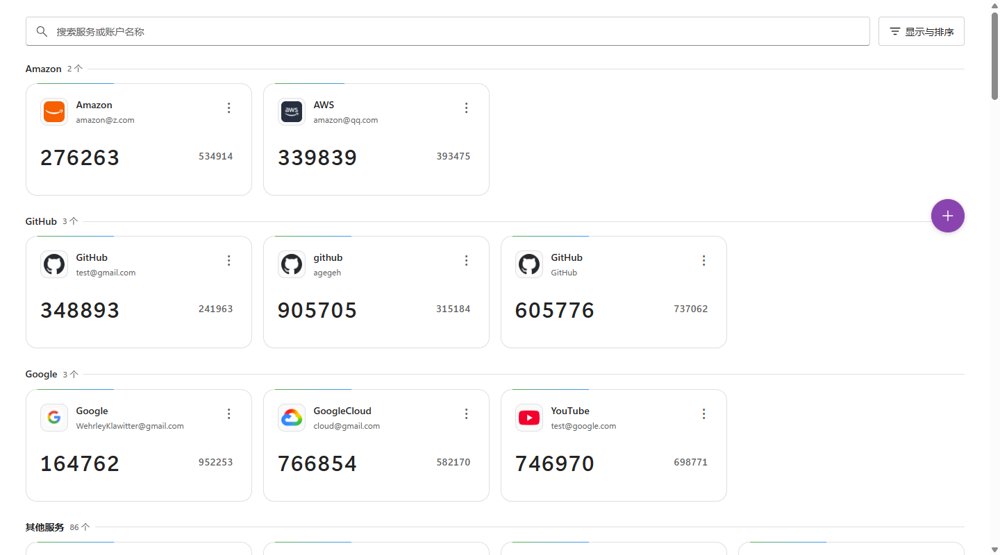
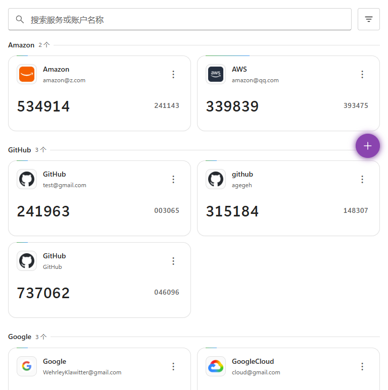
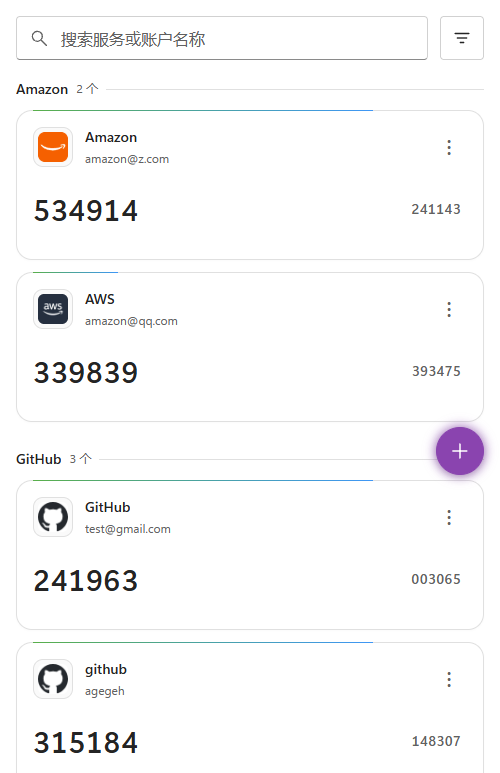

# 🔐 2FA

基於 Cloudflare Workers 的兩步驟驗證金鑰管理系統。免費部署、全球加速、支援 PWA 離線使用。

**[简体中文](README.md)** · **[English](README_EN.md)**


**主要特色：** TOTP/HOTP 驗證碼自動產生 · QR Code 掃描/圖片識別/貼上截圖/拖曳圖片新增金鑰 · AES-GCM 256 位元加密儲存 · 從 Google Authenticator、Aegis、2FAS、Bitwarden 等應用程式批次匯入 · 多格式匯出（TXT/JSON/CSV/HTML/Google 轉移 QR Code） · 自動備份與還原 · WebDAV/S3/OneDrive/Google Drive 遠端備份同步 · 帳號安全/同步/偏好設定 · 多國語言支援（繁體中文 / 簡體中文 / English，依瀏覽器自動判定） · 淺色/深色/跟隨系統主題 · Fluent 2 風格響應式介面

## 📸 截圖預覽

|                    桌面端                     |                    平板端                    |                    手機端                    |
| :-------------------------------------------: | :------------------------------------------: | :------------------------------------------: |
|  |  |  |

## 🚀 快速部署

### 線上體驗

造訪示範網站（密碼 `2fa-Demo.`）：**[https://2fa-dev.wzf.workers.dev](https://2fa-dev.wzf.workers.dev)**

### 一鍵部署（推薦）

[](https://deploy.workers.cloudflare.com/?url=https://github.com/wuzf/2fa)

> 推薦一鍵部署；所有使用者統一透過 **Sync Upstream** 原地升級，請勿透過刪除 Worker、刪除儲存庫或重新安裝的方式升級。

1. 點選上方按鈕，使用 GitHub 登入並授權
2. 登入 Cloudflare 帳戶，點選 **Deploy** 等待部署完成（KV 儲存自動建立）
3. 開啟 Cloudflare 提供的 Workers 連結，**設定管理密碼**即可開始使用

> Git 自動建置會直接使用儲存庫中的 `wrangler.toml` 部署；目前設定已顯式宣告 `SECRETS_KV`，Wrangler 會在首次部署時自動建立所需 KV，並在後續部署中繼續沿用目前 Worker 已綁定的資源。
> 若你在 Cloudflare Dashboard 中手動設定 Git 建置指令，**部署指令請使用 `npm run deploy`，請勿直接輸入 `npx wrangler deploy`**，以保留專案中的版本注入流程，並與儲存庫預設部署入口維持一致。

#### 推薦：啟用資料加密

部署後，在 **Cloudflare Dashboard → Worker → Settings → Variables** 中新增 Secret `ENCRYPTION_KEY`：

```bash
# 產生加密金鑰（任選一種）
openssl rand -base64 32
node -e "console.log(require('crypto').randomBytes(32).toString('base64'))"
```

> `ENCRYPTION_KEY` 是解密現有資料的主金鑰。**強烈建議設定**，前提是請務必將原始數值立即儲存至密碼管理器、離線備份或其他安全位置。
>
> 若你無法確保妥善保管原始數值，**寧可暫時不設定，也切勿在設定後遺失**：
>
> - 設定後：金鑰列表、自動備份、WebDAV/S3/OneDrive/Google Drive 憑證皆會加密儲存
> - 遺失後：Cloudflare 不會再次顯示原值，已有的加密資料與加密備份將無法讀取或復原
> - 目前程式行為：偵測到已有加密資料但缺少 `ENCRYPTION_KEY` 時，會直接鎖定讀取與修改，避免意外覆蓋舊資料

#### 版本更新

一鍵部署產生的是獨立儲存庫（非 Fork），升級統一使用 **Sync Upstream** 工作流程原地完成。

> ⚠️ **升級前務必先備份資料**：在執行版本更新前，請先透過 **批次匯出** 或 **還原配置 → 匯出備份** 將目前資料匯出至本機，以防操作失敗導致資料遺失。

1. 開啟一鍵部署時在你 GitHub 上產生的 2fa 儲存庫
2. 進入 **Actions** → **Sync Upstream**
3. 點選 **Run workflow**，上游分支維持預設的 `main`，發起一次新執行
4. 等待同步完成及 Cloudflare 自動部署，完成後重新整理應用程式即可

工作流程會自動保留你目前儲存庫裡的 Worker 名稱、KV 綁定與常見部署設定，並重新部署**同一個 Worker**。儲存庫中已有的工作流程檔案也會一併保留。

---

## 📖 使用指南

### 新增金鑰

點選右下角 **➕** 懸浮按鈕：

- **掃描 QR Code** — 相機掃描 2FA QR Code，自動填入
- **選擇圖片** — 上傳 QR Code 截圖，自動識別
- **貼上截圖** — Ctrl+V 貼上剪貼簿中的 QR Code 截圖（適合無相機的 PC 使用者）
- **拖曳圖片** — 直接將 QR Code 圖片拖入彈出視窗，自動識別
- **手動新增** — 輸入服務名稱與 Base32 金鑰（可展開進階設定調整位數/週期/演算法）

### 日常使用

- **複製驗證碼**：直接點選驗證碼數字
- **管理金鑰**：點選卡片右上角 **⋯** → 檢視 QR Code / 複製 URI / 複製網頁連結 / 編輯 / 刪除
- **搜尋**：頂部搜尋框依服務名稱或帳號即時搜尋
- **智慧聚合**：預設依服務系列自動分組，同一服務的多個帳號彙整在一起，亦可切換為全平鋪
- **排序**：依新增時間或名稱排序
- **多國語言**：懸浮按鈕 → **設定 → 偏好設定 → 顯示語言**，支援繁體中文、簡體中文、English 或跟隨瀏覽器
- **主題**：懸浮按鈕 → **設定 → 偏好設定 → 主題模式**，選擇淺色、深色或跟隨系統

### 批次匯入

點選懸浮按鈕 → **📥 批次匯入**，支援檔案匯入或文字貼上。

**相容格式：**

| 來源                   | 格式                                    |
| ---------------------- | --------------------------------------- |
| 通用                   | `otpauth://` URI 文字（TXT）、CSV、HTML |
| Google Authenticator   | 轉移 QR Code（`otpauth-migration://`）  |
| Aegis                  | JSON 匯出檔案                           |
| 2FAS                   | `.2fas` 匯出檔案                        |
| Bitwarden              | JSON、Authenticator CSV 匯出檔案        |
| LastPass Authenticator | JSON 匯出檔案                           |
| andOTP                 | JSON 匯出檔案                           |
| Ente Auth              | 匯出檔案                                |

### 批次匯出

點選懸浮按鈕 → **📤 批次匯出**，支援 TXT、JSON、CSV、HTML 格式，以及產生 **Google Authenticator 轉移 QR Code**（可直接掃碼匯入）。
標準 TXT / JSON / CSV / HTML 匯出在連線時優先使用統一後端格式；離線或請求內容過大時會自動降級至本機相容匯出，持續保證 PWA 可用性。

### 備份與還原

系統自動備份（資料異動後自動觸發 + 每日定時檢查），保留最近 100 份備份（可在設定中調整）。
新建立的備份檔案格式會跟隨 **設定 → 預設匯出格式**；遠端自動備份亦會使用相同的副檔名（`txt` / `json` / `csv` / `html`）。

點選懸浮按鈕 → **🔄 還原配置** 檢視備份清單、預覽內容、還原或匯出；亦可上傳從 WebDAV/S3/OneDrive/Google Drive 下載的 `backup_*.(txt|json|csv|html)` 檔案進行預覽與復原。

#### 遠端備份

支援將備份同步至遠端儲存空間，資料異動時自動推送，可設定多個備份目標：

- **WebDAV** — 支援標準 WebDAV 協定的雲端硬碟或自建服務
- **S3 相容儲存** — 支援 AWS S3、Cloudflare R2、MinIO、阿里雲 OSS 等 S3 相容服務
- **OneDrive** — 透過 Microsoft OAuth 授權後，將備份寫入 OneDrive 應用程式專用目錄下的子路徑
- **Google Drive** — 透過 Google OAuth 授權後，將備份寫入 Google Drive 指定目錄

在 **設定 → 同步設定** 中新增與管理遠端備份目標。

---

## 🔒 安全性

- **密碼**：PBKDF2-SHA256（100,000 次反覆運算）加鹽雜湊，JWT 儲存於 HttpOnly + Secure + SameSite=Strict Cookie 中
- **資料加密**：設定 `ENCRYPTION_KEY` 後所有金鑰、備份以及 WebDAV/S3/OneDrive/Google Drive 憑證皆使用 AES-GCM 256 位元加密；請務必妥善儲存原始金鑰，遺失後無法解密既有資料
- **傳輸**：全程 HTTPS，TLS 1.2+
- **隱私**：OTP 於用戶端本地運算產生，不蒐集使用資料，完全開源
- **登入有效期限**：預設 30 天，可在設定中自訂，活躍使用自動續期（剩餘 < 7 天時自動延長）

---

## 🔗 公開 OTP API

無需登入，透過 URL 直接產生驗證碼：

```
https://your-worker.workers.dev/otp/YOUR_SECRET_KEY
https://your-worker.workers.dev/otp/YOUR_SECRET_KEY?digits=8&period=60
https://your-worker.workers.dev/otp/YOUR_SECRET_KEY?type=hotp&counter=5
```

參數：`type`（totp/hotp）、`digits`（6/8）、`period`（30/60/120）、`algorithm`（sha1/sha256/sha512）、`counter`（HOTP 專用）

TOTP 網頁同時顯示目前與下一期驗證碼，均可點選複製，到期後原地更新。HOTP 網頁顯示連結中指定計數器的驗證碼，複製不會推進計數器。

---

## 📄 授權條款

本專案採用 [MIT License](LICENSE) 開源授權。
