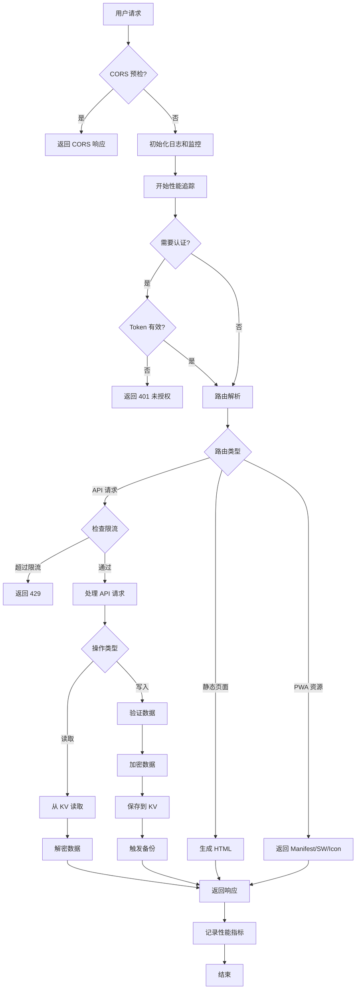
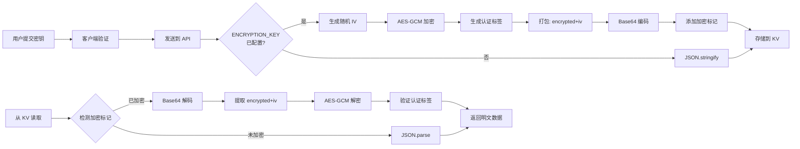
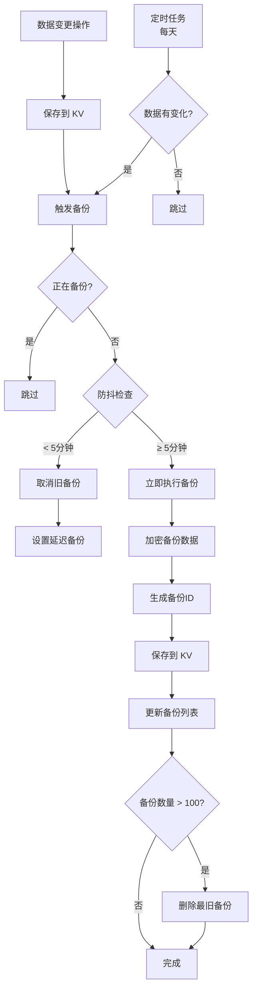

# 🏗️ 项目架构文档

## 📋 目录

- [总体架构](#总体架构)
- [技术栈](#技术栈)
- [代码结构](#代码结构)
- [核心模块详解](#核心模块详解)
- [数据流](#数据流)
- [前端架构](#前端架构)
- [设计模式](#设计模式)

---

## 总体架构

### 三层架构

```
┌─────────────────────────────────────────────────────┐
│                   用户层                             │
│   浏览器 / PWA / 移动设备                            │
└──────────────────┬──────────────────────────────────┘
                   │ HTTPS
                   ▼
┌─────────────────────────────────────────────────────┐
│              Cloudflare Edge                        │
│   CDN + DDoS 保护 + SSL + 全球分布                  │
└──────────────────┬──────────────────────────────────┘
                   │
                   ▼
┌─────────────────────────────────────────────────────┐
│          Cloudflare Workers（应用层）                │
│  ┌─────────────┐  ┌─────────────┐  ┌────────────┐ │
│  │  路由处理   │  │  API服务    │  │  UI渲染    │ │
│  └─────────────┘  └─────────────┘  └────────────┘ │
│  ┌─────────────┐  ┌─────────────┐  ┌────────────┐ │
│  │  认证系统   │  │  加密系统   │  │  监控系统  │ │
│  └─────────────┘  └─────────────┘  └────────────┘ │
└──────────────────┬──────────────────────────────────┘
                   │
                   ▼
┌─────────────────────────────────────────────────────┐
│        Cloudflare KV（数据存储层）                   │
│   全球分布式键值存储 + 自动加密 + 低延迟             │
└─────────────────────────────────────────────────────┘
```

### 核心特性

- **无服务器架构**: 基于 Cloudflare Workers，无需维护服务器
- **全球分布**: 在全球 300+ 个城市的边缘节点上运行
- **高可用性**: 自动故障转移和负载均衡
- **低延迟**: 就近服务，平均响应时间 < 50ms
- **自动扩展**: 根据流量自动扩缩容
- **零冷启动**: V8 隔离技术，无冷启动延迟

---

## 技术栈

### 后端

| 技术                   | 用途       | 版本      |
| ---------------------- | ---------- | --------- |
| **Cloudflare Workers** | 运行时环境 | V8 Engine |
| **ES Modules**         | 模块系统   | ES2022    |
| **Web Crypto API**     | 加密操作   | 标准 API  |
| **Cloudflare KV**      | 数据存储   | -         |

### 前端

| 技术                    | 用途       | 说明                      |
| ----------------------- | ---------- | ------------------------- |
| **HTML5**               | 页面结构   | 语义化标签                |
| **CSS3**                | 样式系统   | 模块化 CSS                |
| **JavaScript (ES2022)** | 交互逻辑   | 原生 JS，无框架           |
| **PWA**                 | 应用增强   | Service Worker + Manifest |
| **jsQR**                | 二维码识别 | CDN 引入                  |
| **qrcode-generator**    | 二维码生成 | CDN 引入                  |

### 开发工具

| 工具             | 用途             |
| ---------------- | ---------------- |
| **Wrangler CLI** | 开发和部署工具   |
| **Git**          | 版本控制         |
| **Node.js**      | 构建工具运行环境 |

---

## 代码结构

### 完整目录树

```
src/
├── worker.js                      # 🎯 Worker 主入口
│                                  # - Fetch 事件处理
│                                  # - CORS 处理
│                                  # - 全局错误捕获
│                                  # - 监控系统初始化
│
├── router/
│   └── handler.js                 # 🛣️ 路由处理器
│                                  # - 路径解析和分发
│                                  # - 认证检查
│                                  # - API 路由映射
│
├── api/
│   ├── secrets/                   # 🔌 密钥管理 API（模块化）
│   │   ├── index.js              # 统一导出（Barrel Export）
│   │   ├── shared.js             # 共享工具（saveSecretsToKV, getAllSecrets）
│   │   ├── crud.js               # CRUD 操作
│   │   ├── batch.js              # 批量导入
│   │   ├── backup.js             # 备份创建和列表
│   │   ├── restore.js            # 备份恢复和导出
│   │   └── otp.js                # OTP 生成
│   └── favicon.js                 # 🌐 Favicon 代理 API
│
├── otp/
│   └── generator.js               # 🔐 OTP 算法实现
│                                  # - TOTP (RFC 6238)
│                                  # - HOTP (RFC 4226)
│                                  # - Base32 编解码
│
├── ui/
│   ├── page.js                    # 🎨 主页面生成
│   │                              # - HTML 结构
│   │                              # - 样式集成
│   │                              # - 脚本集成
│   │
│   ├── manifest.js                # 📱 PWA Manifest
│   │                              # - 应用信息
│   │                              # - 图标定义
│   │                              # - 快捷方式
│   │
│   ├── serviceworker.js           # ⚙️ Service Worker
│   │                              # - 缓存策略
│   │                              # - 离线支持
│   │                              # - CDN 资源缓存
│   │
│   ├── scripts/                   # 📜 前端 JavaScript 模块
│   │   ├── index.js              # 模块集成入口
│   │   ├── state.js              # 全局状态管理
│   │   ├── auth.js               # 认证逻辑
│   │   ├── core.js               # 核心业务逻辑
│   │   ├── utils.js              # 工具函数
│   │   └── pwa.js                # PWA 功能
│   │
│   └── styles/                    # 🎨 前端 CSS 模块
│       ├── index.js              # 样式集成入口
│       ├── base.js               # 基础样式
│       ├── components.js         # 组件样式
│       ├── modals.js             # 模态框样式
│       └── responsive.js         # 响应式样式
│
└── utils/                         # 🛠️ 工具模块
    ├── auth.js                    # 🔑 认证系统
    │                              # - Token 验证
    │                              # - HttpOnly Cookie
    │                              # - 自动刷新
    │
    ├── backup.js                  # 💾 智能备份系统
    │                              # - 事件驱动备份
    │                              # - 防抖机制
    │                              # - 自动清理
    │
    ├── constants.js               # 📋 常量定义
    │                              # - KV 键名
    │                              # - 配置常量
    │
    ├── crypto.js                  # 🔐 加密工具
    │                              # - HMAC-SHA1/256
    │                              # - Base32 编解码
    │
    ├── encryption.js              # 🔒 数据加密
    │                              # - AES-GCM 256
    │                              # - 密钥派生
    │                              # - 自动加解密
    │
    ├── errors.js                  # ❌ 统一错误分类
    │                              # - 自定义错误类
    │                              # - 错误处理和响应格式
    │
    ├── logger.js                  # 📝 日志系统
    │                              # - 结构化日志
    │                              # - 性能计时
    │                              # - 日志级别
    │
    ├── monitoring.js              # 📊 监控系统
    │                              # - 错误追踪
    │                              # - 性能监控
    │                              # - Sentry 集成
    │
    ├── rateLimit.js               # 🛡️ 请求限流
    │                              # - 固定窗口计数器算法
    │                              # - 可配置策略
    │                              # - 基于 KV 存储
    │
    ├── response.js                # 📡 响应工具
    │                              # - 标准化响应格式
    │                              # - CORS 头处理
    │
    ├── security.js                # 🔒 安全工具
    │                              # - CORS 配置
    │                              # - CSP 头
    │                              # - 预检请求
    │
    └── validation.js              # ✅ 数据验证
                                   # - Base32 验证
                                   # - 输入校验
                                   # - 业务规则检查
```

---

## 核心模块详解

### 1. Worker 主入口 (`worker.js`)

**职责**: Cloudflare Worker 的入口点，处理所有传入请求

**核心功能**:

```javascript
export default {
	async fetch(request, env, ctx) {
		// 1. 初始化日志和监控
		// 2. 处理 CORS 预检请求
		// 3. 开始请求追踪
		// 4. 调用路由处理器
		// 5. 记录响应和性能指标
		// 6. 全局错误处理
	},

	async scheduled(event, env, ctx) {
		// 定时任务：自动备份（每天）
	},
};
```

**集成的系统**:

- 日志系统 (`logger.js`)
- 监控系统 (`monitoring.js`)
- 路由处理 (`router/handler.js`)
- CORS 处理 (`utils/security.js`)

---

### 2. 路由处理器 (`router/handler.js`)

**职责**: 解析 URL 路径并分发到对应的处理函数

**路由表**:

| 路由                       | 方法   | 处理器                    | 认证 |
| -------------------------- | ------ | ------------------------- | ---- |
| `/`                        | GET    | `createMainPage()`        | ❌   |
| `/setup`                   | GET    | `createSetupPage()`       | ❌   |
| `/manifest.json`           | GET    | `createManifest()`        | ❌   |
| `/sw.js`                   | GET    | `createServiceWorker()`   | ❌   |
| `/icon-*.png`              | GET    | `createDefaultIcon()`     | ❌   |
| `/modules/{name}`          | GET    | `getModuleCode()`         | ✅   |
| `/api/setup`               | POST   | `handleFirstTimeSetup()`  | ❌   |
| `/api/login`               | POST   | `handleLogin()`           | ❌   |
| `/api/refresh-token`       | POST   | `handleRefreshToken()`    | ✅   |
| `/api/secrets`             | GET    | `handleGetSecrets()`      | ✅   |
| `/api/secrets`             | POST   | `handleAddSecret()`       | ✅   |
| `/api/secrets/{id}`        | PUT    | `handleUpdateSecret()`    | ✅   |
| `/api/secrets/{id}`        | DELETE | `handleDeleteSecret()`    | ✅   |
| `/api/secrets/batch`       | POST   | `handleBatchAddSecrets()` | ✅   |
| `/api/backup`              | GET    | `handleGetBackups()`      | ✅   |
| `/api/backup`              | POST   | `handleBackupSecrets()`   | ✅   |
| `/api/backup/restore`      | POST   | `handleRestoreBackup()`   | ✅   |
| `/api/backup/export/{key}` | GET    | `handleExportBackup()`    | ✅   |
| `/api/favicon/{domain}`    | GET    | `handleFaviconProxy()`    | ✅   |
| `/otp/{secret}`            | GET    | `handleGenerateOTP()`     | ❌   |

---

### 3. 密钥管理 API (`api/secrets/`)

**职责**: 处理 2FA 密钥的 CRUD 操作和备份管理

**模块化组织**:

- `shared.js` - 共享工具函数（saveSecretsToKV, getAllSecrets）
- `crud.js` - CRUD 操作（GET/POST/PUT/DELETE）
- `batch.js` - 批量导入
- `backup.js` - 备份创建和列表
- `restore.js` - 备份恢复和导出
- `otp.js` - OTP 生成
- `index.js` - 统一导出（Barrel Export）

**核心功能**:

#### 数据自动加密

```javascript
async function saveSecretsToKV(env, secrets, reason) {
	// 1. 排序密钥
	sortSecretsByName(secrets);

	// 2. 加密数据（如果配置了 ENCRYPTION_KEY）
	const encryptedData = await encryptSecrets(secrets, env);

	// 3. 保存到 KV
	await env.SECRETS_KV.put('secrets', encryptedData);

	// 4. 触发事件驱动备份
	await triggerBackup(secrets, env, { reason });
}
```

#### 请求限流集成

```javascript
export async function handleAddSecret(request, env) {
	// 1. 检查限流
	const rateLimitResult = await checkRateLimit(request, env, RATE_LIMIT_PRESETS.api);

	if (!rateLimitResult.allowed) {
		return createRateLimitResponse(rateLimitResult);
	}

	// 2. 处理请求...
}
```

---

### 4. OTP 生成器 (`otp/generator.js`)

**职责**: 实现 TOTP/HOTP 算法，生成一次性密码

**支持的算法**:

#### TOTP (Time-based OTP) - RFC 6238

```javascript
/**
 * 算法流程:
 * 1. 计算时间计数器 (counter = floor(currentTime / 30))
 * 2. 将 Base32 密钥解码为字节数组
 * 3. 使用 HMAC-SHA1 计算哈希值
 * 4. 动态截断生成 6 位数字 OTP
 */
export async function generateTOTP(secret, options = {}) {
	const {
		timeStep = 30, // 时间步长（秒）
		digits = 6, // OTP 长度
		algorithm = 'SHA1', // 哈希算法
	} = options;

	const counter = Math.floor(Date.now() / 1000 / timeStep);
	return await generateHOTP(secret, counter, { digits, algorithm });
}
```

#### HOTP (HMAC-based OTP) - RFC 4226

```javascript
export async function generateHOTP(secret, counter, options = {}) {
	// 1. Base32 解码
	const key = base32Decode(secret);

	// 2. 计数器转字节数组
	const counterBytes = new ArrayBuffer(8);
	const view = new DataView(counterBytes);
	view.setUint32(4, counter, false); // 大端序

	// 3. HMAC-SHA1
	const hmac = await crypto.subtle.sign('HMAC', key, counterBytes);

	// 4. 动态截断
	const offset = hmac[hmac.length - 1] & 0x0f;
	const binary =
		((hmac[offset] & 0x7f) << 24) | ((hmac[offset + 1] & 0xff) << 16) | ((hmac[offset + 2] & 0xff) << 8) | (hmac[offset + 3] & 0xff);

	// 5. 生成 OTP
	const otp = binary % Math.pow(10, digits);
	return otp.toString().padStart(digits, '0');
}
```

---

### 5. 认证系统 (`utils/auth.js`)

**职责**: 管理用户身份认证和授权

**架构设计**:

```
┌───────────┐     登录请求      ┌───────────┐
│  浏览器   │ ──────────────→  │  Worker   │
└───────────┘                  └─────┬─────┘
      ↑                              │
      │                              ▼
      │                    验证密码（KV存储）
      │                              │
      │                              ▼
      │  Set-Cookie:             生成 JWT
      │  auth_token=...             │
      │  HttpOnly; Secure           │
      │  ←───────────────────────────┘
      │
      │     后续请求（自动携带 Cookie）
      │  ──────────────────────────────→
      │
      │     验证 JWT + 自动刷新
      │  ←──────────────────────────────
```

**核心功能**:

#### HttpOnly Cookie 认证

```javascript
// 生成认证 Cookie
function createAuthCookie(token, expiresAt) {
	const maxAge = Math.floor((expiresAt - Date.now()) / 1000);

	return [
		`auth_token=${token}`,
		'HttpOnly', // 防止 XSS
		'Secure', // 仅 HTTPS
		'SameSite=Strict', // 防止 CSRF
		`Max-Age=${maxAge}`,
		'Path=/',
	].join('; ');
}
```

#### Token 自动刷新

```javascript
export async function handleRefreshToken(request, env) {
	// 1. 验证当前 Token
	const currentToken = extractTokenFromCookie(request);
	if (!isValidToken(currentToken)) {
		return createUnauthorizedResponse();
	}

	// 2. 生成新 Token
	const newToken = await generateJWT({
		iat: Math.floor(Date.now() / 1000),
		exp: Math.floor(Date.now() / 1000) + 7 * 24 * 60 * 60, // 7天
	});

	// 3. 设置新 Cookie
	return new Response(JSON.stringify({ success: true }), {
		headers: {
			'Set-Cookie': createAuthCookie(newToken, Date.now() + 7 * 24 * 60 * 60 * 1000),
			'Content-Type': 'application/json',
		},
	});
}
```

---

### 6. 加密系统 (`utils/encryption.js`)

**职责**: 使用 AES-GCM 256 位加密保护敏感数据

**加密流程**:

```
明文数据 → JSON.stringify → UTF-8 编码
    ↓
生成随机 IV (96 bits)
    ↓
AES-GCM 256 加密
    ↓
认证标签 (128 bits)
    ↓
{encrypted: base64(密文), iv: base64(IV)}
    ↓
JSON.stringify → Base64 编码
    ↓
存储到 KV
```

**核心实现**:

```javascript
export async function encryptData(data, env) {
	// 1. 检查是否配置了加密密钥
	if (!env.ENCRYPTION_KEY) {
		// 未配置密钥，返回明文
		return typeof data === 'string' ? data : JSON.stringify(data);
	}

	// 2. 导入加密密钥
	const keyBuffer = base64ToArrayBuffer(env.ENCRYPTION_KEY);
	const key = await crypto.subtle.importKey('raw', keyBuffer, { name: 'AES-GCM' }, false, ['encrypt']);

	// 3. 生成随机 IV
	const iv = crypto.getRandomValues(new Uint8Array(12));

	// 4. 加密数据
	const plaintext = new TextEncoder().encode(typeof data === 'string' ? data : JSON.stringify(data));

	const ciphertext = await crypto.subtle.encrypt({ name: 'AES-GCM', iv }, key, plaintext);

	// 5. 打包加密结果
	const encrypted = {
		encrypted: arrayBufferToBase64(ciphertext),
		iv: arrayBufferToBase64(iv.buffer),
	};

	// 6. 添加加密标记并返回
	return `__ENCRYPTED__${btoa(JSON.stringify(encrypted))}`;
}
```

**自动检测和解密**:

```javascript
export async function decryptSecrets(data, env) {
	if (!data) return [];

	// 检查是否已加密
	if (isEncrypted(data)) {
		// 数据已加密，需要解密
		if (!env.ENCRYPTION_KEY) {
			console.error('数据已加密但未配置 ENCRYPTION_KEY');
			return [];
		}
		return await decryptData(data, env);
	} else {
		// 数据未加密（明文或旧数据）
		try {
			return JSON.parse(data);
		} catch (error) {
			console.error('解析数据失败:', error);
			return [];
		}
	}
}
```

---

### 7. 备份系统 (`utils/backup.js`)

**职责**: 实现智能备份策略，防止数据丢失

**备份策略**:

#### 1. 事件驱动备份

```
用户操作 → 数据变更 → 触发备份
    ↓
防抖检查 (5分钟内只备份一次)
    ↓
执行备份 → 加密 → 存储到 KV
    ↓
自动清理 (保留最新100个)
```

#### 2. 定时备份（兜底）

```
Cron 触发 (每天)
    ↓
检查数据是否变化
    ↓
如果变化 → 执行备份
```

**核心实现**:

```javascript
class BackupManager {
	constructor(env) {
		this.env = env;
		this.lastBackupTime = 0;
		this.pendingBackup = null;
		this.backupInProgress = false;
	}

	/**
	 * 触发备份（带防抖）
	 */
	async triggerBackup(secrets, options = {}) {
		const { immediate = false, reason = 'event-driven' } = options;

		// 如果正在备份，跳过
		if (this.backupInProgress) {
			return null;
		}

		// 防抖检查（除非是立即备份）
		if (!immediate && !this.shouldBackup()) {
			// 取消之前的待处理备份
			if (this.pendingBackup) {
				clearTimeout(this.pendingBackup);
			}

			// 设置延迟备份
			const remainingTime = DEBOUNCE_INTERVAL - (Date.now() - this.lastBackupTime);
			this.pendingBackup = setTimeout(() => {
				this.executeBackup(secrets, reason);
			}, remainingTime);

			return { scheduled: true, delay: remainingTime };
		}

		// 立即执行备份
		return await this.executeBackup(secrets, reason);
	}

	/**
	 * 执行备份
	 */
	async executeBackup(secrets, reason) {
		this.backupInProgress = true;
		const startTime = Date.now();

		try {
			// 1. 生成备份ID
			const backupId = `backup_${Date.now()}`;

			// 2. 加密备份数据
			const backupData = {
				id: backupId,
				timestamp: new Date().toISOString(),
				count: secrets.length,
				reason,
				data: secrets,
			};

			const encrypted = await encryptData(backupData, this.env);

			// 3. 保存到 KV
			await this.env.SECRETS_KV.put(backupId, encrypted);

			// 4. 更新备份列表
			await this._updateBackupsList(backupId);

			// 5. 清理旧备份
			await this._cleanupOldBackupsAsync();

			// 6. 记录性能指标
			const duration = Date.now() - startTime;
			this.logger.info('✅ 备份成功', {
				backupId,
				reason,
				count: secrets.length,
				duration: `${duration}ms`,
			});

			this.lastBackupTime = Date.now();
			return { success: true, backupId, duration };
		} catch (error) {
			this.logger.error('❌ 备份失败', { reason }, error);
			throw error;
		} finally {
			this.backupInProgress = false;
		}
	}

	/**
	 * 清理旧备份
	 */
	async _cleanupOldBackupsAsync() {
		const list = await this.env.SECRETS_KV.list({ prefix: 'backup_' });
		const backups = list.keys;

		if (backups.length > MAX_BACKUPS) {
			// 按时间排序，删除最旧的备份
			const toDelete = backups.sort((a, b) => a.name.localeCompare(b.name)).slice(0, backups.length - MAX_BACKUPS);

			for (const backup of toDelete) {
				await this.env.SECRETS_KV.delete(backup.name);
			}

			this.logger.info(`🗑️ 已清理 ${toDelete.length} 个旧备份`);
		}
	}
}
```

---

### 8. 监控系统 (`utils/logger.js` + `utils/monitoring.js`)

**职责**: 提供结构化日志和错误追踪

**日志系统架构**:

```
┌───────────────┐
│  Logger API   │
│  (logger.js)  │
└───────┬───────┘
        │
        ├─→ Console (开发环境)
        ├─→ Sentry (生产环境)
        └─→ Cloudflare Analytics
```

**核心功能**:

#### 结构化日志

```javascript
class Logger {
	constructor(env, context = {}) {
		this.env = env;
		this.context = context;
		this.level = env.LOG_LEVEL || 'INFO';
	}

	info(message, meta = {}) {
		this._log('INFO', message, meta);
	}

	error(message, meta = {}, error = null) {
		this._log('ERROR', message, { ...meta, error: error?.stack });

		// 同时发送到错误监控
		if (error) {
			monitoring.captureError(error, meta, ErrorSeverity.ERROR);
		}
	}

	_log(level, message, meta) {
		if (!this._shouldLog(level)) return;

		const logEntry = {
			level,
			message,
			timestamp: new Date().toISOString(),
			context: this.context,
			meta,
		};

		console.log(JSON.stringify(logEntry));
	}
}
```

#### 性能计时

```javascript
class PerformanceTimer {
	constructor(name, logger) {
		this.name = name;
		this.logger = logger;
		this.startTime = Date.now();
		this.checkpoints = [];
	}

	checkpoint(label) {
		const elapsed = Date.now() - this.startTime;
		this.checkpoints.push({ label, elapsed });
	}

	end(meta = {}) {
		const duration = Date.now() - this.startTime;

		this.logger.info(`⏱️ ${this.name} completed`, {
			duration: `${duration}ms`,
			checkpoints: this.checkpoints,
			...meta,
		});

		// 记录到性能监控
		monitoring.recordMetric(this.name, duration, 'ms', meta);
	}
}
```

#### Sentry 集成

```javascript
class ErrorMonitor {
	constructor(env) {
		this.env = env;
		this.sentryDSN = env.SENTRY_DSN;
		this.enabled = !!this.sentryDSN;
	}

	captureError(error, context = {}, severity = ErrorSeverity.ERROR) {
		// 生成错误ID
		const errorId = `err_${Date.now()}_${Math.random().toString(36).substr(2, 9)}`;

		// 本地日志
		console.error('[ErrorMonitor]', {
			errorId,
			message: error.message,
			stack: error.stack,
			context,
			severity,
		});

		// 发送到 Sentry（如果配置）
		if (this.enabled) {
			this._sendToSentry({
				errorId,
				error,
				context,
				severity,
				timestamp: new Date().toISOString(),
			});
		}

		return { errorId, captured: this.enabled };
	}

	async _sendToSentry(data) {
		// Sentry API 集成
		try {
			await fetch(this.sentryDSN, {
				method: 'POST',
				headers: { 'Content-Type': 'application/json' },
				body: JSON.stringify({
					event_id: data.errorId,
					message: data.error.message,
					level: data.severity.toLowerCase(),
					exception: {
						values: [
							{
								type: data.error.name,
								value: data.error.message,
								stacktrace: { frames: this._parseStackTrace(data.error.stack) },
							},
						],
					},
					extra: data.context,
					timestamp: data.timestamp,
				}),
			});
		} catch (err) {
			console.error('[Sentry] Failed to send error:', err);
		}
	}
}
```

---

### 9. 限流系统 (`utils/rateLimit.js`)

**职责**: 防止 API 滥用和 DDoS 攻击

**算法**: 固定窗口计数器 (Fixed Window Counter)

```
时间轴: ───────────────────────────→
         │    窗口 1     │    窗口 2     │
      t=0s           t=60s          t=120s
         └─────────────┘─────────────┘
           计数器重置      计数器重置

窗口内计数: count ≤ maxAttempts
窗口过期: resetAt 时间到达时，创建新窗口
```

**核心实现**:

```javascript
export async function checkRateLimit(key, env, options) {
	const { maxAttempts = 5, windowSeconds = 60 } = options;
	const rateLimitKey = `ratelimit:${key}`;

	// 1. 获取当前限流数据
	const data = await env.SECRETS_KV.get(rateLimitKey, 'json');
	const now = Date.now();

	// 2. 如果没有数据或窗口已过期，创建新窗口
	if (!data || now > data.resetAt) {
		await env.SECRETS_KV.put(
			rateLimitKey,
			JSON.stringify({
				count: 1,
				resetAt: now + windowSeconds * 1000,
				firstRequest: now,
			}),
			{
				expirationTtl: windowSeconds + 10,
			},
		);

		return {
			allowed: true,
			remaining: maxAttempts - 1,
			resetAt: now + windowSeconds * 1000,
			limit: maxAttempts,
		};
	}

	// 3. 检查是否超过限制
	if (data.count >= maxAttempts) {
		return {
			allowed: false,
			remaining: 0,
			resetAt: data.resetAt,
			limit: maxAttempts,
		};
	}

	// 4. 增加计数
	data.count++;
	await env.SECRETS_KV.put(rateLimitKey, JSON.stringify(data), {
		expirationTtl: Math.ceil((data.resetAt - now) / 1000) + 10,
	});

	return {
		allowed: true,
		remaining: maxAttempts - data.count,
		resetAt: data.resetAt,
		limit: maxAttempts,
	};
}
```

**预设策略**:

```javascript
export const RATE_LIMIT_PRESETS = {
	// 登录：每分钟 5 次
	login: {
		maxAttempts: 5,
		windowSeconds: 60,
	},

	// API 操作：每分钟 30 次
	api: {
		maxAttempts: 30,
		windowSeconds: 60,
	},

	// 敏感操作：每分钟 10 次
	sensitive: {
		maxAttempts: 10,
		windowSeconds: 60,
	},

	// 批量操作：每 5 分钟 5 次
	bulk: {
		maxAttempts: 5,
		windowSeconds: 300,
	},

	// 全局保护：每分钟 100 次
	global: {
		maxAttempts: 100,
		windowSeconds: 60,
	},
};
```

**算法选择理由**:

- ✅ 实现简单，性能高效（单次 KV 操作）
- ✅ 内存占用低（只存储计数和窗口结束时间）
- ✅ 完美适配 Cloudflare Workers 无状态架构
- ⚠️ 存在窗口边界效应（可能 2倍突发流量）

---

## 数据流

### 完整请求处理流程



### 数据加密流程



### 备份触发流程



---

## 前端架构

### 模块化 JavaScript (5 个模块)

```
scripts/
├── state.js          # 全局状态变量
│   └── 定义所有全局变量（secrets, scannerStream, etc.）
│
├── auth.js           # 认证逻辑
│   ├── showLoginModal()
│   ├── hideLoginModal()
│   ├── checkAuth()
│   ├── refreshAuthToken()
│   └── authenticatedFetch()
│
├── core.js           # 核心业务逻辑 (最大模块，106KB)
│   ├── loadSecrets()
│   ├── renderSecrets()
│   ├── handleAddSecret()
│   ├── handleEditSecret()
│   ├── handleDeleteSecret()
│   ├── startOTPCountdown()
│   ├── showQRCodeModal()
│   ├── startQRScanner()
│   ├── handleBatchImport()
│   └── ... (50+ 个函数)
│
├── utils.js          # 工具函数
│   ├── showCenterToast()
│   ├── copyToClipboard()
│   ├── validateBase32()
│   ├── generateQRCodeDataURL()
│   ├── waitForQRCodeLibrary()
│   ├── formatOTPAuthURL()
│   └── ... (20+ 个工具函数)
│
└── pwa.js            # PWA 功能
    ├── Service Worker 注册
    ├── PWA 模式检测
    └── 更新检查
```

**模块加载流程**:

```
page.js → scripts/index.js
    ├─ import state.js    (全局变量初始化)
    ├─ import auth.js     (认证函数定义)
    ├─ import core.js     (核心业务逻辑)
    ├─ import utils.js    (工具函数)
    └─ import pwa.js      (PWA 功能)
         ↓
    inline <script>
         ↓
    页面加载完成执行
```

### 模块化 CSS (4 个模块)

```
styles/
├── base.js           # 基础样式
│   ├── * { box-sizing, margin, padding }
│   ├── body { font, background }
│   ├── .container
│   ├── .header
│   └── .theme-toggle
│
├── components.js     # 组件样式
│   ├── .secret-card
│   ├── .otp-preview
│   ├── .progress-bar
│   ├── .action-menu
│   └── .search-bar
│
├── modals.js         # 模态框样式
│   ├── .modal
│   ├── .modal-content
│   ├── .modal-header
│   ├── .form-group
│   └── .btn-*
│
└── responsive.js     # 响应式样式
    ├── @media (max-width: 480px)
    ├── @media (min-width: 481px)
    └── @media (min-width: 1200px)
```

**样式加载流程**:

```
page.js → styles/index.js
    ├─ import base.js
    ├─ import components.js
    ├─ import modals.js
    └─ import responsive.js
         ↓
    合并为单个 <style> 标签
         ↓
    inline 到 HTML
```

### PWA 架构

#### Service Worker 缓存策略

```
Service Worker (sw.js)
├── Static Cache (v2)
│   ├── / (主页面)
│   ├── /manifest.json
│   ├── /icon-192.png
│   └── /icon-512.png
│
├── CDN Cache (白名单)
│   ├── jsQR.min.js
│   └── qrcode.min.js
│
└── Runtime Cache
    └── API 响应（不缓存）
```

**缓存策略**:

- **静态资源**: Cache First (缓存优先)
- **CDN 资源**: Cache First + CORS 处理
- **API 请求**: Network Only (始终从网络获取)
- **其他外部资源**: Network Only + 静默失败

**更新机制**:

```javascript
// 1. Service Worker 安装
self.addEventListener('install', (event) => {
	// 预缓存静态资源
	event.waitUntil(
		caches.open(CACHE_NAME).then((cache) => {
			return cache.addAll(STATIC_RESOURCES);
		}),
	);
	self.skipWaiting(); // 立即激活
});

// 2. Service Worker 激活
self.addEventListener('activate', (event) => {
	// 清理旧缓存
	event.waitUntil(
		caches.keys().then((names) => {
			return Promise.all(names.filter((name) => name !== CACHE_NAME && name !== RUNTIME_CACHE).map((name) => caches.delete(name)));
		}),
	);
	self.clients.claim(); // 立即控制页面
});

// 3. 拦截请求
self.addEventListener('fetch', (event) => {
	const url = new URL(event.request.url);

	if (url.origin === location.origin) {
		// 本地资源：缓存优先
		event.respondWith(
			caches.match(event.request).then((response) => {
				return response || fetch(event.request);
			}),
		);
	} else if (isCDNLibrary(url)) {
		// CDN 资源：缓存优先 + CORS
		event.respondWith(
			caches.match(event.request).then((response) => {
				return response || fetch(event.request, { mode: 'cors' });
			}),
		);
	} else {
		// 其他资源：直接透传
		event.respondWith(fetch(event.request));
	}
});
```

---

## 设计模式

### 1. 模块化设计 (Modular Design)

**原则**: 每个模块负责单一职责

```
✅ 好的模块设计:
- auth.js: 只处理认证相关逻辑
- encryption.js: 只处理加密解密
- backup.js: 只处理备份逻辑

❌ 不好的设计:
- utils.js: 混杂了认证、加密、备份等所有功能
```

### 2. 依赖注入 (Dependency Injection)

**应用**: 环境变量 (`env`) 通过参数传递

```javascript
// ✅ 好的设计
export async function handleGetSecrets(env) {
	const logger = getLogger(env); // 注入依赖
	const data = await env.SECRETS_KV.get('secrets');
}

// ❌ 不好的设计
let globalEnv;
export function initEnv(env) {
	globalEnv = env;
}
export async function handleGetSecrets() {
	const data = await globalEnv.SECRETS_KV.get('secrets');
}
```

### 3. 工厂模式 (Factory Pattern)

**应用**: 创建响应对象

```javascript
// 工厂函数
export function createJsonResponse(data, status = 200) {
	return new Response(JSON.stringify(data), {
		status,
		headers: {
			'Content-Type': 'application/json',
			...getCORSHeaders(),
		},
	});
}

// 使用
return createJsonResponse({ success: true, data: secrets });
```

### 4. 策略模式 (Strategy Pattern)

**应用**: OTP 算法选择

```javascript
// 策略接口
const OTP_STRATEGIES = {
	totp: generateTOTP,
	hotp: generateHOTP,
};

// 使用策略
export async function generateOTP(secret, type = 'totp', options = {}) {
	const strategy = OTP_STRATEGIES[type];
	if (!strategy) {
		throw new Error(`Unsupported OTP type: ${type}`);
	}
	return await strategy(secret, options);
}
```

### 5. 装饰器模式 (Decorator Pattern)

**应用**: 性能监控包装

```javascript
// 装饰器
function withPerformanceLogging(fn, name) {
	return async function (...args) {
		const timer = new PerformanceTimer(name, logger);
		try {
			const result = await fn(...args);
			timer.end({ success: true });
			return result;
		} catch (error) {
			timer.cancel();
			throw error;
		}
	};
}

// 使用
const handleGetSecrets = withPerformanceLogging(async (env) => {
	// 原始逻辑
}, 'GetSecrets');
```

### 6. 中间件模式 (Middleware Pattern)

**应用**: 请求处理流水线

```
请求 → CORS中间件 → 认证中间件 → 限流中间件 → 路由处理 → 响应
```

```javascript
// 中间件链
async function handleRequest(request, env) {
	// 中间件 1: CORS
	const corsResponse = handleCORS(request);
	if (corsResponse) return corsResponse;

	// 中间件 2: 认证
	if (requiresAuth(pathname)) {
		const isAuthorized = await verifyAuth(request, env);
		if (!isAuthorized) return createUnauthorizedResponse();
	}

	// 中间件 3: 限流
	const rateLimitResult = await checkRateLimit(request, env);
	if (!rateLimitResult.allowed) {
		return createRateLimitResponse(rateLimitResult);
	}

	// 最终处理
	return await routeRequest(pathname, method, request, env);
}
```

### 7. 观察者模式 (Observer Pattern)

**应用**: 数据变更 → 备份触发

```javascript
// 主题 (Subject)
async function saveSecretsToKV(env, secrets, reason) {
	// 保存数据
	await env.SECRETS_KV.put('secrets', encrypted);

	// 通知观察者
	await triggerBackup(secrets, env, { reason }); // 观察者
}

// 观察者 (Observer)
export async function triggerBackup(secrets, env, options) {
	// 响应数据变更事件
	await backupManager.executeBackup(secrets, options.reason);
}
```

### 8. 单例模式 (Singleton Pattern)

**应用**: 备份管理器、监控系统

```javascript
// 单例模式
let backupManagerInstance = null;

export function getBackupManager(env) {
	if (!backupManagerInstance) {
		backupManagerInstance = new BackupManager(env);
	}
	return backupManagerInstance;
}
```

---

## 性能优化

### 1. 代码优化

- **模块化**: 拆分为小模块，便于维护和缓存
- **懒加载**: Service Worker 按需缓存资源
- **最小化**: 减少不必要的计算和内存使用

### 2. 缓存策略

- **静态资源**: 长期缓存（PWA）
- **CDN 资源**: 缓存优先策略
- **API 响应**: 不缓存（实时数据）

### 3. 数据库优化

- **批量操作**: 一次性读取和写入
- **数据压缩**: 使用加密同时压缩数据
- **索引优化**: 使用有意义的 KV key

### 4. 网络优化

- **全球 CDN**: Cloudflare Edge Network
- **HTTP/2**: 多路复用
- **压缩**: Gzip/Brotli 自动压缩

---

## 安全架构

### 多层安全防护

```
┌────────────────────────────────────────┐
│  1. Cloudflare Edge 层                 │
│     - DDoS 防护                        │
│     - WAF (Web Application Firewall)   │
│     - Bot 管理                         │
└────────────┬───────────────────────────┘
             │
┌────────────▼───────────────────────────┐
│  2. 应用层安全                         │
│     - HttpOnly Cookie 认证             │
│     - CORS 白名单                      │
│     - CSP Header                       │
│     - Rate Limiting                    │
└────────────┬───────────────────────────┘
             │
┌────────────▼───────────────────────────┐
│  3. 数据层安全                         │
│     - AES-GCM 256 位加密               │
│     - Cloudflare Secrets 存储密钥      │
│     - 加密备份                         │
└────────────┬───────────────────────────┘
             │
┌────────────▼───────────────────────────┐
│  4. 监控和审计                         │
│     - 结构化日志                       │
│     - 错误追踪                         │
│     - 性能监控                         │
└────────────────────────────────────────┘
```

---

## 扩展性设计

### 水平扩展

- ✅ 无状态设计：每个请求独立处理
- ✅ 全球分布：自动在边缘节点运行
- ✅ 自动扩缩容：根据流量自动调整

### 功能扩展

- ✅ 插件式架构：新功能作为独立模块添加
- ✅ 策略模式：易于添加新的 OTP 算法
- ✅ 中间件模式：易于添加新的请求处理逻辑

---

## 总结

2FA 采用现代化的无服务器架构，具有以下特点：

| 特性       | 说明                                 |
| ---------- | ------------------------------------ |
| **高性能** | 全球 CDN + 边缘计算，平均响应 < 50ms |
| **高可用** | 99.99% SLA，自动故障转移             |
| **高安全** | 多层安全防护 + AES-256 加密          |
| **易维护** | 模块化设计 + 完整监控                |
| **易扩展** | 无状态 + 插件式架构                  |
| **低成本** | 按需计费 + 免费额度                  |

---

**相关文档**:

- [部署指南](DEPLOYMENT.md) - 如何部署应用
- [API 参考](API_REFERENCE.md) - API 端点文档
- [功能文档](features/) - 各功能模块详解

---
