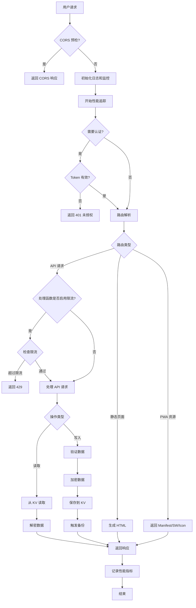
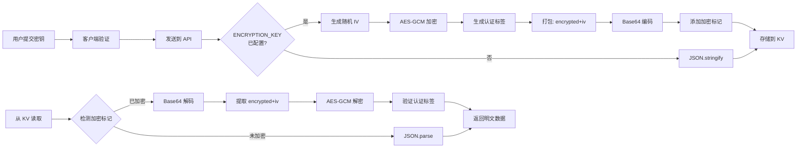
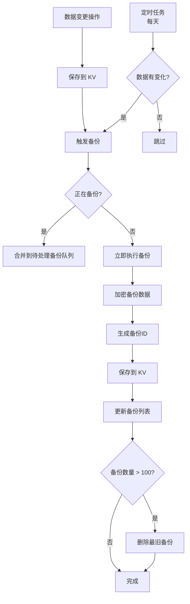

# 🏗️ 项目架构文档

## 📋 目录

- [总体架构](#总体架构)
- [技术栈](#技术栈)
- [代码结构](#代码结构)
- [核心模块详解](#核心模块详解)
- [数据流](#数据流)
- [前端架构](#前端架构)
- [设计模式](#设计模式)

---

## 总体架构

### 三层架构

```
┌─────────────────────────────────────────────────────┐
│                   用户层                             │
│   浏览器 / PWA / 移动设备                            │
└──────────────────┬──────────────────────────────────┘
                   │ HTTPS
                   ▼
┌─────────────────────────────────────────────────────┐
│              Cloudflare Edge                        │
│   CDN + DDoS 保护 + SSL + 全球分布                  │
└──────────────────┬──────────────────────────────────┘
                   │
                   ▼
┌─────────────────────────────────────────────────────┐
│          Cloudflare Workers（应用层）                │
│  ┌─────────────┐  ┌─────────────┐  ┌────────────┐ │
│  │  路由处理   │  │  API服务    │  │  UI渲染    │ │
│  └─────────────┘  └─────────────┘  └────────────┘ │
│  ┌─────────────┐  ┌─────────────┐  ┌────────────┐ │
│  │  认证系统   │  │  加密系统   │  │  监控系统  │ │
│  └─────────────┘  └─────────────┘  └────────────┘ │
└──────────────────┬──────────────────────────────────┘
                   │
                   ▼
┌─────────────────────────────────────────────────────┐
│        Cloudflare KV（数据存储层）                   │
│   全球分布式键值存储 + 自动加密 + 低延迟             │
└─────────────────────────────────────────────────────┘
```

### 核心特性

- **无服务器架构**: 基于 Cloudflare Workers，无需维护服务器
- **全球分布**: 在全球 300+ 个城市的边缘节点上运行
- **高可用性**: 自动故障转移和负载均衡
- **低延迟**: 就近服务，平均响应时间 < 50ms
- **自动扩展**: 根据流量自动扩缩容
- **零冷启动**: V8 隔离技术，无冷启动延迟

---

## 技术栈

### 后端

| 技术                   | 用途       | 版本      |
| ---------------------- | ---------- | --------- |
| **Cloudflare Workers** | 运行时环境 | V8 Engine |
| **ES Modules**         | 模块系统   | ES2022    |
| **Web Crypto API**     | 加密操作   | 标准 API  |
| **Cloudflare KV**      | 数据存储   | -         |

### 前端

| 技术                    | 用途       | 说明                      |
| ----------------------- | ---------- | ------------------------- |
| **HTML5**               | 页面结构   | 语义化标签                |
| **CSS3**                | 样式系统   | 模块化 CSS                |
| **JavaScript (ES2022)** | 交互逻辑   | 原生 JS，无框架           |
| **PWA**                 | 应用增强   | Service Worker + Manifest |
| **jsQR**                | 二维码识别 | CDN 引入                  |
| **qrcode-generator**    | 二维码生成 | CDN 引入                  |

### 开发工具

| 工具             | 用途             |
| ---------------- | ---------------- |
| **Wrangler CLI** | 开发和部署工具   |
| **Git**          | 版本控制         |
| **Node.js**      | 构建工具运行环境 |

---

## 代码结构

### 主要目录结构

下图展示主要模块，完整文件清单以 `src/` 目录为准。OTP 的 HMAC 与 Base32 实现在 `otp/generator.js`，数据加密使用 `utils/encryption.js`，密码哈希和 JWT 使用 `utils/auth.js`；加密运算调用 Web Crypto API。

```
src/
├── worker.js                      # 🎯 Worker 主入口
│                                  # - Fetch 事件处理
│                                  # - CORS 处理
│                                  # - 全局错误捕获
│                                  # - 监控系统初始化
│
├── router/
│   └── handler.js                 # 🛣️ 路由处理器
│                                  # - 路径解析和分发
│                                  # - 认证检查
│                                  # - API 路由映射
│
├── api/
│   ├── secrets/                   # 🔌 密钥管理 API（模块化）
│   │   ├── index.js              # 统一导出（Barrel Export）
│   │   ├── shared.js             # 共享工具（saveSecretsToKV, getAllSecrets）
│   │   ├── crud.js               # CRUD 操作
│   │   ├── batch.js              # 批量导入
│   │   ├── backup.js             # 备份创建和列表
│   │   ├── restore.js            # 备份恢复和导出
│   │   └── otp.js                # OTP 生成
│   └── favicon.js                 # 🌐 Favicon 代理 API
│
├── otp/
│   └── generator.js               # 🔐 OTP 算法实现
│                                  # - TOTP (RFC 6238)
│                                  # - HOTP (RFC 4226)
│                                  # - Base32 编解码
│
├── ui/
│   ├── page.js                    # 🎨 主页面生成
│   │                              # - HTML 结构
│   │                              # - 样式集成
│   │                              # - 脚本集成
│   │
│   ├── quickOtp.js                # 🔢 公开 OTP 输入与验证码页面
│   ├── standalone.js              # 🖥️ 独立页面共享 Fluent 主题
│   ├── offlinePage.js             # 📴 离线兜底页面
│   ├── setupPage.js               # 🔧 首次设置页面
│   ├── dialogIcons.js             # 🧩 对话框 SVG 图标
│   │
│   ├── manifest.js                # 📱 PWA Manifest
│   │                              # - 应用信息
│   │                              # - 图标定义
│   │                              # - 快捷方式
│   │
│   ├── serviceworker.js           # ⚙️ Service Worker
│   │                              # - 缓存策略
│   │                              # - 离线支持
│   │                              # - CDN 资源缓存
│   │
│   ├── scripts/                   # 📜 前端 JavaScript 模块
│   │   ├── index.js              # 模块集成入口
│   │   ├── state.js              # 全局状态管理
│   │   ├── time.js               # 时间校准
│   │   ├── auth.js               # 认证逻辑
│   │   ├── otp.js                # OTP 计算与动效
│   │   ├── ui.js                 # 主题与弹窗交互
│   │   ├── search.js             # 搜索与显示控制
│   │   ├── settings.js           # 设置面板
│   │   ├── core.js               # 核心业务逻辑
│   │   ├── serviceAggregation.js # 服务分组
│   │   ├── utils.js              # 工具函数
│   │   ├── pwa.js                # PWA 功能
│   │   └── moduleLoader.js       # 懒加载模块入口
│   │
│   └── styles/                    # 🎨 前端 CSS 模块
│       ├── index.js              # 样式集成入口
│       ├── variables.js          # 主题变量和过渡
│       ├── base.js               # 基础样式
│       ├── components.js         # 组件样式
│       ├── modals.js             # 模态框样式
│       ├── responsive.js         # 响应式样式
│       ├── progress.js           # 共享进度条常量
│       ├── workspace.js          # Fluent 2 工作区
│       ├── dialogs.js            # Fluent 2 对话框
│       ├── setup.js              # 首次设置页
│       └── backupDocument.js     # HTML 备份文档
│
└── utils/                         # 🛠️ 工具模块
    ├── auth.js                    # 🔑 认证系统
    │                              # - Token 验证
    │                              # - HttpOnly Cookie
    │                              # - 自动刷新
    │
    ├── backup.js                  # 💾 智能备份系统
    │                              # - 事件驱动备份
    │                              # - 并发合并 / 后台执行
    │                              # - 自动清理
    │
    ├── constants.js               # 📋 常量定义
    │                              # - KV 键名
    │                              # - 配置常量
    │
    ├── encryption.js              # 🔒 数据加密
    │                              # - AES-GCM 256
    │                              # - 密钥派生
    │                              # - 自动加解密
    │
    ├── errors.js                  # ❌ 统一错误分类
    │                              # - 自定义错误类
    │                              # - 错误处理和响应格式
    │
    ├── logger.js                  # 📝 日志系统
    │                              # - 结构化日志
    │                              # - 性能计时
    │                              # - 日志级别
    │
    ├── monitoring.js              # 📊 监控系统
    │                              # - 错误追踪
    │                              # - 性能监控
    │
    ├── rateLimit.js               # 🛡️ 请求限流
    │                              # - 滑动窗口算法
    │                              # - 可配置策略
    │                              # - 基于 KV 存储
    │
    ├── response.js                # 📡 响应工具
    │                              # - 标准化响应格式
    │                              # - CORS 头处理
    │
    ├── security.js                # 🔒 安全工具
    │                              # - CORS 配置
    │                              # - CSP 头
    │                              # - 预检请求
    │
    └── validation.js              # ✅ 数据验证
                                   # - Base32 验证
                                   # - 输入校验
                                   # - 业务规则检查
```

---

## 核心模块详解

### 1. Worker 主入口 (`worker.js`)

**职责**: Cloudflare Worker 的入口点，处理所有传入请求

**核心功能**:

```javascript
export default {
	async fetch(request, env, ctx) {
		// 1. 初始化日志和监控
		// 2. 处理 CORS 预检请求
		// 3. 开始请求追踪
		// 4. 调用路由处理器
		// 5. 记录响应和性能指标
		// 6. 全局错误处理
	},

	async scheduled(event, env, ctx) {
		// 定时任务：自动备份（每天）
	},
};
```

**集成的系统**:

- 日志系统 (`logger.js`)
- 监控系统 (`monitoring.js`)
- 路由处理 (`router/handler.js`)
- CORS 处理 (`utils/security.js`)

---

### 2. 路由处理器 (`router/handler.js`)

**职责**: 解析 URL 路径并分发到对应的处理函数

**路由表**:

| 路由                       | 方法   | 处理器                    | 认证 |
| -------------------------- | ------ | ------------------------- | ---- |
| `/`                        | GET    | `createMainPage()`        | ❌   |
| `/setup`                   | GET    | `createSetupPage()`       | ❌   |
| `/manifest.json`           | GET    | `createManifest()`        | ❌   |
| `/sw.js`                   | GET    | `createServiceWorker()`   | ❌   |
| `/icon-*.png`              | GET    | `createDefaultIcon()`     | ❌   |
| `/modules/{name}`          | GET    | `getModuleCode()`         | ✅   |
| `/api/setup`               | POST   | `handleFirstTimeSetup()`  | ❌   |
| `/api/login`               | POST   | `handleLogin()`           | ❌   |
| `/api/refresh-token`       | POST   | `handleRefreshToken()`    | ✅   |
| `/api/secrets`             | GET    | `handleGetSecrets()`      | ✅   |
| `/api/secrets`             | POST   | `handleAddSecret()`       | ✅   |
| `/api/secrets/{id}`        | PUT    | `handleUpdateSecret()`    | ✅   |
| `/api/secrets/{id}`        | DELETE | `handleDeleteSecret()`    | ✅   |
| `/api/secrets/batch`       | POST   | `handleBatchAddSecrets()` | ✅   |
| `/api/secrets/export`      | POST   | `handleExportSecrets()`   | ✅   |
| `/api/backup`              | GET    | `handleGetBackups()`      | ✅   |
| `/api/backup`              | POST   | `handleBackupSecrets()`   | ✅   |
| `/api/backup/restore`      | POST   | `handleRestoreBackup()`   | ✅   |
| `/api/backup/export/{key}` | GET    | `handleExportBackup()`    | ✅   |
| `/api/favicon/{domain}`    | GET    | `handleFaviconProxy()`    | ✅   |
| `/otp/{secret}`            | GET    | `handleGenerateOTP()`     | ❌   |

---

### 3. 密钥管理 API (`api/secrets/`)

**职责**: 处理 2FA 密钥的 CRUD 操作和备份管理

**模块化组织**:

- `shared.js` - 共享工具函数（saveSecretsToKV, getAllSecrets）
- `crud.js` - CRUD 操作（GET/POST/PUT/DELETE）
- `batch.js` - 批量导入
- `backup.js` - 备份创建和列表
- `restore.js` - 备份恢复和导出
- `otp.js` - OTP 生成
- `index.js` - 统一导出（Barrel Export）

**核心功能**:

#### 数据自动加密

```javascript
async function saveSecretsToKV(env, secrets, reason) {
	// 1. 排序密钥
	sortSecretsByName(secrets);

	// 2. 加密数据（如果配置了 ENCRYPTION_KEY）
	const encryptedData = await encryptSecrets(secrets, env);

	// 3. 保存到 KV
	await env.SECRETS_KV.put('secrets', encryptedData);

	// 4. 触发事件驱动备份
	await triggerBackup(secrets, env, { reason });
}
```

#### 请求限流集成

限流由具体处理函数调用。例如删除密钥使用 `getClientIdentifier(request, 'ip')` 得到 key，再调用 `checkRateLimit(key, env, RATE_LIMIT_PRESETS.sensitive)`；新增和读取密钥当前没有显式限流。路由入口没有统一套用 `api` 或 `global` 预设。各端点实际限制及共享计数规则见 [API 参考](API_REFERENCE.md#rate-limiting)。

---

### 4. OTP 生成器 (`otp/generator.js`)

**职责**: 实现 TOTP/HOTP 算法，生成一次性密码

**支持的算法**:

#### TOTP (Time-based OTP) - RFC 6238

```javascript
/**
 * 算法流程:
 * 1. 计算时间计数器 (counter = floor(currentTime / 30))
 * 2. 将 Base32 密钥解码为字节数组
 * 3. 使用 HMAC-SHA1 计算哈希值
 * 4. 动态截断生成 6 位数字 OTP
 */
export async function generateOTP(secret, loadTime, options = {}) {
	const {
		period = 30, // 时间步长（秒）
		digits = 6, // OTP 长度
		algorithm = 'SHA1', // 哈希算法
		type = 'TOTP',
	} = options;

	const timeForCalculation = loadTime || Math.floor(Date.now() / 1000);
	const counter = type === 'HOTP' ? options.counter || 0 : Math.floor(timeForCalculation / period);
	return await generateHOTP(secret, counter, { digits, algorithm });
}
```

#### HOTP (HMAC-based OTP) - RFC 4226

```javascript
export async function generateHOTP(secret, counter, options = {}) {
	// 1. Base32 解码
	const key = base32Decode(secret);

	// 2. 计数器转字节数组
	const counterBytes = new ArrayBuffer(8);
	const view = new DataView(counterBytes);
	view.setUint32(4, counter, false); // 大端序

	// 3. HMAC-SHA1
	const hmac = await crypto.subtle.sign('HMAC', key, counterBytes);

	// 4. 动态截断
	const offset = hmac[hmac.length - 1] & 0x0f;
	const binary =
		((hmac[offset] & 0x7f) << 24) | ((hmac[offset + 1] & 0xff) << 16) | ((hmac[offset + 2] & 0xff) << 8) | (hmac[offset + 3] & 0xff);

	// 5. 生成 OTP
	const otp = binary % Math.pow(10, digits);
	return otp.toString().padStart(digits, '0');
}
```

---

### 5. 认证系统 (`utils/auth.js`)

**职责**: 管理用户身份认证和授权

**架构设计**:

```
┌───────────┐     登录请求      ┌───────────┐
│  浏览器   │ ──────────────→  │  Worker   │
└───────────┘                  └─────┬─────┘
      ↑                              │
      │                              ▼
      │                    验证密码（KV存储）
      │                              │
      │                              ▼
      │  Set-Cookie:             生成 JWT
      │  auth_token=...             │
      │  HttpOnly; Secure           │
      │  ←───────────────────────────┘
      │
      │     后续请求（自动携带 Cookie）
      │  ──────────────────────────────→
      │
      │     验证 JWT + 自动刷新
      │  ←──────────────────────────────
```

**核心功能**:

#### HttpOnly Cookie 认证

```javascript
// 生成认证 Cookie
function createAuthCookie(token, expiresAt) {
	const maxAge = Math.floor((expiresAt - Date.now()) / 1000);

	return [
		`auth_token=${token}`,
		'HttpOnly', // 防止 XSS
		'Secure', // 仅 HTTPS
		'SameSite=Strict', // 防止 CSRF
		`Max-Age=${maxAge}`,
		'Path=/',
	].join('; ');
}
```

#### Token 自动刷新

```javascript
export async function handleRefreshToken(request, env) {
	// 1. 验证当前 Token
	const currentToken = extractTokenFromCookie(request);
	if (!isValidToken(currentToken)) {
		return createUnauthorizedResponse();
	}

	// 2. 生成新 Token
	const newToken = await generateJWT({
		iat: Math.floor(Date.now() / 1000),
		exp: Math.floor(Date.now() / 1000) + 7 * 24 * 60 * 60, // 7天
	});

	// 3. 设置新 Cookie
	return new Response(JSON.stringify({ success: true }), {
		headers: {
			'Set-Cookie': createAuthCookie(newToken, Date.now() + 7 * 24 * 60 * 60 * 1000),
			'Content-Type': 'application/json',
		},
	});
}
```

---

### 6. 加密系统 (`utils/encryption.js`)

**职责**: 使用 AES-GCM 256 位加密保护敏感数据

**加密流程**:

```
明文数据 → JSON.stringify → UTF-8 编码
    ↓
生成随机 IV (96 bits)
    ↓
AES-GCM 256 加密
    ↓
认证标签 (128 bits)
    ↓
{encrypted: base64(密文), iv: base64(IV)}
    ↓
JSON.stringify → Base64 编码
    ↓
存储到 KV
```

**核心实现**:

```javascript
export async function encryptData(data, env) {
	// 1. 检查是否配置了加密密钥
	if (!env.ENCRYPTION_KEY) {
		// 未配置密钥，返回明文
		return typeof data === 'string' ? data : JSON.stringify(data);
	}

	// 2. 导入加密密钥
	const keyBuffer = base64ToArrayBuffer(env.ENCRYPTION_KEY);
	const key = await crypto.subtle.importKey('raw', keyBuffer, { name: 'AES-GCM' }, false, ['encrypt']);

	// 3. 生成随机 IV
	const iv = crypto.getRandomValues(new Uint8Array(12));

	// 4. 加密数据
	const plaintext = new TextEncoder().encode(typeof data === 'string' ? data : JSON.stringify(data));

	const ciphertext = await crypto.subtle.encrypt({ name: 'AES-GCM', iv }, key, plaintext);

	// 5. 打包加密结果
	const encrypted = {
		encrypted: arrayBufferToBase64(ciphertext),
		iv: arrayBufferToBase64(iv.buffer),
	};

	// 6. 添加加密标记并返回
	return `__ENCRYPTED__${btoa(JSON.stringify(encrypted))}`;
}
```

**自动检测和解密**:

```javascript
export async function decryptSecrets(data, env) {
	if (!data) return [];

	// 检查是否已加密
	if (isEncrypted(data)) {
		// 数据已加密，需要解密
		if (!env.ENCRYPTION_KEY) {
			console.error('数据已加密但未配置 ENCRYPTION_KEY');
			return [];
		}
		return await decryptData(data, env);
	} else {
		// 数据未加密（明文或旧数据）
		try {
			return JSON.parse(data);
		} catch (error) {
			console.error('解析数据失败:', error);
			return [];
		}
	}
}
```

---

### 7. 备份系统 (`utils/backup.js`)

**职责**: 实现智能备份策略，防止数据丢失

**备份策略**:

#### 1. 事件驱动备份

```
用户操作 → 数据变更 → 触发备份
    ↓
如有请求上下文则转入 waitUntil 后台执行
    ↓
执行备份 → 加密 → 存储到 KV
    ↓
自动清理 (保留最新100个)
```

#### 2. 定时备份（兜底）

```
Cron 触发 (每天)
    ↓
检查数据是否变化
    ↓
如果变化 → 执行备份
```

**核心实现**:

```javascript
class BackupManager {
	constructor(env) {
		this.env = env;
		this.logger = getLogger(env);
		this.backupInProgress = false;
		this.pendingBackups = [];
	}

	/**
	 * 触发备份（支持并发合并）
	 */
	async triggerBackup(secrets, options = {}) {
		const { immediate = false, reason = 'event-driven', ctx } = options;

		if (this.backupInProgress) {
			this.pendingBackups.push({ secrets, reason, ctx, immediate });
			return { queued: true };
		}

		return this.executeBackup(secrets, reason, ctx, { immediate });
	}

	/**
	 * 执行备份
	 */
	async executeBackup(secrets, reason, ctx) {
		this.backupInProgress = true;

		try {
			const backupEntry = await createBackupEntry(secrets, this.env, {
				format: await resolveConfiguredBackupFormat(this.env, this.logger),
				reason,
			});

			await putBackupRecord(this.env, backupEntry.backupKey, backupEntry.backupContent, backupEntry.metadata);
			ctx?.waitUntil?.(pushToAllWebDAV(backupEntry.backupKey, backupEntry.backupContent, this.env));
			ctx?.waitUntil?.(pushToAllS3(backupEntry.backupKey, backupEntry.backupContent, this.env));
			ctx?.waitUntil?.(pushToAllOneDrive(backupEntry.backupKey, backupEntry.backupContent, this.env));
			ctx?.waitUntil?.(pushToAllGoogleDrive(backupEntry.backupKey, backupEntry.backupContent, this.env));
			await this._cleanupOldBackupsAsync();
			return { success: true, backupKey: backupEntry.backupKey, format: backupEntry.format };
		} catch (error) {
			this.logger.error('❌ 备份失败', { reason }, error);
			throw error;
		} finally {
			this.backupInProgress = false;
		}
	}

	/**
	 * 清理旧备份
	 */
	async _cleanupOldBackupsAsync() {
		const list = await this.env.SECRETS_KV.list({ prefix: 'backup_' });
		const backups = list.keys;

		if (backups.length > MAX_BACKUPS) {
			// 按时间排序，删除最旧的备份
			const toDelete = backups.sort((a, b) => a.name.localeCompare(b.name)).slice(0, backups.length - MAX_BACKUPS);

			for (const backup of toDelete) {
				await this.env.SECRETS_KV.delete(backup.name);
			}

			this.logger.info(`🗑️ 已清理 ${toDelete.length} 个旧备份`);
		}
	}
}
```

---

### 8. 监控系统 (`utils/logger.js` + `utils/monitoring.js`)

**职责**: 提供结构化日志和错误追踪

**日志系统架构**:

```
┌───────────────┐
│  Logger API   │
│  (logger.js)  │
└───────┬───────┘
        │
        ├─→ Console (开发环境)
        └─→ Cloudflare Analytics
```

**核心功能**:

#### 结构化日志

```javascript
class Logger {
	constructor(env, context = {}) {
		this.env = env;
		this.context = context;
		this.level = env.LOG_LEVEL || 'INFO';
	}

	info(message, meta = {}) {
		this._log('INFO', message, meta);
	}

	error(message, meta = {}, error = null) {
		this._log('ERROR', message, { ...meta, error: error?.stack });

		// 同时发送到错误监控
		if (error) {
			monitoring.captureError(error, meta, ErrorSeverity.ERROR);
		}
	}

	_log(level, message, meta) {
		if (!this._shouldLog(level)) return;

		const logEntry = {
			level,
			message,
			timestamp: new Date().toISOString(),
			context: this.context,
			meta,
		};

		console.log(JSON.stringify(logEntry));
	}
}
```

#### 性能计时

```javascript
class PerformanceTimer {
	constructor(name, logger) {
		this.name = name;
		this.logger = logger;
		this.startTime = Date.now();
		this.checkpoints = [];
	}

	checkpoint(label) {
		const elapsed = Date.now() - this.startTime;
		this.checkpoints.push({ label, elapsed });
	}

	end(meta = {}) {
		const duration = Date.now() - this.startTime;

		this.logger.info(`⏱️ ${this.name} completed`, {
			duration: `${duration}ms`,
			checkpoints: this.checkpoints,
			...meta,
		});

		// 记录到性能监控
		monitoring.recordMetric(this.name, duration, 'ms', meta);
	}
}
```

---

### 9. 限流系统 (`utils/rateLimit.js`)

**职责**: 为显式调用它的处理函数提供基于 Cloudflare KV 的请求频率限制。

`checkRateLimit` 默认使用滑动窗口，也保留 `algorithm: 'fixed-window'` 的兼容路径。默认路径使用 `ratelimit:v2:<key>` 存储请求时间戳：

1. 从 KV 读取时间戳，过滤掉窗口外的记录。
2. 记录数达到限额时拒绝请求，并以最早记录的过期时刻计算 `resetAt`。
3. 未达到限额时追加当前时间戳并写回 KV，设置过期时间。

允许请求通常需要一次 KV 读取和一次写入。KV 读写不构成原子计数，因此该实现不保证高并发下严格的全局配额；KV 异常时采取 Fail Open，允许请求继续。

**预设策略**:

| 预设          | 配置           |
| ------------- | -------------- |
| `login`       | 5 次 / 60 秒   |
| `loginStrict` | 3 次 / 60 秒   |
| `api`         | 30 次 / 60 秒  |
| `sensitive`   | 10 次 / 60 秒  |
| `bulk`        | 20 次 / 300 秒 |
| `global`      | 100 次 / 60 秒 |

以上是可复用配置，并非所有端点自动继承的规则。实际启用情况由处理函数的调用决定；共享相同 key 的操作也会共享计数记录。详见 [API 限流说明](API_REFERENCE.md#rate-limiting)。

---

## 数据流

### 完整请求处理流程


```mermaid
graph TD
    A[用户请求] --> B{CORS 预检?}
    B -->|是| C[返回 CORS 响应]
    B -->|否| D[初始化日志和监控]
    D --> E[开始性能追踪]
    E --> F{需要认证?}
    F -->|是| G{Token 有效?}
    G -->|否| H[返回 401 未授权]
    G -->|是| I[路由解析]
    F -->|否| I
    I --> J{路由类型}
    J -->|静态页面| K[生成 HTML]
    J -->|API 请求| L{处理函数是否启用限流?}
    J -->|PWA 资源| M[返回 Manifest/SW/Icon]
    L -->|是| L1{检查限流}
    L1 -->|超过限流| N[返回 429]
    L1 -->|通过| O[处理 API 请求]
    L -->|否| O
    O --> P{操作类型}
    P -->|读取| Q[从 KV 读取]
    P -->|写入| R[验证数据]
    Q --> S[解密数据]
    R --> T[加密数据]
    S --> U[返回响应]
    T --> V[保存到 KV]
    V --> W[触发备份]
    W --> U
    K --> U
    M --> U
    U --> X[记录性能指标]
    X --> Y[结束]
```

### 数据加密流程


```mermaid
graph LR
    A[用户提交密钥] --> B[客户端验证]
    B --> C[发送到 API]
    C --> D{ENCRYPTION_KEY<br/>已配置?}
    D -->|是| E[生成随机 IV]
    E --> F[AES-GCM 加密]
    F --> G[生成认证标签]
    G --> H[打包: encrypted+iv]
    H --> I[Base64 编码]
    I --> J[添加加密标记]
    J --> K[存储到 KV]
    D -->|否| L[JSON.stringify]
    L --> K

    K2[从 KV 读取] --> M{检测加密标记}
    M -->|已加密| N[Base64 解码]
    N --> O[提取 encrypted+iv]
    O --> P[AES-GCM 解密]
    P --> Q[验证认证标签]
    Q --> R[返回明文数据]
    M -->|未加密| S[JSON.parse]
    S --> R
```

### 备份触发流程


```mermaid
graph TD
    A[数据变更操作] --> B[保存到 KV]
    B --> C[触发备份]
    C --> D{正在备份?}
    D -->|是| E[合并到待处理备份队列]
    D -->|否| I[立即执行备份]
    I --> J[加密备份数据]
    J --> K[生成备份ID]
    K --> L[保存到 KV]
    L --> M[更新备份列表]
    M --> N{备份数量 > 100?}
    N -->|是| O[删除最旧备份]
    N -->|否| P[完成]
    O --> P

    Q[定时任务<br/>每天] --> R{数据有变化?}
    R -->|是| C
    R -->|否| S[跳过]
```

---

## 前端架构

### 模块化 JavaScript

```
scripts/
├── utils.js / state.js / time.js        # 通用函数、状态与校准时间
├── auth.js / otp.js                     # 认证、OTP 计算与刷新
├── ui.js / search.js / settings.js      # 页面交互、显示控制与设置
├── core.js / serviceAggregation.js      # 密钥业务与服务分组
├── pwa.js / moduleLoader.js             # PWA 与按需模块加载
├── versionCheck.js                      # 版本检查
└── import/ export.js backup.js 等       # 按需加载的功能模块
```

**模块加载流程**:

```
page.js → scripts/index.js
    ├─ utils.js / state.js / time.js
    ├─ auth.js / otp.js
    ├─ ui.js / search.js / settings.js
    ├─ core.js / serviceAggregation.js
    └─ pwa.js / moduleLoader.js / versionCheck.js
         ↓
    inline <script>
         ↓
    页面加载完成执行
```

导入、导出、备份、二维码、Google 迁移和工具模块在默认模式下通过 `/modules/*.js` 按需加载；完整模式由 `scripts/index.js` 按依赖顺序直接拼接。

### 模块化 CSS

```
styles/
├── variables.js      # 主题变量、浅深色配置和切换过渡
│
├── base.js           # 基础样式
│   ├── * { box-sizing, margin, padding }
│   ├── body { font, background }
│   ├── .container
│   ├── .header
│   └── 基础表单与菜单
│
├── components.js     # 组件样式
│   ├── .secret-card
│   ├── .otp-preview
│   ├── .progress-bar
│   ├── .action-menu
│   └── .search-bar
│
├── modals.js         # 模态框样式
│   ├── .modal
│   ├── .modal-content
│   ├── .modal-header
│   ├── .form-group
│   └── .btn-*
│
├── responsive.js     # 响应式样式
│   ├── @media (max-width: 480px)
│   ├── @media (min-width: 481px)
│   └── @media (min-width: 1200px)
│
├── progress.js       # 共享进度条尺寸与渐变常量
├── workspace.js      # Fluent 2 主工作区和卡片
├── dialogs.js        # Fluent 2 对话框与设置页
├── setup.js          # 首次设置页
└── backupDocument.js # HTML 备份/导出文档
```

**样式加载流程**:

```
page.js → styles/index.js
    ├─ import variables.js
    ├─ import base.js
    ├─ import components.js
    ├─ import modals.js
    ├─ import responsive.js
    ├─ import workspace.js
    └─ import dialogs.js
         ↓
    合并为单个 <style> 标签
         ↓
    inline 到 HTML
```

### PWA 架构

#### Service Worker 缓存策略

```
Service Worker (sw.js)
├── Versioned Cache: 2fa-cache-${SW_VERSION}
│   ├── / (主页面离线回退)
│   ├── /manifest.json
│   ├── /icon-192.png / icon-512.png
│   └── 白名单 CDN（首次请求后缓存）
├── IndexedDB: pending-operations
│   └── 支持的离线写操作队列
└── 激活新版本时清理旧缓存
```

**缓存策略**:

- **主页**: Network First，失败时返回缓存或完整离线页
- **Favicon 代理**: Cache First
- **CDN 资源**: 缓存命中后后台更新；首次请求通过 CORS 获取并缓存
- **API 请求**（Favicon 代理除外）: 请求网络，不缓存响应；支持的密钥写操作遇到网络错误时进入离线队列
- **其他同源资源**: Network Only；网络错误时返回 503，无 Service Worker 缓存回退
- **其他外部资源**: Network Only；网络错误时返回空 404，无 Service Worker 缓存回退

**更新机制**:

```text
install  → 预缓存主页、manifest 和图标 → skipWaiting
activate → 删除旧版本缓存 → clients.claim
fetch /  → 请求网络 → 成功则更新缓存 → 失败则缓存/离线页
fetch API → 请求网络 → 支持的写操作失败则保存到 IndexedDB
fetch CDN → 命中缓存立即返回并后台更新；未命中则通过 CORS 获取
```

---

## 设计模式

### 1. 模块化设计 (Modular Design)

**原则**: 每个模块负责单一职责

```
✅ 好的模块设计:
- auth.js: 只处理认证相关逻辑
- encryption.js: 只处理加密解密
- backup.js: 只处理备份逻辑

❌ 不好的设计:
- utils.js: 混杂了认证、加密、备份等所有功能
```

### 2. 依赖注入 (Dependency Injection)

**应用**: 环境变量 (`env`) 通过参数传递

```javascript
// ✅ 好的设计
export async function handleGetSecrets(env) {
	const logger = getLogger(env); // 注入依赖
	const data = await env.SECRETS_KV.get('secrets');
}

// ❌ 不好的设计
let globalEnv;
export function initEnv(env) {
	globalEnv = env;
}
export async function handleGetSecrets() {
	const data = await globalEnv.SECRETS_KV.get('secrets');
}
```

### 3. 工厂模式 (Factory Pattern)

**应用**: 创建响应对象

```javascript
// 工厂函数
export function createJsonResponse(data, status = 200) {
	return new Response(JSON.stringify(data), {
		status,
		headers: {
			'Content-Type': 'application/json',
			...getCORSHeaders(),
		},
	});
}

// 使用
return createJsonResponse({ success: true, data: secrets });
```

### 4. 策略模式 (Strategy Pattern)

**应用**: OTP 算法选择

```javascript
// 策略接口
const OTP_STRATEGIES = {
	totp: generateTOTP,
	hotp: generateHOTP,
};

// 使用策略
export async function generateOTP(secret, type = 'totp', options = {}) {
	const strategy = OTP_STRATEGIES[type];
	if (!strategy) {
		throw new Error(`Unsupported OTP type: ${type}`);
	}
	return await strategy(secret, options);
}
```

### 5. 装饰器模式 (Decorator Pattern)

**应用**: 性能监控包装

```javascript
// 装饰器
function withPerformanceLogging(fn, name) {
	return async function (...args) {
		const timer = new PerformanceTimer(name, logger);
		try {
			const result = await fn(...args);
			timer.end({ success: true });
			return result;
		} catch (error) {
			timer.cancel();
			throw error;
		}
	};
}

// 使用
const handleGetSecrets = withPerformanceLogging(async (env) => {
	// 原始逻辑
}, 'GetSecrets');
```

### 6. 中间件模式 (Middleware Pattern)

**应用**: CORS、认证和日志等横切逻辑与具体业务处理分离。

```text
请求 → CORS / 日志 → 路由与认证 → 具体处理函数 → 响应
                                  └─ 按需检查限流
```

当前路由没有统一的全局限流步骤。限流在具体处理函数中显式执行；`withRateLimit` 提供可选包装器，但不能据此认定所有路由都已接入。

### 7. 观察者模式 (Observer Pattern)

**应用**: 数据变更 → 备份触发

```javascript
// 主题 (Subject)
async function saveSecretsToKV(env, secrets, reason) {
	// 保存数据
	await env.SECRETS_KV.put('secrets', encrypted);

	// 通知观察者
	await triggerBackup(secrets, env, { reason }); // 观察者
}

// 观察者 (Observer)
export async function triggerBackup(secrets, env, options) {
	// 响应数据变更事件
	await backupManager.executeBackup(secrets, options.reason);
}
```

### 8. 单例模式 (Singleton Pattern)

**应用**: 备份管理器、监控系统

```javascript
// 单例模式
let backupManagerInstance = null;

export function getBackupManager(env) {
	if (!backupManagerInstance) {
		backupManagerInstance = new BackupManager(env);
	}
	return backupManagerInstance;
}
```

---

## 性能优化

### 1. 代码优化

- **模块化**: 拆分为小模块，便于维护和缓存
- **懒加载**: Service Worker 按需缓存资源
- **最小化**: 减少不必要的计算和内存使用

### 2. 缓存策略

- **静态资源**: 长期缓存（PWA）
- **CDN 资源**: 缓存优先策略
- **API 响应**: 不缓存（实时数据）

### 3. 数据库优化

- **批量操作**: 一次性读取和写入
- **数据压缩**: 使用加密同时压缩数据
- **索引优化**: 使用有意义的 KV key

### 4. 网络优化

- **全球 CDN**: Cloudflare Edge Network
- **HTTP/2**: 多路复用
- **压缩**: Gzip/Brotli 自动压缩

---

## 安全架构

### 多层安全防护

```
┌────────────────────────────────────────┐
│  1. Cloudflare Edge 层                 │
│     - DDoS 防护                        │
│     - WAF (Web Application Firewall)   │
│     - Bot 管理                         │
└────────────┬───────────────────────────┘
             │
┌────────────▼───────────────────────────┐
│  2. 应用层安全                         │
│     - HttpOnly Cookie 认证             │
│     - CORS 白名单                      │
│     - CSP Header                       │
│     - Rate Limiting                    │
└────────────┬───────────────────────────┘
             │
┌────────────▼───────────────────────────┐
│  3. 数据层安全                         │
│     - AES-GCM 256 位加密               │
│     - Cloudflare Secrets 存储密钥      │
│     - 加密备份                         │
└────────────┬───────────────────────────┘
             │
┌────────────▼───────────────────────────┐
│  4. 监控和审计                         │
│     - 结构化日志                       │
│     - 错误追踪                         │
│     - 性能监控                         │
└────────────────────────────────────────┘
```

---

## 扩展性设计

### 水平扩展

- ✅ 无状态设计：每个请求独立处理
- ✅ 全球分布：自动在边缘节点运行
- ✅ 自动扩缩容：根据流量自动调整

### 功能扩展

- ✅ 插件式架构：新功能作为独立模块添加
- ✅ 策略模式：易于添加新的 OTP 算法
- ✅ 中间件模式：易于添加新的请求处理逻辑

---

## 总结

2FA 采用现代化的无服务器架构，具有以下特点：

| 特性       | 说明                                 |
| ---------- | ------------------------------------ |
| **高性能** | 全球 CDN + 边缘计算，平均响应 < 50ms |
| **高可用** | 99.99% SLA，自动故障转移             |
| **高安全** | 多层安全防护 + AES-256 加密          |
| **易维护** | 模块化设计 + 完整监控                |
| **易扩展** | 无状态 + 插件式架构                  |
| **低成本** | 按需计费 + 免费额度                  |

---

**相关文档**:

- [部署指南](DEPLOYMENT.md) - 如何部署应用
- [API 参考](API_REFERENCE.md) - API 端点文档
- [项目说明](../README.md) - 功能概览与使用指南

---
