# ☁️ 网盘备份配置指南

本文档用于配置：

- `OneDrive` 远程备份
- `Google Drive` 远程备份

本文档面向“自己部署，自己使用”的场景。

> 如果你不打算使用 `OneDrive` / `Google Drive` 备份，可以直接跳过本文档。

目标是两件事：

1. 让你一步一步完成一次性的 OAuth 平台配置
2. 让你后续只需要点“保存并授权”，授权成功后目标会自动启用，立即开始同步

> 📷 **关于文中截图**
>
> 为了截图更具通用性，`Google Cloud Console` 和 `Microsoft Entra` 两处控制台均切换到英文界面后截取。如果你使用的是中文界面，菜单位置完全一致，只是文字显示为中文；每一步操作下方都同时标注了中英文按钮名称，按任一种语言查找都可以。

---

## 一、先理解为什么要分两步

这个功能分成两层：

> 虽然是你自己部署、自己使用，但流程仍然分成两步：
>
> 1. 先完成一次性的 OAuth 应用初始化；
> 2. 再回到站内点击“保存并授权”绑定你自己的网盘帐号。授权成功后目标会自动启用，后续备份自动同步。
>
> 也就是说，这份文档里的平台配置步骤仍然需要做一次，不能直接跳到授权按钮。

### 1. 首次做一次配置

你需要：

- 去 Google / Microsoft 控制台创建授权应用
- 拿到 `客户端 ID` 和 `客户端密钥`
- 填回 Cloudflare Worker

这一步只做一次。

原因是：

- 当前项目不会把 `CLIENT_SECRET` 内置在仓库里
- OAuth 回调地址还需要和你自己的部署域名对应起来

### 2. 后续日常使用

完成上面的一次性配置后，你平时只需要：

1. 打开 `设置 -> 同步设置`
2. 进入 `OneDrive 同步` 或 `Google Drive 同步`
3. 填一个目标名称
4. 点击 `保存并授权`
5. 登录自己的网盘并同意授权
6. 授权成功后目标会自动启用并立即开始同步（如需暂停，在列表里把开关关掉即可）

也就是说：

- **复杂操作只在首次初始化时做一次**
- **后续使用应该尽量像“绑定登录 + 开关控制”一样简单**

---

## 二、开始前先准备好这几个东西

### 1. 你的应用访问地址

例如：

```text
https://your-app.workers.dev
```

或者：

```text
https://2fa.example.com
```

后面会用到两个回调地址：

```text
https://你的应用地址/api/gdrive/oauth/callback
https://你的应用地址/api/onedrive/oauth/callback
```

### 2. Cloudflare 中要配置的变量名

你最终需要配置这 4 个 Secret：

```text
ONEDRIVE_CLIENT_ID
ONEDRIVE_CLIENT_SECRET
GOOGLE_DRIVE_CLIENT_ID
GOOGLE_DRIVE_CLIENT_SECRET
```

可选再加 1 个普通变量：

```text
OAUTH_REDIRECT_BASE_URL
```

它的作用是：

- 如果不填，程序默认使用当前访问域名
- 如果你绑定了自定义域名，建议显式填写

例如：

```text
https://2fa.example.com
```

---

## 三、Google Drive 配置步骤

下面这部分完全按中英文对照写。

### 第 1 步：打开 Google Cloud Console

访问：

https://console.cloud.google.com/

登录后会看到欢迎页，顶部栏显示的就是当前的项目。

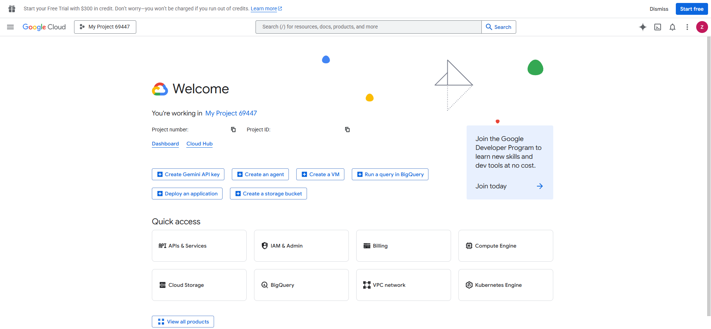

### 第 2 步：创建一个新项目

点击页面顶部的项目选择框（标注位置 1），在弹出的对话框中点击右上角：

```text
新建项目 / New project
```

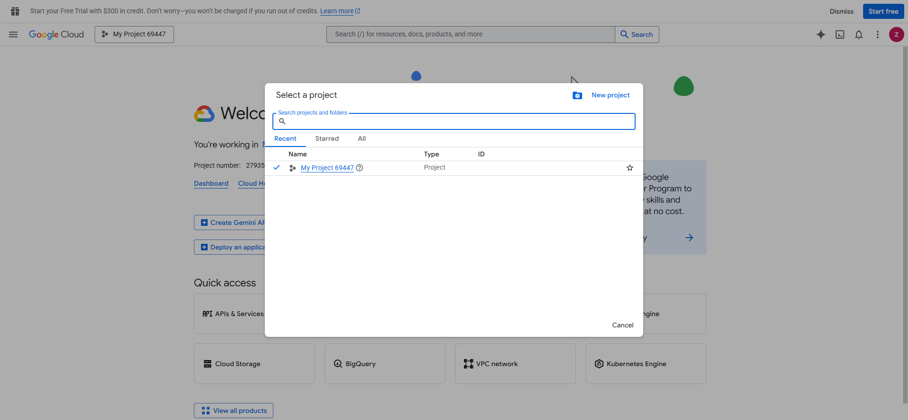

项目名称建议填写：

```text
2FA Backup Google Drive
```

创建完成后，确认顶部显示的当前项目就是它。

### 第 3 步：启用 Google Drive API

左上角打开菜单，进入：

```text
API 和服务 -> 库 / APIs & Services -> Library
```

搜索 `Google Drive API`，打开产品详情页后点击蓝色的：

```text
启用 / Enable
```

按钮。

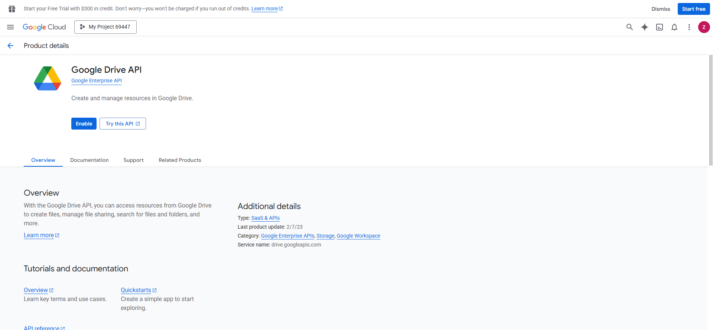

> ⚠️ **这一步不能跳过。** 只创建 OAuth 凭据但没启用 Drive API 的话，授权能成功但调用 Drive 接口时会报错：
>
> ```text
> Google Drive 授权已保存，但自动连接测试失败：Google Drive API 尚未启用。
> 请到 Google Cloud Console 中启用 Google Drive API 后再重试。
> ```

启用成功后页面会跳到 `API/Service Details`，状态显示为 `Enabled`，按钮变成 `Disable API`，就说明 Drive API 已经对你当前的 Google Cloud 项目生效了：

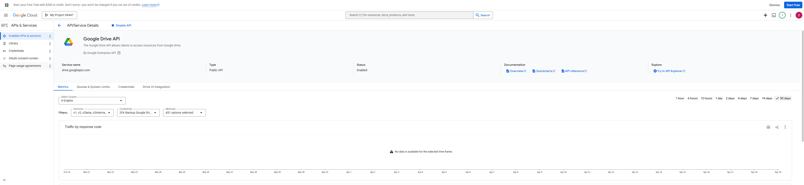

### 第 4 步：进入 OAuth 配置区域（Google Auth Platform）

左侧菜单进入：

```text
Google Auth Platform
```

> 最新版控制台把 `品牌塑造`、`目标对象`、`数据访问` 等步骤整合成一个名叫 **Project configuration** 的一次性向导，实质上还是同一件事，只是步骤被串成了连续的 4 步（App Information → Audience → Contact Information → Finish）。

如果还没有初始化过，你会看到一个醒目的提示 `Google Auth Platform not configured yet`，点击 `Get started` 开始配置。

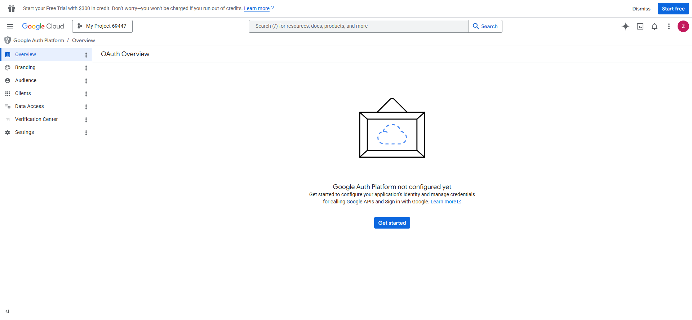

左侧的菜单项依次是：

- `概览 / Overview`
- `品牌塑造 / Branding`
- `目标对象 / Audience`
- `客户端 / Clients`
- `数据访问 / Data Access`

这些就是后面需要轮流打开的页面。

### 第 5 步：配置“品牌塑造”（App Information）

在向导第 1 步里按页面提示填写：

- **应用名称 / App name**：`2FA Backup Google Drive`
- **用户支持邮箱 / User support email**：选你自己的邮箱

填完后点击 `Next`。

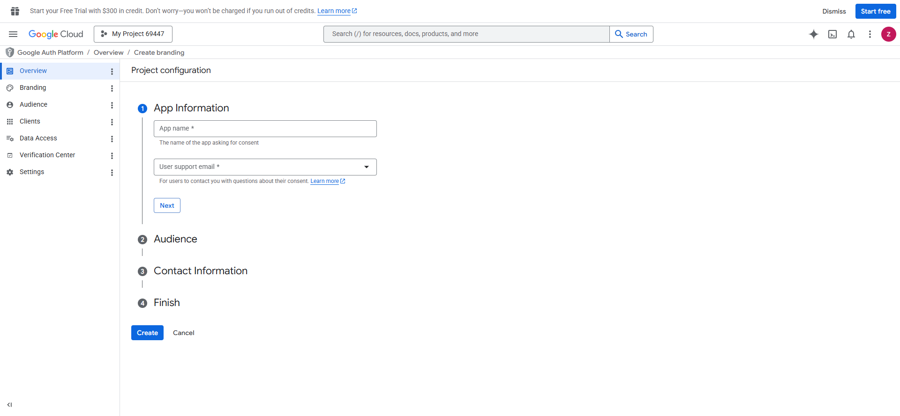

### 第 6 步：配置“目标对象”（Audience）

进入向导第 2 步。选择：

```text
外部 / External
```

原因：

- 个人 Gmail 账号可以使用
- 这是个人自部署、自用场景下最合适的用户类型

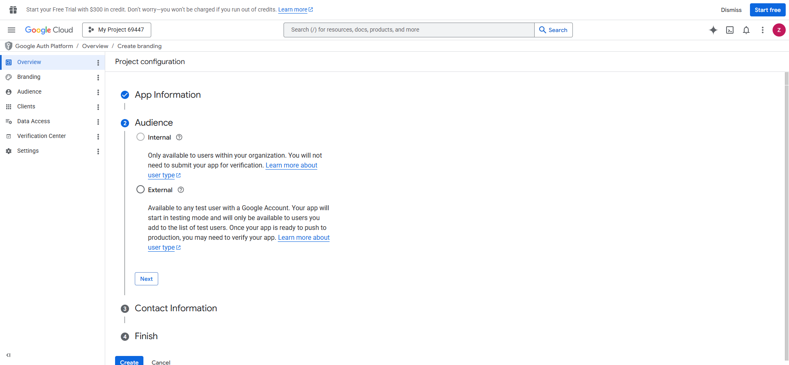

### 第 6.5 步：把应用切到“正式版 / In production”（**必做**）

> ⚠️ **这一步是必做的，不是可选项。** wizard 完成后默认发布状态是 `Testing`。在 `Testing` 状态下，只有你手动加入「测试用户 / Test users」名单里的邮箱能完成授权；其它 Google 帐号（包括你自己，如果没加入名单）都会被 Google 直接拦下，页面会显示：
>
> ```text
> Access blocked: <你的域名> has not completed the Google verification process
> Error 403: access_denied
> ```

wizard 关闭后，回到左侧菜单点击 `Audience / 目标对象` 打开它本身的页面（这是独立页面，不是 wizard 里的那一步）。你会看到：

- `Publishing status / 发布状态` ＝ `Testing`
- 右侧一个蓝色的 `Publish app / 发布应用` 按钮

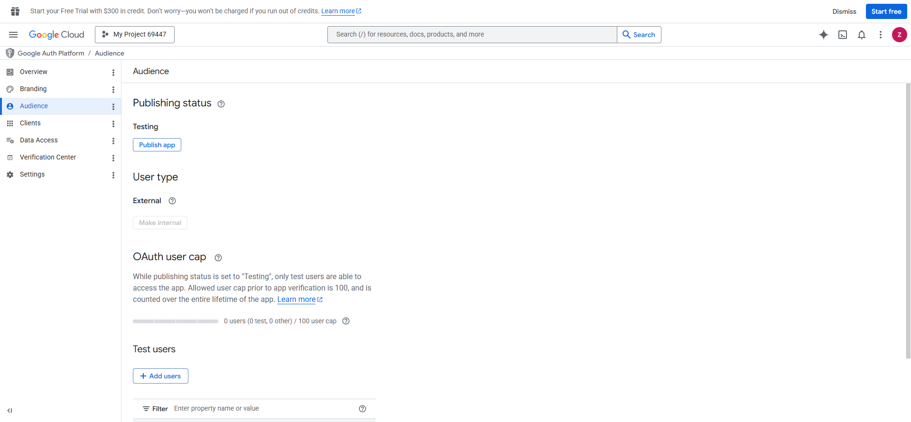

点击 `Publish app`，弹出 `Push to production? / 推送到正式版？` 确认框，直接点 `Confirm / 确认`：

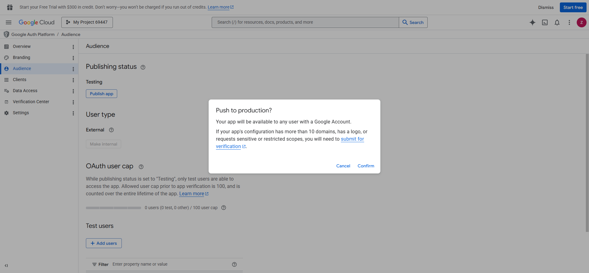

确认后，`Publishing status` 会切成 `In production`，按钮变成 `Back to testing`：

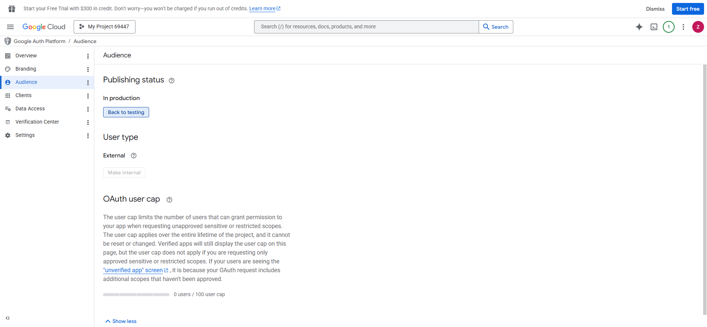

> **个人自用 + 只请求 `drive.file` / `userinfo.email` / `userinfo.profile` 这 3 个范围时：**
>
> - 不需要提交 Google 官方验证（verification）。
> - 第一次授权时可能会看到“未验证应用 / App not verified”的中间页；点左下角 `高级 / Advanced → 前往 <你的应用名>（不安全）/ Go to <app name> (unsafe)` 继续即可。
> - 该路径完全够用于自部署、自己给自己授权的场景，不会影响 refresh token 的长期有效性。

> **如果你出于特殊原因必须停留在 `Testing`：** 需要手动把自己的 Google 邮箱加入 `Test users`：
>
> 1. 在 `Audience` 页面找到 `测试用户 / Test users`
> 2. 点击 `添加用户 / Add users`
> 3. 输入你自己的 Google 邮箱后保存
>
> 否则授权就会抛 `access_denied`。但自用场景下首选仍是 `Publish app → In production`，不必留在 Testing。

### 第 7 步：配置“数据访问”（Data Access / Scopes）

向导结束后左侧进入：

```text
数据访问 / Data Access
```

页面主表格分成 `非敏感范围`、`敏感范围`、`受限范围` 三块，默认为空：

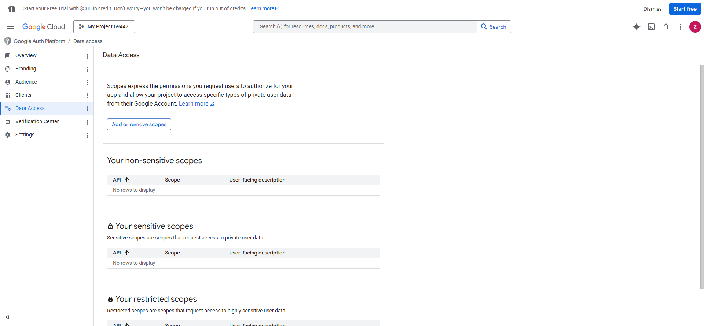

点击右上角的：

```text
添加或移除范围 / Add or remove scopes
```

在弹出的 `Update selected scopes` 对话框里把这 3 个范围加进去：

```text
https://www.googleapis.com/auth/drive.file
https://www.googleapis.com/auth/userinfo.email
https://www.googleapis.com/auth/userinfo.profile
```

对话框里可以用过滤器搜索，也可以拉到最下面的 `Manually add scopes` 文本框中直接粘贴以上 3 条 URL。

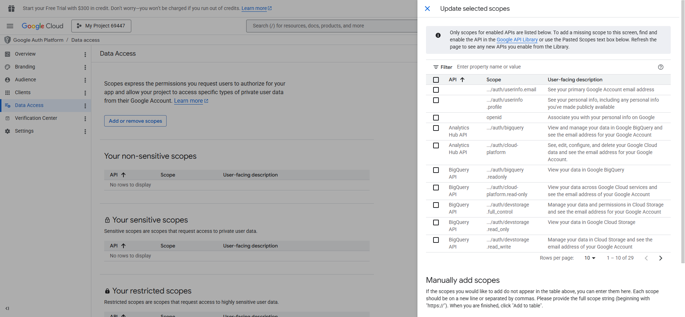

说明：

- `drive.file`：让应用可以写入和管理它自己创建的备份文件
- `userinfo.email`：读取邮箱地址
- `userinfo.profile`：读取基本账号信息

额外说明：

- 页面里填写的 `备份目录`，应理解为应用会在自己的可管理范围内自动创建并维护的目录路径。
- 不要把它理解成“可直接复用你网盘里任意一个现有目录”；为了避免权限和可见性问题，建议为本应用单独使用一个专用目录。

加完后点击：

```text
更新 / Update
```

然后再点击页面里的：

```text
保存 / Save
```

### 第 8 步：创建客户端（Create OAuth client）

点击左侧：

```text
客户端 / Clients
```

然后点击：

```text
创建 OAuth 客户端 / Create OAuth client
```

在 `Application type` 下拉里选择：

```text
Web 应用 / Web application
```

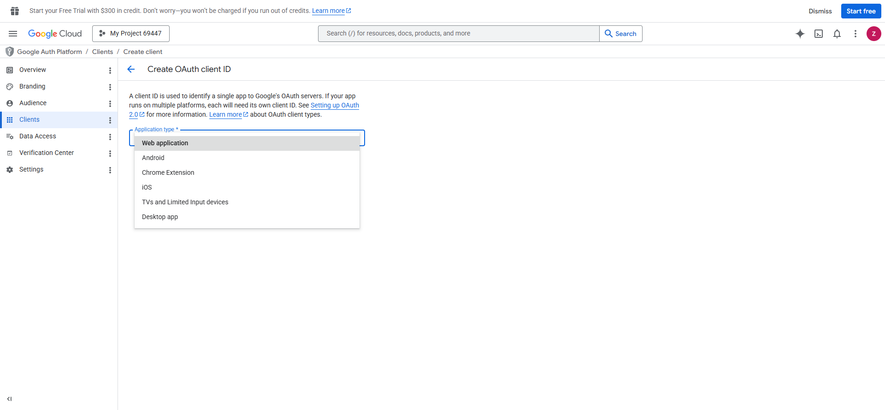

名称建议填写：

```text
2FA Backup Google Drive Web
```

### 第 9 步：填写 Google Drive 回调地址

在 `已获授权的重定向 URI / Authorized redirect URIs` 区域点击 `Add URI` 并填入：

```text
https://你的应用地址/api/gdrive/oauth/callback
```

例如：

```text
https://your-app.workers.dev/api/gdrive/oauth/callback
```

或者：

```text
https://2fa.example.com/api/gdrive/oauth/callback
```

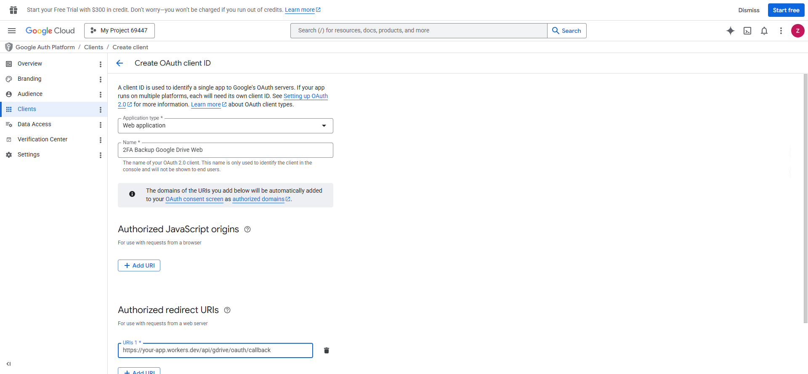

然后点击底部 `Create` 创建。

### 第 10 步：复制客户端信息

创建完成后，会弹出 `OAuth client created` 对话框，里面会显示 `Client ID`：

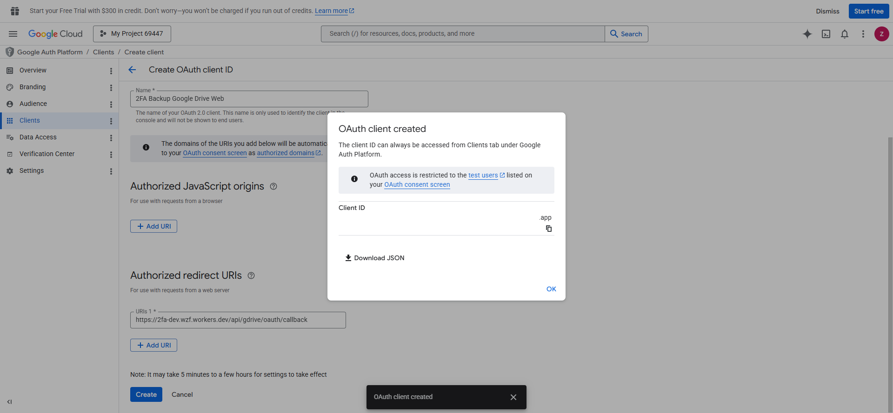

想要同时查看 `Client secret`（密钥），关闭该弹窗后点击刚创建的客户端名称，在详情页右下角的 `Additional information` 和 `Client secrets` 区块中可以看到完整信息，`Client secret` 右侧有一键复制按钮：

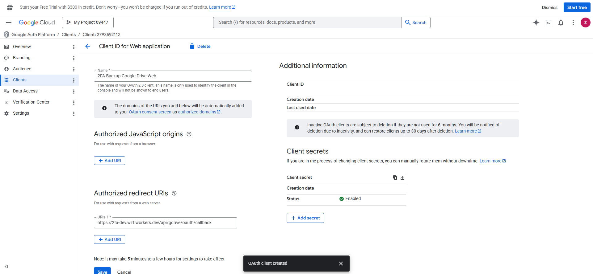

把它们保存下来。分别对应：

```text
GOOGLE_DRIVE_CLIENT_ID
GOOGLE_DRIVE_CLIENT_SECRET
```

---

## 四、OneDrive 配置步骤

下面这部分是给 Microsoft / OneDrive 用的。

### 第 1 步：打开 Microsoft Entra 管理中心

访问：

https://entra.microsoft.com/

登录后进入首页，界面顶部显示当前的租户和帐户信息。

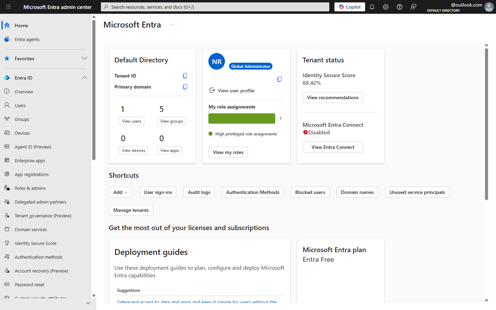

> 注意：
>
> - `entra.microsoft.com` 是 Microsoft Entra 的租户管理后台，不是普通的个人 OneDrive 登录页。
> - 如果你用的是 `outlook.com` / `hotmail.com` / `live.com` 这类个人 Microsoft 帐号，并且打开后直接报 `AADSTS16000` 或“`user account from identity provider 'live.com' does not exist in tenant`”，通常表示这个帐号当前没有可管理的 Entra 租户。
> - 解决办法通常是二选一：
>   1. 改用已有 Microsoft 365 / Azure / 工作或学校租户的帐号登录；
>   2. 或先去 `https://portal.azure.com/` 创建一个 Microsoft Entra 租户，再回到这里注册应用。
> - 如果浏览器自动带入了错误帐号，先退出当前所有 Microsoft 登录状态，或使用无痕窗口重新登录。

### 第 2 步：进入应用注册（App registrations）

左侧进入：

```text
Microsoft Entra ID -> 应用注册 / App registrations
```

点击顶部的：

```text
新注册 / New registration
```

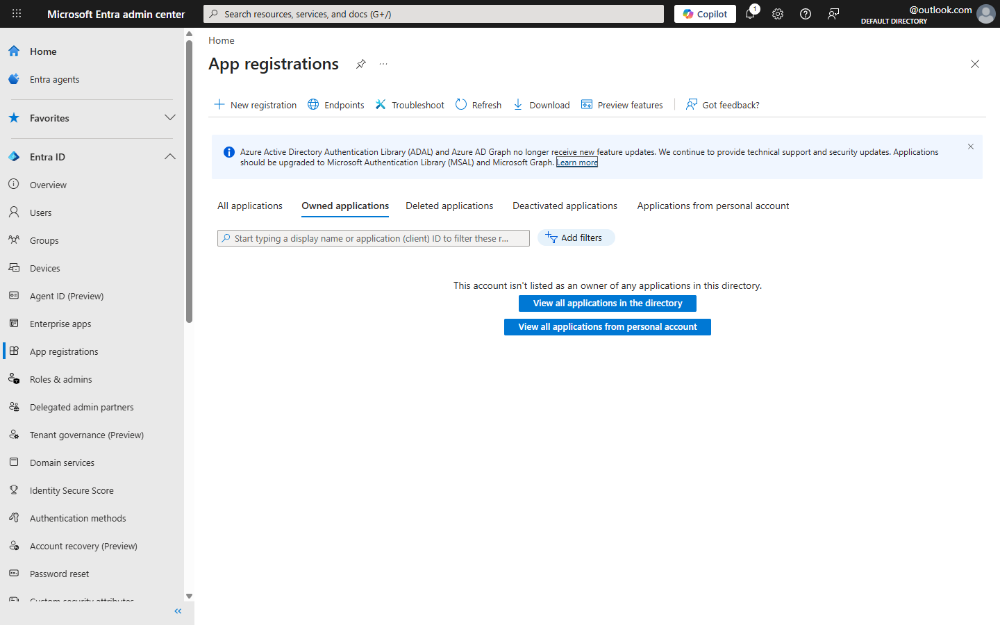

### 第 3 步：创建应用

建议填写：

- 名称 / Name：`2FA Backup OneDrive`

支持的帐户类型建议选择：

```text
任何组织目录中的帐户以及个人 Microsoft 帐户
/ Accounts in any organizational directory (Any Microsoft Entra ID tenant - Multitenant) and personal Microsoft accounts
```

原因：

- 当前项目实现使用通用授权端点
- 这样个人 OneDrive 和工作/学校 OneDrive 都更容易兼容

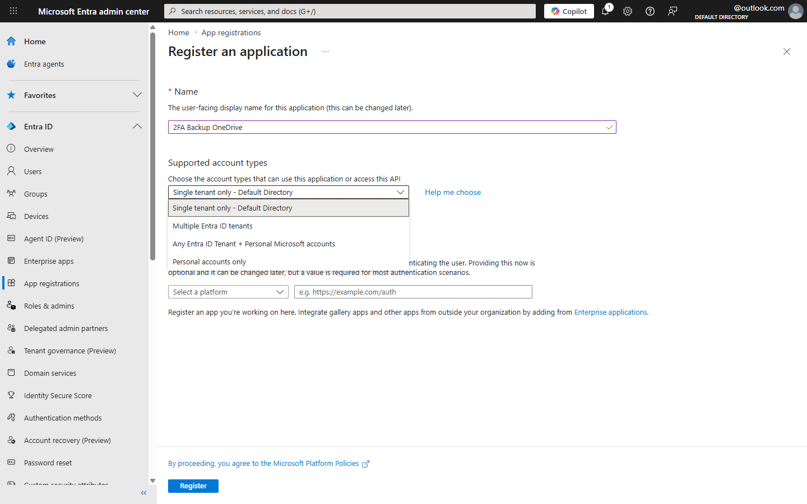

然后点击注册 / Register。

### 第 4 步：复制客户端 ID（Application (client) ID）

创建完成后，在概览页找到：

```text
应用程序(客户端) ID / Application (client) ID
```

页面结构：`Essentials` 卡片里会依次显示 `Display name`、`Application (client) ID`、`Object ID`、`Directory (tenant) ID` 等字段，每个字段右侧有一键复制按钮。把 `Application (client) ID` 那一行的值复制下来。

它对应：

```text
ONEDRIVE_CLIENT_ID
```

> 此步截图会直接暴露 `client/tenant ID` 与个人账号邮箱，文档里不再附图，防止误推到仓库。按页面上的位置找 `Application (client) ID` 一栏即可。

### 第 5 步：配置身份验证（Authentication）

左侧进入：

```text
Authentication (Preview)
```

在新版 Entra 界面中，保持停留在：

```text
重定向 URI 配置 / Redirect URI configuration
```

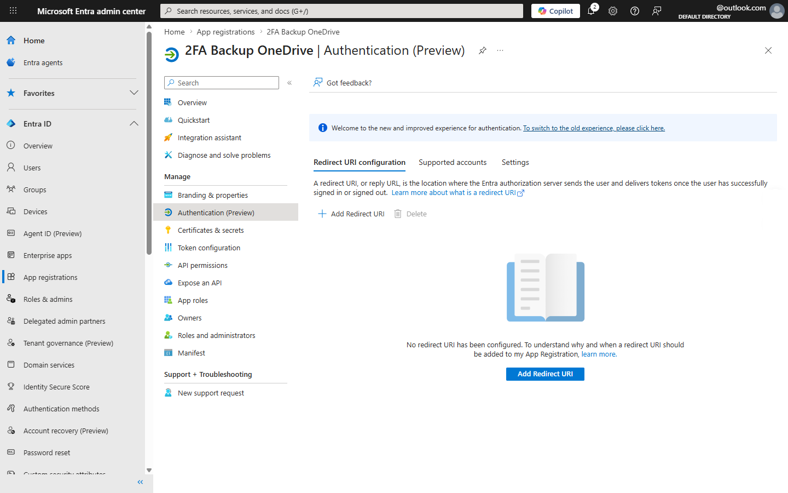

然后点击：

```text
添加重定向 URI / Add Redirect URI
```

### 第 6 步：填写 OneDrive 回调地址

右侧会弹出 `Select a platform to add redirect URI` 侧栏。

在 `Web applications` 区域选择：

```text
Web
```

> 不要选择 `单页应用程序 / Single-page application`（SPA）。

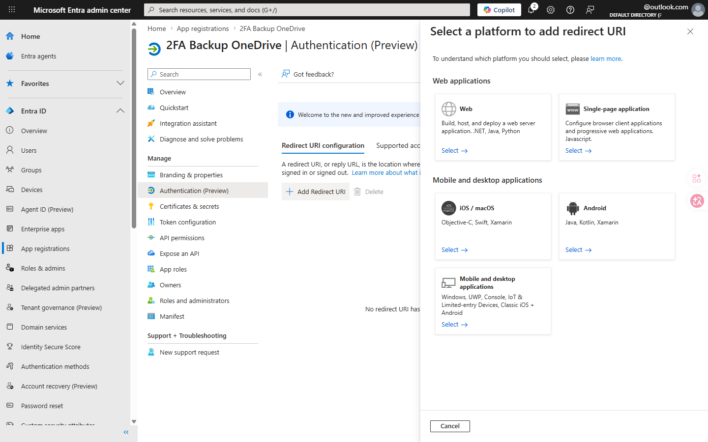

在重定向 URI 输入框中填写：

```text
https://你的应用地址/api/onedrive/oauth/callback
```

例如：

```text
https://your-app.workers.dev/api/onedrive/oauth/callback
```

或者：

```text
https://2fa.example.com/api/onedrive/oauth/callback
```

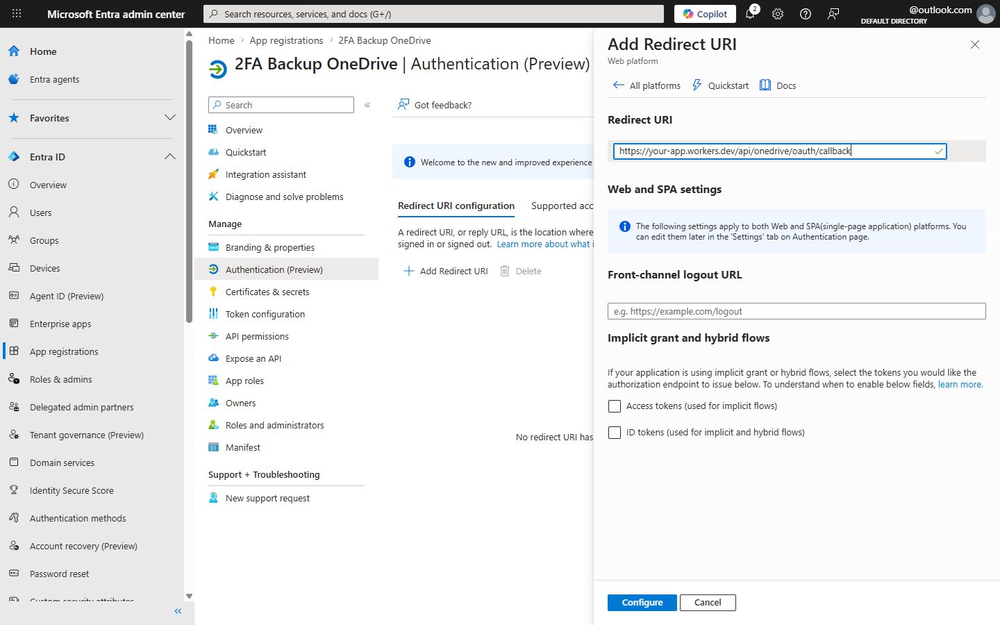

填写后点击 `Configure` 保存。

> 如果你看到的是旧版界面，也可以按旧流程操作：`身份验证 -> 添加平台 -> Web`。

### 第 7 步：配置 API 权限（API permissions）

左侧进入：

```text
API 权限 / API permissions
```

点击 `Add a permission`，选择 `Microsoft Graph`，然后选择 `委托的权限 / Delegated permissions`。

页面默认会已经带有一个 `User.Read`，再额外添加：

```text
Files.ReadWrite.AppFolder
```

如果页面里能找到 `offline_access`，也一并加上。

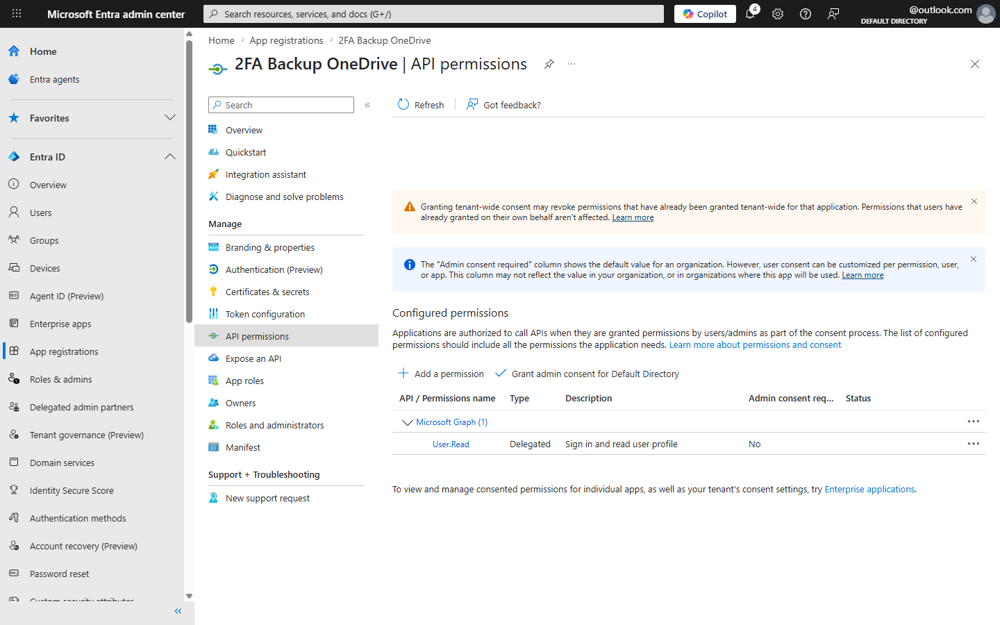

说明：

- `Files.ReadWrite.AppFolder`：允许把备份写到 OneDrive 应用专用目录
- `User.Read`：读取基本账户信息

### 第 8 步：企业账号可能需要管理员同意

如果你使用的是公司或学校账号，后面授权时可能提示需要管理员批准。

这种情况可以回到 `API 权限 / API permissions`，点击：

```text
授予管理员同意 / Grant admin consent
```

> 个人 Microsoft 帐号（`outlook.com` / `hotmail.com`）或自建的个人租户一般不会触发这一步，可以直接跳过。

如果你没有管理员权限，就需要让管理员来操作。

### 第 9 步：创建客户端密钥（Client secrets）

左侧进入：

```text
证书和密码 / Certificates & secrets
```

切换到 `客户端密码 / Client secrets` 选项卡，点击：

```text
新建客户端密码 / New client secret
```

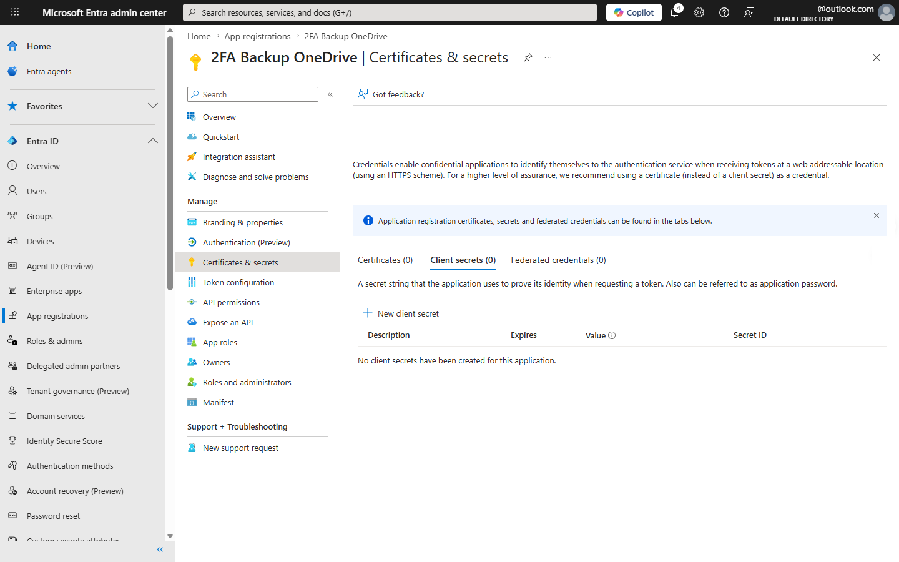

在弹出的侧栏里：

- 描述 / Description：建议填 `2FA OneDrive Secret`
- 有效期 / Expires：按页面推荐即可（默认 180 天 / 6 个月）

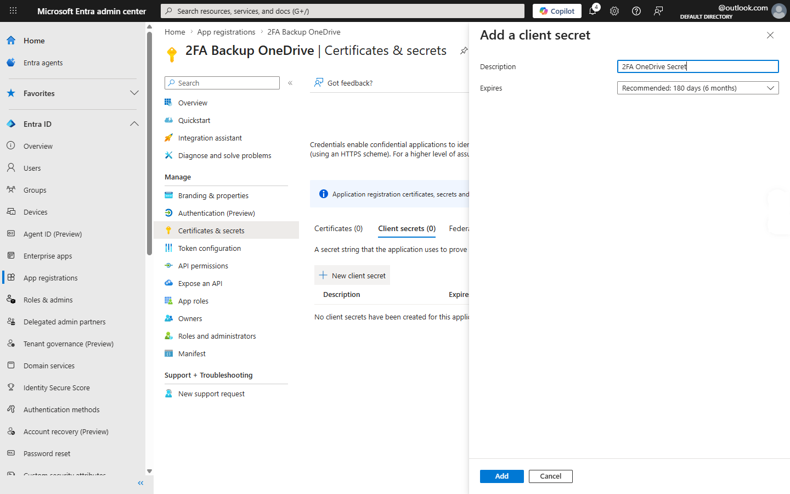

然后点击 `Add` 创建。

### 第 10 步：立刻复制“值”（Value）

创建后表格里会多出一条记录，两个列分别是：

- `值 / Value`
- `机密 ID / Secret ID`

请复制 **`值 / Value`** 这一列（页面会提示 `Value` 只在刚创建时可见，刷新或离开页面后就再也查不到），不是 `机密 ID / Secret ID`。

> 此步页面会完整显示刚创建的 secret 值，文档里不再附图，防止误推到仓库。按页面上的位置找到刚新建的那一行，复制 `Value` 列即可。

这个值对应：

```text
ONEDRIVE_CLIENT_SECRET
```

---

## 五、把凭据填回 Cloudflare

### 方式一：命令行

在项目目录下执行：

```bash
npx wrangler secret put ONEDRIVE_CLIENT_ID
npx wrangler secret put ONEDRIVE_CLIENT_SECRET
npx wrangler secret put GOOGLE_DRIVE_CLIENT_ID
npx wrangler secret put GOOGLE_DRIVE_CLIENT_SECRET
```

**强烈建议再加一条 `ENCRYPTION_KEY`**（否则 OAuth 的 `refresh_token / access_token` 会以**明文**写入 KV，授权页会弹警告 `ENCRYPTION_KEY 未配置，... 凭据将以明文存储`）：

```bash
# 1. 生成一个 32 字节的 AES-GCM-256 密钥（Base64 格式）
node -e "console.log(require('crypto').randomBytes(32).toString('base64'))"

# 2. 把上一步输出的字符串粘贴给 Wrangler
npx wrangler secret put ENCRYPTION_KEY
```

> ⚠️ **配置完记得把生成的密钥妥善备份到密码管理器里。** 如果之后 `ENCRYPTION_KEY` 丢了，已经加密保存过的 OAuth 凭据、WebDAV 配置、备份文件全部无法解密；程序在这种情况下会直接报错拒绝读取，不会尝试乱猜。

如果你使用自定义域名，建议再配置：

```text
OAUTH_REDIRECT_BASE_URL = https://你的应用地址
```

### 方式二：Cloudflare Dashboard

进入：

```text
Workers & Pages -> 你的 Worker -> Settings -> Variables and Secrets
```

找到 **Variables and Secrets / 变量和机密** 区块，点击右侧的 `Add / 添加` 按钮。

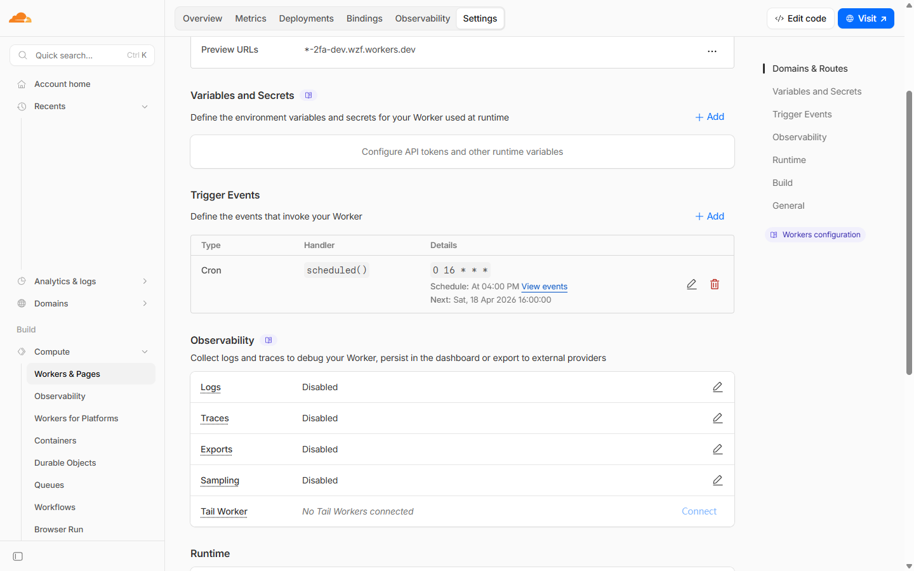

在弹出的侧栏中：

- 把 **Type / 类型** 切到 `Secret`
- **Variable name / 变量名** 填入下面 4 个名字之一
- **Value / 值** 填入对应的 ID 或 Secret
- 点击 `Add variable` → 最后 `Deploy` 部署

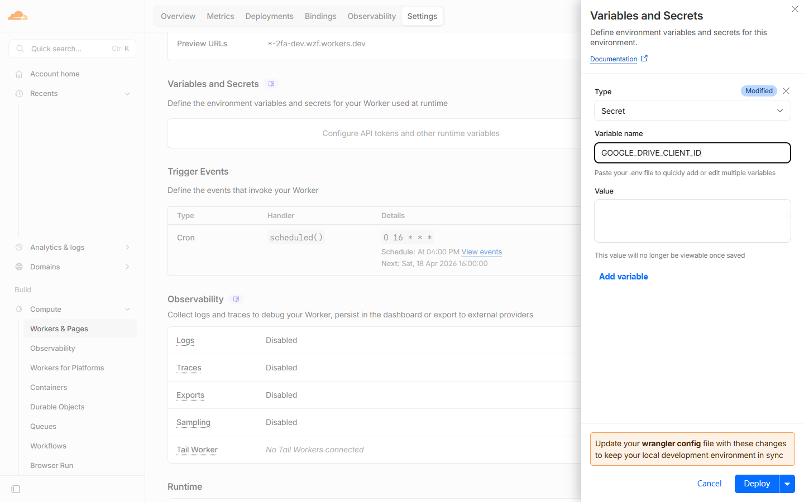

新增 4 个 Secret：

- `ONEDRIVE_CLIENT_ID`
- `ONEDRIVE_CLIENT_SECRET`
- `GOOGLE_DRIVE_CLIENT_ID`
- `GOOGLE_DRIVE_CLIENT_SECRET`

**强烈建议再加一个 `ENCRYPTION_KEY`**（Type = `Secret`），用于加密 KV 里存的 OAuth 刷新令牌。Value 按下面的命令在任意机器上生成 32 字节 Base64 字符串后粘贴：

```bash
node -e "console.log(require('crypto').randomBytes(32).toString('base64'))"
```

> ⚠️ 生成的 `ENCRYPTION_KEY` 请立刻备份到密码管理器。丢失密钥 = 现有加密数据无法恢复。

如果用了自定义域名，再新增普通变量（Type = `Text`）：

- `OAUTH_REDIRECT_BASE_URL`

例如：

```text
https://2fa.example.com
```

### 最后一步

重新部署 Worker。

---

## 六、如何验证自己配置成功

部署完成后，打开你的 2FA 应用，依次检查：

1. 进入 `设置 -> 同步设置`
2. 查看 `OneDrive 同步` 和 `Google Drive 同步`
3. 如果页面不再提示“服务端未配置 OAuth 凭据”，说明 Cloudflare 变量大概率已经生效
4. 分别添加一个测试目标
5. 点击 `保存并授权`
6. 在弹出的窗口中完成登录和授权
7. 首次授权成功 + 连接测试通过后，目标会自动启用（若只想暂停同步，可随时在列表里把开关关掉）
8. 手动触发一次备份，查看网盘里是否出现 `backup_*.(txt|json|csv|html)` 文件
   文件扩展名取决于「设置 → 默认导出格式」

---

## 七、后续如何使用

完成配置后，你后续应当只需要：

1. 打开 `设置 -> 同步设置`
2. 进入 `OneDrive 同步` 或 `Google Drive 同步`
3. 添加目标
4. 填一个名称
5. 点击 `保存并授权`
6. 登录自己的网盘并同意授权
7. 首次授权成功 + 连接测试通过后，目标会自动启用（若只想暂停同步，可随时在列表里把开关关掉）

然后系统会对所有**已启用**目标自动：

- 在手动备份时推送
- 在数据变更触发备份时推送
- 在定时备份时推送

---

## 八、最常见的问题

### 1. 提示 `redirect_uri_mismatch`

原因：

- 平台控制台里填写的回调地址和程序实际使用的不完全一致

重点检查：

- 是否是 `https`
- 域名是否一致
- 路径是否一致
- 是否多了或少了 `/`

### 2. Google 授权被挡：`Access blocked` / `Error 403: access_denied`

典型报错：

```text
Access blocked: <你的域名> has not completed the Google verification process
Error 403: access_denied
```

原因：应用仍然处于 `Testing`，而你当前授权的邮箱不在 `Test users` 名单里。Google 会直接把请求挡下来。

处理办法（推荐按这个顺序）：

1. 打开 `Google Auth Platform -> Audience`；
2. 看 `Publishing status`：
   - 如果是 `Testing`：点 `Publish app`，在弹出的 `Push to production?` 对话框里点 `Confirm`，确认变成 `In production` 后重新授权（见本文档「第 6.5 步」）。
   - 如果必须留在 `Testing`：找到 `Test users` → `Add users`，把你当前授权的 Google 邮箱加进去后再授权。
3. 切到 `正式版` 后，如果个人自用且只请求 `drive.file` / `userinfo.email` / `userinfo.profile` 三个范围，**不需要**提交 Google 验证；第一次授权看到“未验证应用”中间页时点 `高级 / Advanced → 前往 <你的应用名>（不安全）/ Go to <app name> (unsafe)` 继续即可。

### 3. 打开 `entra.microsoft.com` 就报 `AADSTS16000`

常见原因：

- 你当前登录的是个人 Microsoft 帐号
- 该帐号没有关联可管理的 Microsoft Entra 租户
- 浏览器自动复用了错误的 Microsoft 登录状态

处理办法：

- 先确认你登录的是准备用来创建 OneDrive OAuth 应用的帐号
- 如果你已有 Microsoft 365 / Azure / 工作或学校租户，切换到对应帐号或对应目录后再进入 Entra
- 如果你只有个人帐号，先访问 `https://portal.azure.com/`，按 Microsoft 官方文档创建一个 Microsoft Entra 租户，再回到 `https://entra.microsoft.com/`
- 仍然报同样错误时，先退出所有 Microsoft 帐号，或使用无痕窗口重新登录

### 4. OneDrive 提示需要管理员批准

常见原因：

- 你使用的是企业租户
- 需要管理员同意权限

处理办法：

- 回到 `API 权限`
- 让管理员点击 `授予管理员同意`

### 5. 页面里能看到入口，但点击授权失败

优先检查：

- `ONEDRIVE_CLIENT_ID`
- `ONEDRIVE_CLIENT_SECRET`
- `GOOGLE_DRIVE_CLIENT_ID`
- `GOOGLE_DRIVE_CLIENT_SECRET`

是否真的已经配置到 Cloudflare，并且已经重新部署。

### 6. Google 授权成功，但立刻提示 `Google Drive API 尚未启用`

典型报错：

```text
Google Drive 授权已保存，但自动连接测试失败：Google Drive API 尚未启用。
请到 Google Cloud Console 中启用 Google Drive API 后再重试。
```

原因：你只配置了 OAuth 凭据（Client ID / Secret），但没有在 Google Cloud 项目里启用 `Google Drive API`。授权流程只检验凭据合法性，不会检查 Drive API 是否开通。

处理办法：**回去执行「第 3 步：启用 Google Drive API」**。打开 `https://console.cloud.google.com/apis/library/drive.googleapis.com`（记得在右上角确认是你 OAuth 客户端所在的那个项目），点蓝色的 `Enable`，等页面跳到 `API/Service Details` 并显示 `Status: Enabled` 后，回到应用重新点「保存并授权」即可（不需要再跑一遍 OAuth 流程，应用会自动重试连接测试）。

### 7. 授权页弹出 `ENCRYPTION_KEY 未配置，... 凭据将以明文存储`

原因：Cloudflare 里没配置 `ENCRYPTION_KEY`。此时 OAuth 的 `access_token / refresh_token` 会以 **明文** 写入 KV——虽然 KV 自身有访问控制，但在自部署场景下仍然建议加密。

处理办法：按「第五节 · 把凭据填回 Cloudflare」里的 `ENCRYPTION_KEY` 子步骤生成一个 32 字节 Base64 字符串并配置为 Secret。重新部署后，后续所有新授权会自动加密；之前已存的明文凭据不会被自动迁移，但程序会正确读取（向后兼容），下一次重新授权就会覆盖成密文。

> `ENCRYPTION_KEY` 同时也会被备份、WebDAV/S3 凭据加密复用，不只是 OAuth 场景需要。
