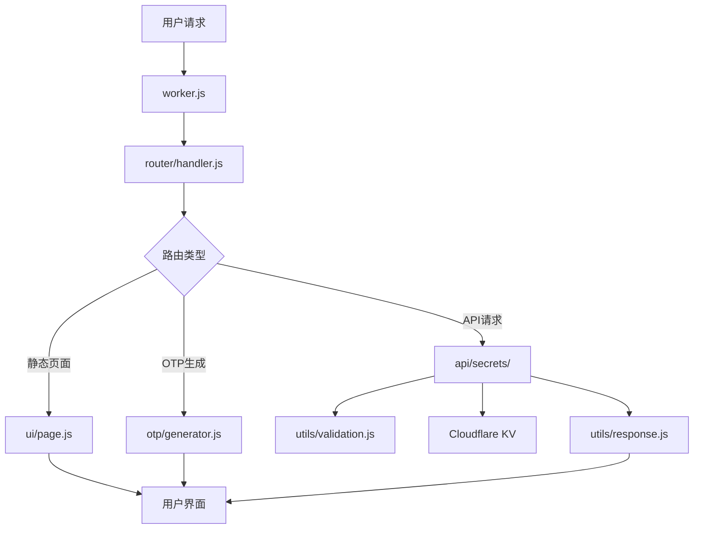

# 2FA 开发文档

## 📋 目录

- [项目架构](#项目架构)
- [模块说明](#模块说明)
- [开发环境](#开发环境)
- [代码规范](#代码规范)
- [API设计](#api设计)
- [数据库设计](#数据库设计)
- [部署](#部署)
- [测试指南](#测试指南)
- [性能优化](#性能优化)
- [故障排查](#故障排查)

## 🏗️ 项目架构

### 整体架构

```
2FA (Cloudflare Workers)
├── 前端 (HTML/CSS/JS)
│   ├── 响应式UI界面
│   ├── 实时OTP显示
│   ├── PWA 离线支持
│   └── 二维码扫描
├── 后端 (Worker模块)
│   ├── 路由处理
│   ├── API服务
│   ├── OTP算法（TOTP/HOTP/Steam Guard）
│   ├── JWT 认证
│   ├── AES-GCM 加密
│   └── 数据验证
└── 存储 (Cloudflare KV)
    ├── 密钥数据持久化（加密）
    └── 自动备份管理
```

### 模块化设计

```
src/
├── worker.js              # 🎯 Worker入口点（fetch + scheduled 处理）
├── router/
│   └── handler.js         # 🛣️ 请求路由分发
├── api/
│   ├── secrets/           # 🔌 密钥管理API（模块化）
│   │   ├── index.js      # 统一导出
│   │   ├── shared.js     # 共享工具（saveSecretsToKV, getAllSecrets）
│   │   ├── crud.js       # CRUD 操作（GET/POST/PUT/DELETE）
│   │   ├── batch.js      # 批量导入
│   │   ├── backup.js     # 备份创建和列表
│   │   ├── restore.js    # 备份恢复和导出
│   │   └── otp.js        # OTP 生成
│   └── favicon.js         # Favicon 代理
├── otp/
│   └── generator.js       # 🔐 TOTP/HOTP/Steam Guard 算法
├── ui/
│   ├── page.js           # 🎨 主页面 HTML 生成
│   ├── setupPage.js      # 🔧 首次设置页面
│   ├── manifest.js       # 📱 PWA Manifest
│   ├── serviceworker.js  # ⚙️ Service Worker
│   ├── scripts/          # 📜 前端 JavaScript 模块
│   │   ├── index.js     # 模块集成入口
│   │   ├── state.js     # 全局状态管理
│   │   ├── auth.js      # 认证逻辑
│   │   ├── core.js      # 核心业务逻辑（~106KB）
│   │   ├── utils.js     # 工具函数
│   │   └── pwa.js       # PWA 功能
│   └── styles/           # 🎨 前端 CSS 模块
│       ├── index.js     # 样式集成入口
│       ├── base.js      # 基础样式
│       ├── components.js # 组件样式
│       ├── modals.js    # 模态框样式
│       └── responsive.js # 响应式样式
└── utils/                # 🛠️ 工具函数
    ├── auth.js           # 🔑 JWT 认证（PBKDF2, HttpOnly Cookie）
    ├── backup.js         # 💾 智能备份（防抖 + 自动清理）
    ├── constants.js      # 📋 常量定义
    ├── crypto.js         # 🔐 加密工具（HMAC-SHA1/256）
    ├── encryption.js     # 🔒 AES-GCM 256 位加密
    ├── logger.js         # 📝 结构化日志
    ├── monitoring.js     # 📊 错误追踪（Sentry 集成）
    ├── rateLimit.js      # 🛡️ 请求限流
    ├── response.js       # 📡 标准化 HTTP 响应
    ├── security.js       # 🔒 CORS/CSP 安全头
    └── validation.js     # ✅ 输入验证
```

### 数据流架构



## 📦 模块说明

### 1. 主入口模块 (`worker.js`)

**职责**: Cloudflare Worker的入口点，处理CORS和请求分发

**核心功能**:

- CORS预检请求处理
- 请求路由分发
- 错误边界处理
- 定时任务处理（scheduled handler）
- 数据哈希校验（SHA-256）

**关键代码**:

```javascript
export default {
	async fetch(request, env, ctx) {
		// 处理CORS预检请求
		const corsResponse = handleCORS(request);
		if (corsResponse) return corsResponse;

		// 分发到路由处理器
		return handleRequest(request, env);
	},

	async scheduled(event, env, ctx) {
		// 定时备份任务
	},
};
```

### 2. 路由处理模块 (`router/handler.js`)

**职责**: HTTP请求路由解析和分发

**路由规则**:

- `/` → 主页面 (UI模块)
- `/setup` → 首次设置页面
- `/api/secrets` → 密钥管理API
- `/api/secrets/otp` → OTP生成
- `/api/secrets/batch` → 批量导入
- `/api/secrets/backup` → 备份管理
- `/api/secrets/restore` → 备份恢复
- `/api/auth/*` → 认证端点

**核心功能**:

- URL路径解析
- HTTP方法处理
- JWT认证验证
- 404错误处理
- API路由分发

### 3. API模块 (`api/secrets/`)

**职责**: 密钥数据的CRUD操作

**模块化组织**:

- `shared.js` - 共享工具（saveSecretsToKV, getAllSecrets）
- `crud.js` - CRUD操作（GET/POST/PUT/DELETE）
- `batch.js` - 批量导入
- `backup.js` - 备份创建和列表
- `restore.js` - 备份恢复和导出
- `otp.js` - OTP生成
- `index.js` - 统一导出

**支持的操作**:

- `GET /api/secrets` - 获取所有密钥
- `POST /api/secrets` - 添加新密钥
- `PUT /api/secrets/{id}` - 更新密钥
- `DELETE /api/secrets/{id}` - 删除密钥

**数据验证**:

- Base32格式验证
- 必填字段检查
- 重复性检查

**错误处理**:

- 统一错误格式
- 详细错误信息
- HTTP状态码标准化

### 4. OTP生成模块 (`otp/generator.js`)

**职责**: TOTP/HOTP/Steam Guard 算法实现

**技术规范**:

- **TOTP (RFC 6238)**: 时间步长30秒，HMAC-SHA1/SHA256/SHA512
- **HOTP (RFC 4226)**: 基于计数器，HMAC-SHA1
- **Steam Guard**: 自定义5字符编码，字母表 `23456789BCDFGHJKMNPQRTVWXY`

**核心功能**:

- Base32密钥解码
- TOTP/HOTP算法实现
- Steam Guard 编码
- 时间同步处理
- OTPAuth URL生成

**算法实现**:

```javascript
// TOTP核心算法
const counter = Math.floor(Date.now() / 1000 / 30);
const hmac = await crypto.subtle.sign('HMAC', key, counterBytes);
const offset = hmac[hmac.length - 1] & 0x0f;
const binary = ((hmac[offset] & 0x7f) << 24) | ...;
const otp = binary % 1000000;
```

### 5. UI模块 (`ui/`)

**职责**: 前端页面生成和交互逻辑

**模块组成**:

- `page.js` - 主页面HTML生成
- `setupPage.js` - 首次设置页面
- `manifest.js` - PWA Manifest
- `serviceworker.js` - Service Worker（缓存策略）
- `scripts/` - 前端JavaScript模块（5个模块）
- `styles/` - 前端CSS模块（4个模块）

**前端 JavaScript 模块加载顺序**:

1. `state.js` - 全局变量
2. `auth.js` - 认证函数
3. `core.js` - 核心业务逻辑（最大模块，~106KB）
4. `utils.js` - 辅助函数
5. `pwa.js` - PWA 功能

**Service Worker 缓存策略**:

- **静态资源** (/, manifest, icons): Cache First
- **CDN 库** (jsQR, qrcode): Cache First with CORS
- **API 请求**: Network Only（永不缓存）
- 缓存名: `2fa-v2`

**页面结构**:

```
页面组件
├── 头部区域 (Logo + 主题切换)
├── 搜索区域 (实时搜索)
├── 操作区域 (添加/扫描/导入/导出)
├── 密钥列表 (卡片式布局)
└── 模态框 (添加/编辑/二维码/扫描/导入)
```

### 6. 工具模块 (`utils/`)

#### 认证模块 (`utils/auth.js`)

**职责**: JWT认证，PBKDF2密码哈希

**关键特性**:

- JWT tokens 存储在 HttpOnly, Secure, SameSite=Strict cookies
- Token 有效期 1 天
- 首次使用通过 `/setup` 设置密码

#### 加密模块 (`utils/encryption.js`)

**职责**: AES-GCM 256位加密/解密

**关键特性**:

- 使用 Web Crypto API (`crypto.subtle`)
- 96位 IV + 128位认证标签
- 密钥为 256位（32字节）base64编码
- 加密数据格式: `__ENCRYPTED__<base64-encoded-json>`
- 自动检测加密/明文数据

#### 备份模块 (`utils/backup.js`)

**职责**: 智能备份管理

**策略**:

- **事件驱动**: 数据变更后自动触发，5分钟防抖
- **定时任务**: 每10分钟 cron（仅在数据变化时通过SHA-256哈希比较）
- **自动清理**: 保留最新100个备份

#### 限流模块 (`utils/rateLimit.js`)

**职责**: 滑动窗口限流

**预设**:

- API请求: 60次/分钟
- 登录尝试: 5次/分钟
- OTP生成: 100次/分钟

#### 验证模块 (`utils/validation.js`)

**职责**: 数据格式验证和业务逻辑验证

**验证规则**:

- Base32格式: `[A-Z2-7]+=*$`
- 最小长度: 8字符
- 服务名称: 非空字符串
- 数据完整性检查

#### 响应模块 (`utils/response.js`)

**职责**: 标准化HTTP响应格式

**响应类型**:

- JSON响应 (API数据)
- 错误响应 (统一错误格式)
- HTML响应 (页面内容)
- 成功响应 (操作确认)

**标准格式**:

```javascript
// 成功响应
{
  "success": true,
  "data": {...},
  "message": "操作成功"
}

// 错误响应
{
  "error": "错误标题",
  "message": "详细错误信息",
  "timestamp": "2023-12-07T10:30:00.000Z"
}
```

## 🛠️ 开发环境

### 环境要求

- **Node.js**: >= 16.0.0
- **npm**: >= 8.0.0
- **Wrangler CLI**: >= 3.0.0
- **Cloudflare账户**: 用于部署和KV存储

### 本地开发设置

1. **克隆项目**:

```bash
git clone <repository-url>
cd 2fa
```

2. **安装依赖**:

```bash
npm install
```

3. **配置环境**:

```bash
# 登录Cloudflare
npx wrangler login

# 创建KV存储
npx wrangler kv:namespace create SECRETS_KV
npx wrangler kv:namespace create SECRETS_KV --preview
```

4. **启动开发服务器**:

```bash
npm run dev
# 或
npx wrangler dev --port 8787
```

### 开发工具配置

**VS Code推荐扩展**:

- ES6 String HTML
- Prettier
- ESLint
- Thunder Client (API测试)

**配置文件** (`.vscode/settings.json`):

```json
{
	"editor.formatOnSave": true,
	"editor.defaultFormatter": "esbenp.prettier-vscode",
	"files.associations": {
		"*.js": "javascript"
	}
}
```

## 📝 代码规范

### JavaScript规范

**模块导入/导出**:

```javascript
// ✅ 推荐 - 命名导出
export function functionName() {}
export const CONSTANT_NAME = 'value';

// ✅ 推荐 - 命名导入
import { specificFunction } from './module.js';

// ❌ 避免 - 默认导出 (除了Worker入口)
export default something;
```

**函数命名**:

```javascript
// ✅ 动词开头，驼峰命名
function handleRequest() {}
function validateData() {}
function createResponse() {}

// ✅ 布尔值返回用is/has开头
function isValidSecret() {}
function hasPermission() {}
```

**错误处理**:

```javascript
// ✅ 推荐 - 具体的错误信息
try {
	await operation();
} catch (error) {
	console.error('Operation failed:', error);
	return createErrorResponse('操作失败', error.message);
}

// ❌ 避免 - 忽略错误
try {
	await operation();
} catch (error) {
	// 不处理错误
}
```

**注释规范**:

```javascript
/**
 * 函数描述
 * @param {Type} paramName - 参数描述
 * @returns {Type} 返回值描述
 */
function exampleFunction(paramName) {
	// 行内注释说明业务逻辑
	return result;
}
```

### CSS规范

**命名约定**:

```css
/* ✅ BEM命名方式 */
.secret-card {
}
.secret-card__header {
}
.secret-card__header--active {
}

/* ✅ 功能性类名 */
.btn-primary {
}
.text-center {
}
.hidden {
}
```

**响应式设计**:

```css
/* 移动优先设计 */
.component {
	/* 基础样式 */
}

@media (min-width: 481px) {
	.component {
		/* 平板样式 */
	}
}

@media (min-width: 1200px) {
	.component {
		/* 桌面样式 */
	}
}
```

### HTML规范

**语义化标签**:

```html
<!-- ✅ 推荐 -->
<main class="content">
	<section class="secrets-list">
		<article class="secret-card">
			<header class="card-header">
				<h3>服务名称</h3>
			</header>
		</article>
	</section>
</main>
```

**无障碍设计**:

```html
<!-- ✅ 推荐 -->
<button aria-label="复制验证码" title="点击复制">
	<span aria-hidden="true">📋</span>
</button>

<input type="text" aria-describedby="help-text" />
<div id="help-text">输入帮助信息</div>
```

## 🔌 API设计

### RESTful API规范

**端点设计**:

```
GET    /api/secrets          # 获取所有密钥
POST   /api/secrets          # 创建新密钥
PUT    /api/secrets/{id}     # 更新密钥
DELETE /api/secrets/{id}     # 删除密钥
POST   /api/secrets/batch    # 批量导入
POST   /api/secrets/otp      # 生成OTP
GET    /api/secrets/backup   # 获取备份列表
POST   /api/secrets/backup   # 创建备份
POST   /api/secrets/restore  # 恢复备份
```

**请求格式**:

```javascript
// POST/PUT 请求体
{
  "name": "GitHub",           // 必填 - 服务名称
  "service": "user@email.com", // 可选 - 账户名称
  "secret": "JBSWY3DPEHPK3PXP" // 必填 - Base32密钥
}
```

**响应格式**:

```javascript
// 成功响应
{
  "id": "uuid-string",
  "name": "GitHub",
  "account": "user@email.com",
  "secret": "JBSWY3DPEHPK3PXP",
  "createdAt": "2023-12-07T10:30:00.000Z",
  "updatedAt": "2023-12-07T10:30:00.000Z"
}

// 错误响应
{
  "error": "验证失败",
  "message": "密钥格式无效，必须是有效的Base32格式",
  "timestamp": "2023-12-07T10:30:00.000Z"
}
```

### HTTP状态码规范

| 状态码 | 场景           | 说明                 |
| ------ | -------------- | -------------------- |
| 200    | GET成功        | 数据获取成功         |
| 201    | POST成功       | 资源创建成功         |
| 204    | PUT/DELETE成功 | 操作成功，无返回内容 |
| 400    | 请求错误       | 参数验证失败         |
| 401    | 未认证         | JWT token 缺失或过期 |
| 404    | 资源不存在     | 密钥ID不存在         |
| 409    | 冲突           | 重复的服务和账户组合 |
| 429    | 请求过多       | 触发限流             |
| 500    | 服务器错误     | 内部处理错误         |

## 🗄️ 数据库设计

### KV存储结构

**主键设计**:

```
secrets → 存储所有密钥的数组（加密存储）
backup:<timestamp> → 备份数据
data_hash → 数据变更检测哈希
```

**数据模型**:

```javascript
// 密钥对象结构
{
  "id": "uuid-v4",              // 唯一标识符
  "name": "服务名称",            // 显示名称
  "account": "账户名称",         // 可选的账户信息
  "secret": "BASE32SECRET",     // Base32编码的密钥
  "type": "totp",               // 类型: totp/hotp/steam
  "algorithm": "SHA1",          // 哈希算法
  "digits": 6,                  // OTP位数
  "period": 30,                 // 时间步长（秒）
  "createdAt": "ISO8601时间戳",  // 创建时间
  "updatedAt": "ISO8601时间戳"   // 更新时间
}

// 存储在KV中的数据结构（加密后）
// __ENCRYPTED__<base64-encoded-json>
// 解密后为数组:
[
  {密钥对象1},
  {密钥对象2},
  ...
]
```

### 数据操作模式

**读取操作**:

```javascript
// 获取所有密钥（自动解密）
const secrets = await getAllSecrets(env);
```

**写入操作**:

```javascript
// 保存所有密钥（自动加密 + 触发备份）
await saveSecretsToKV(env, secrets);
```

**数据迁移**:

```javascript
// 版本兼容性处理
function migrateSecrets(secrets) {
	return secrets.map((secret) => ({
		...secret,
		id: secret.id || generateUUID(),
		createdAt: secret.createdAt || new Date().toISOString(),
		updatedAt: secret.updatedAt || new Date().toISOString(),
	}));
}
```

## 🚀 部署

详细的部署指南请参考 [部署文档](DEPLOYMENT.md)，包括：

- 一键部署（GitHub 按钮）
- 非开发者图文教程
- 开发者快速部署
- 自定义域名和环境变量配置

## 🧪 测试指南

### 测试框架

本项目使用 [Vitest](https://vitest.dev/) 作为测试框架，共有 598 个测试用例。

### 运行测试

```bash
npm test              # 运行所有测试
npm run test:watch    # 监听模式（开发时使用）
npm run test:coverage # 生成覆盖率报告（V8 provider）
npm run test:ui       # Vitest UI 界面
```

### 测试目录结构

测试文件位于 `tests/` 目录，按模块组织。覆盖率排除了 `src/ui/**` 和 `src/worker.js`。

### 编写测试

```javascript
import { describe, it, expect } from 'vitest';
import { yourFunction } from '../src/utils/yourModule.js';

describe('yourFunction', () => {
	it('should work correctly', () => {
		expect(yourFunction('input')).toBe('expected');
	});
});
```

### API测试

**使用curl测试**:

```bash
# 获取所有密钥（需要认证）
curl -b cookies.txt https://your-worker.workers.dev/api/secrets

# 添加新密钥
curl -b cookies.txt -X POST https://your-worker.workers.dev/api/secrets \
  -H "Content-Type: application/json" \
  -d '{"name":"Test","secret":"JBSWY3DPEHPK3PXP"}'
```

### 前端测试

**手动测试清单**:

- [ ] 页面加载和渲染
- [ ] 密钥增删改查
- [ ] OTP实时更新
- [ ] 二维码扫描功能
- [ ] 搜索和过滤
- [ ] 批量导入/导出
- [ ] 主题切换
- [ ] 移动端适配
- [ ] PWA 安装和离线功能

**浏览器兼容性测试**:

- Chrome (最新版本)
- Firefox (最新版本)
- Safari (iOS/macOS)
- Edge (最新版本)

## ⚡ 性能优化

### 前端优化

**资源优化**:

- 内联CSS和JavaScript (减少请求数，零外部依赖)
- 图片使用Data URL或SVG
- 启用Gzip压缩

**渲染优化**:

```javascript
// 虚拟滚动 (大量密钥时)
function renderVisibleSecrets() {
	const visibleStart = Math.floor(scrollTop / itemHeight);
	const visibleEnd = Math.min(visibleStart + visibleCount, secrets.length);
	// 只渲染可见范围内的密钥卡片
}

// 防抖搜索
const searchDebounced = debounce(filterSecrets, 300);
```

**内存管理**:

```javascript
// 清理定时器
window.addEventListener('beforeunload', () => {
	Object.values(otpIntervals).forEach(clearInterval);
});

// 事件委托
document.addEventListener('click', (e) => {
	if (e.target.matches('.copy-btn')) {
		handleCopy(e.target.dataset.secretId);
	}
});
```

### 后端优化

**KV存储优化**:

```javascript
// 批量操作
async function batchUpdateSecrets(operations) {
	// 一次性读取，批量处理，一次性写入
	const secrets = await getAllSecrets(env);
	operations.forEach((op) => applyOperation(secrets, op));
	await saveSecretsToKV(env, secrets);
}
```

**备份优化**:

```javascript
// SHA-256 哈希比较避免不必要的备份
// 哈希计算排除 createdAt/updatedAt 字段以避免误报
const currentHash = await generateDataHash(secrets);
const lastHash = await env.SECRETS_KV.get('data_hash');
if (currentHash !== lastHash) {
	await createBackup(env, secrets);
}
```

### 监控和分析

**性能指标**:

- 页面加载时间 (< 2秒)
- API响应时间 (< 500ms)
- OTP生成时间 (< 100ms)
- 内存使用量 (< 50MB)

**日志记录**:

```javascript
// 结构化日志（使用 utils/logger.js）
const logger = getLogger(env);
logger.info('Operation completed', { duration: elapsed, operation: 'backup' });

// 错误追踪（可选 Sentry 集成）
// 配置 SENTRY_DSN 环境变量启用
```

## 🔧 故障排查

### 常见问题

**1. KV存储问题**:

```javascript
// 问题: KV存储未正确配置
// 解决: 检查wrangler.toml配置
if (!env.SECRETS_KV) {
	throw new Error('SECRETS_KV binding not configured');
}
```

**2. CORS问题**:

```javascript
// 问题: 跨域请求被阻止
// 解决: 确保CORS头正确设置（见 utils/security.js）
headers: {
  'Access-Control-Allow-Origin': '*',
  'Access-Control-Allow-Methods': 'GET, POST, PUT, DELETE, OPTIONS',
  'Access-Control-Allow-Headers': 'Content-Type'
}
```

**3. OTP时间同步问题**:

```javascript
// 问题: OTP与手机应用不匹配
// 解决: 检查服务器时间同步
const serverTime = Math.floor(Date.now() / 1000);
const expectedTime = Math.floor(serverTime / 30) * 30;
console.log('Server time alignment:', serverTime - expectedTime);
```

**4. 加密相关问题**:

```javascript
// 问题: 无法解密已有数据
// 解决: 确保 ENCRYPTION_KEY 未被更改
// 系统自动检测加密/明文数据，无需手动干预

// 问题: 修改数据后未触发备份
// 解决: 确保使用 saveSecretsToKV() 而非直接写入 KV
```

**5. 认证问题**:

```javascript
// 问题: JWT token 过期
// 解决: 前端使用 authenticatedFetch() 自动处理刷新

// 问题: 首次设置密码失败
// 解决: 检查密码复杂度要求（8位+大小写+数字+特殊字符）
```

### 调试工具

**开发环境调试**:

```bash
# 启动开发服务器（自动热重载）
npm run dev

# 实时查看 Worker 日志
npx wrangler tail
npx wrangler tail --format=pretty

# 过滤错误日志
npx wrangler tail --grep "ERROR"
```

**KV存储检查**:

```bash
# 查看KV数据
npx wrangler kv:key list --namespace-id=your-namespace-id

# 获取特定键值
npx wrangler kv:key get "secrets" --namespace-id=your-namespace-id
```

**生产环境监控**:

```bash
# 查看 Worker 实时日志
npx wrangler tail --env production

# 检查密钥配置
npx wrangler secret list
```

## 📈 项目维护

### 版本管理

**语义化版本控制**:

- 主版本号: 不兼容的API修改
- 次版本号: 向下兼容的功能性新增
- 修订号: 向下兼容的问题修正

**发布流程**:

1. 更新版本号
2. 更新CHANGELOG.md
3. 运行测试套件 (`npm test`)
4. 部署到测试环境
5. 部署到生产环境
6. 创建Git标签

### 依赖管理

**定期更新**:

```bash
# 检查过时的依赖
npm outdated

# 更新依赖
npm update

# 安全审计
npm audit
```

### 文档维护

**文档更新原则**:

- 代码变更同步更新文档
- API变更必须更新接口文档
- 新功能必须添加使用说明
- 定期审查文档的准确性

---

## 📞 技术支持

如有开发相关问题，请：

1. 查阅本文档和相关文档
2. 检查项目的Issue列表
3. 提交详细的Bug报告或功能请求

**相关文档**:

- **[架构详解](ARCHITECTURE.md)** - 深入的架构设计和模式说明
- **[API 参考](API_REFERENCE.md)** - 完整的 API 端点文档
- **[部署指南](DEPLOYMENT.md)** - 部署和运维指南
- **[PWA 指南](PWA_GUIDE.md)** - PWA 安装和离线功能

**贡献指南**: 欢迎提交Pull Request来改进项目！

---
