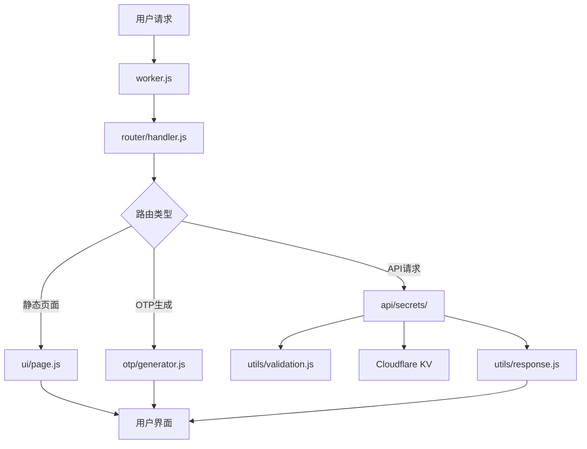

# 2FA 开发文档

## 📋 目录

- [项目架构](#️-项目架构)
- [模块说明](#-模块说明)
- [开发环境](#️-开发环境)
- [代码规范](#-代码规范)
- [API设计](#-api设计)
- [数据库设计](#️-数据库设计)
- [部署](#-部署)
- [测试指南](#-测试指南)
- [浏览器扩展开发与测试](#浏览器扩展开发与测试)
- [性能优化](#-性能优化)
- [故障排查](#-故障排查)

## 🏗️ 项目架构

### 整体架构

```
2FA (Cloudflare Workers)
├── 前端 (HTML/CSS/JS)
│   ├── 响应式UI界面
│   ├── 实时OTP显示
│   ├── PWA 离线支持
│   └── 二维码扫描
├── 后端 (Worker模块)
│   ├── 路由处理
│   ├── API服务
│   ├── OTP算法（TOTP/HOTP/Steam Guard）
│   ├── JWT 认证
│   ├── AES-GCM 加密
│   └── 数据验证
└── 存储 (Cloudflare KV)
    ├── 密钥数据持久化（加密）
    └── 自动备份管理
```

### 模块化设计

以下列出主要模块，完整文件清单以 `src/` 目录为准。OTP 的 HMAC 和 Base32 实现在 `otp/generator.js`，数据加密使用 `utils/encryption.js`，密码哈希及 JWT 使用 `utils/auth.js`；加密运算调用 Web Crypto API。

```
src/
├── worker.js              # 🎯 Worker入口点（fetch + scheduled 处理）
├── router/
│   └── handler.js         # 🛣️ 请求路由分发
├── api/
│   ├── secrets/           # 🔌 密钥管理API（模块化）
│   │   ├── index.js      # 统一导出
│   │   ├── shared.js     # 共享工具（saveSecretsToKV, getAllSecrets）
│   │   ├── crud.js       # CRUD 操作（GET/POST/PUT/DELETE）
│   │   ├── batch.js      # 批量导入
│   │   ├── backup.js     # 备份创建和列表
│   │   ├── restore.js    # 备份恢复和导出
│   │   └── otp.js        # OTP 生成
│   └── favicon.js         # Favicon 代理
├── otp/
│   └── generator.js       # 🔐 TOTP/HOTP/Steam Guard 算法
├── ui/
│   ├── page.js           # 🎨 主页面 HTML 生成
│   ├── quickOtp.js       # 🔢 公开 OTP 输入与验证码页面
│   ├── setupPage.js      # 🔧 首次设置页面
│   ├── standalone.js     # 🖥️ 独立页面共享 Fluent 主题
│   ├── offlinePage.js    # 📴 离线兜底页面
│   ├── dialogIcons.js    # 🧩 对话框图标
│   ├── manifest.js       # 📱 PWA Manifest
│   ├── serviceworker.js  # ⚙️ Service Worker
│   ├── scripts/          # 📜 前端 JavaScript 模块
│   │   ├── index.js     # 模块集成入口
│   │   ├── state.js     # 全局状态管理
│   │   ├── time.js      # 时间校准
│   │   ├── auth.js      # 认证逻辑
│   │   ├── otp.js       # OTP 计算、倒计时与交接动效
│   │   ├── ui.js        # 主题与弹窗交互
│   │   ├── search.js    # 搜索和显示控制
│   │   ├── settings.js  # 设置面板
│   │   ├── core.js      # 核心业务逻辑
│   │   ├── serviceAggregation.js # 服务分组
│   │   ├── utils.js     # 工具函数
│   │   ├── pwa.js       # PWA 功能
│   │   └── moduleLoader.js # 懒加载模块入口
│   └── styles/           # 🎨 前端 CSS 模块
│       ├── index.js     # 样式集成入口
│       ├── variables.js # 主题变量与切换过渡
│       ├── base.js      # 基础样式
│       ├── components.js # 组件样式
│       ├── modals.js    # 模态框样式
│       ├── responsive.js # 响应式样式
│       ├── progress.js   # 共享进度条常量
│       ├── workspace.js # Fluent 2 主工作区
│       ├── dialogs.js   # Fluent 2 对话框
│       ├── setup.js     # 首次设置页
│       └── backupDocument.js # HTML 备份文档
└── utils/                # 🛠️ 工具函数
    ├── auth.js           # 🔑 JWT 认证（PBKDF2, HttpOnly Cookie）
    ├── backup.js         # 💾 智能备份（事件驱动 + 并发合并 + 自动清理）
    ├── constants.js      # 📋 常量定义
    ├── encryption.js     # 🔒 AES-GCM 256 位加密
    ├── logger.js         # 📝 结构化日志
    ├── monitoring.js     # 📊 错误追踪与性能监控
    ├── rateLimit.js      # 🛡️ 请求限流
    ├── response.js       # 📡 标准化 HTTP 响应
    ├── security.js       # 🔒 CORS/CSP 安全头
    └── validation.js     # ✅ 输入验证
```

### 数据流架构


```mermaid
graph TD
    A[用户请求] --> B[worker.js]
    B --> C[router/handler.js]
    C --> D{路由类型}
    D -->|静态页面| E[ui/page.js]
    D -->|API请求| F[api/secrets/]
    D -->|OTP生成| G[otp/generator.js]
    F --> H[utils/validation.js]
    F --> I[Cloudflare KV]
    F --> J[utils/response.js]
    E --> K[用户界面]
    G --> K
    J --> K
```

## 📦 模块说明

### 1. 主入口模块 (`worker.js`)

**职责**: Cloudflare Worker的入口点，处理CORS和请求分发

**核心功能**:

- CORS预检请求处理
- 请求路由分发
- 错误边界处理
- 定时任务处理（scheduled handler）
- 数据哈希校验（SHA-256）

**关键代码**:

```javascript
export default {
	async fetch(request, env, ctx) {
		// 处理CORS预检请求
		const corsResponse = handleCORS(request);
		if (corsResponse) return corsResponse;

		// 分发到路由处理器
		return handleRequest(request, env);
	},

	async scheduled(event, env, ctx) {
		// 定时备份任务
	},
};
```

### 2. 路由处理模块 (`router/handler.js`)

**职责**: HTTP请求路由解析和分发

**路由规则**:

- `/` → 主页面 (UI模块)
- `/setup` → 首次设置页面
- `/api/setup`、`/api/login`、`/api/refresh-token` → 首次设置与认证
- `/api/secrets`、`/api/secrets/{id}`、`/api/secrets/batch`、`/api/secrets/export` → 密钥管理
- `/api/backup`、`/api/backup/restore`、`/api/backup/export/{backupKey}` → 备份管理
- `/api/change-password`、`/api/settings` → 密码与系统设置
- `/api/webdav/*`、`/api/s3/*`、`/api/onedrive/*`、`/api/gdrive/*` → 远程备份目标
- `/api/favicon/{domain}` → Favicon 代理
- `/otp`、`/otp/{secret}` → 公开 OTP 接口

**核心功能**:

- URL路径解析
- HTTP方法处理
- JWT认证验证
- 404错误处理
- API路由分发

### 3. API模块 (`api/secrets/`)

**职责**: 密钥数据的CRUD操作

**模块化组织**:

- `shared.js` - 共享工具（saveSecretsToKV, getAllSecrets）
- `crud.js` - CRUD操作（GET/POST/PUT/DELETE）
- `batch.js` - 批量导入
- `backup.js` - 备份创建和列表
- `restore.js` - 备份恢复和导出
- `otp.js` - OTP生成
- `index.js` - 统一导出

**支持的操作**:

- `GET /api/secrets` - 获取所有密钥
- `POST /api/secrets` - 添加新密钥
- `PUT /api/secrets/{id}` - 更新密钥
- `DELETE /api/secrets/{id}` - 删除密钥

**数据验证**:

- Base32格式验证
- 必填字段检查
- 重复性检查

**错误处理**:

- 统一错误格式
- 详细错误信息
- HTTP状态码标准化

### 4. OTP生成模块 (`otp/generator.js`)

**职责**: TOTP/HOTP/Steam Guard 算法实现

**技术规范**:

- **TOTP (RFC 6238)**: 时间步长30秒，HMAC-SHA1/SHA256/SHA512
- **HOTP (RFC 4226)**: 基于计数器，HMAC-SHA1
- **Steam Guard**: 自定义5字符编码，字母表 `23456789BCDFGHJKMNPQRTVWXY`

**核心功能**:

- Base32密钥解码
- TOTP/HOTP算法实现
- Steam Guard 编码
- 时间同步处理
- OTPAuth URL生成

**算法实现**:

```javascript
// TOTP核心算法
const counter = Math.floor(Date.now() / 1000 / 30);
const hmac = await crypto.subtle.sign('HMAC', key, counterBytes);
const offset = hmac[hmac.length - 1] & 0x0f;
const binary = ((hmac[offset] & 0x7f) << 24) | ...;
const otp = binary % 1000000;
```

### 5. UI模块 (`ui/`)

**职责**: 前端页面生成和交互逻辑

**模块组成**:

- `page.js` - 主页面HTML生成
- `setupPage.js` - 首次设置页面
- `manifest.js` - PWA Manifest
- `serviceworker.js` - Service Worker（缓存策略）
- `scripts/` - 核心交互脚本和按需加载的导入、导出、备份、二维码及工具模块
- `styles/` - 主题变量、基础组件、响应式布局及 Fluent 2 页面样式

**前端 JavaScript 模块加载顺序**:

1. `utils.js`、`state.js`、`time.js` - 通用函数、全局状态和校准时间
2. `auth.js`、`otp.js` - 认证和验证码计算/刷新
3. `ui.js`、`search.js`、`settings.js` - 页面交互、显示控制和设置
4. `core.js`、`serviceAggregation.js` - 密钥业务流程和服务分组
5. `pwa.js`、`moduleLoader.js`、`versionCheck.js` - PWA、按需模块和版本检查

导入、导出、备份、二维码、Google 迁移和工具代码由 `moduleLoader.js` 按需加载；传统完整模式则由 `scripts/index.js` 按依赖顺序一次性拼接。

**Service Worker 缓存策略**:

- **主页** (`/`): Network First；网络失败时返回缓存，缓存也不存在时返回离线页
- **Favicon 代理**: Cache First
- **CDN 库** (jsQR, qrcode): 缓存命中后后台更新，首次请求使用 CORS 获取并缓存
- **API 请求**（Favicon 代理除外）: 请求网络，不缓存响应；支持的密钥写操作遇到网络错误时进入离线同步队列，其他 API 返回错误
- **其他同源资源**: Network Only；网络错误时返回 503，无 Service Worker 缓存回退
- **其他外部资源**: Network Only；网络错误时返回空 404，无 Service Worker 缓存回退
- 缓存名由部署版本生成：`2fa-cache-${SW_VERSION}`

**页面结构**:

```
页面组件
├── 头部区域 (Logo)
├── 搜索区域 (实时搜索)
├── 显示控制 (智能聚合/平铺/排序)
├── 密钥列表 (卡片与服务分组)
├── 悬浮操作入口 (添加/扫描/导入/导出/设置)
└── 模态框 (密钥、工具、同步、还原和偏好设置)
```

### 6. 工具模块 (`utils/`)

#### 认证模块 (`utils/auth.js`)

**职责**: JWT认证，PBKDF2密码哈希

**关键特性**:

- JWT tokens 存储在 HttpOnly, Secure, SameSite=Strict cookies
- Token 默认有效期 30 天（可在设置中自定义），剩余不足 7 天时自动续期
- 首次使用通过 `/setup` 设置密码

#### 加密模块 (`utils/encryption.js`)

**职责**: AES-GCM 256位加密/解密

**关键特性**:

- 使用 Web Crypto API (`crypto.subtle`)
- 96位 IV + 128位认证标签
- 密钥为 256位（32字节）base64编码
- 加密数据格式: `__ENCRYPTED__<base64-encoded-json>`
- 自动检测加密/明文数据

#### 备份模块 (`utils/backup.js`)

**职责**: 智能备份管理

**策略**:

- **事件驱动**: 数据变更后自动触发；有请求上下文时通过 `ctx.waitUntil()` 转入后台执行
- **定时任务**: 每天一次 cron 兜底检查（仅在数据变化时通过 SHA-256 哈希比较）
- **自动清理**: 保留最新100个备份

#### 限流模块 (`utils/rateLimit.js`)

**职责**: 滑动窗口限流

**预设**:

`RATE_LIMIT_PRESETS` 提供可复用配置，只有调用限流逻辑的处理器才应用相应限制，不能把预设视为所有端点的默认限额。各端点实际配置见 [API 参考的速率限制说明](API_REFERENCE.md#rate-limiting)。

#### 验证模块 (`utils/validation.js`)

**职责**: 数据格式验证和业务逻辑验证

**验证规则**:

- Base32格式: `[A-Z2-7]+=*$`
- 最小长度: 8字符
- 服务名称: 非空字符串
- 数据完整性检查

#### 响应模块 (`utils/response.js`)

**职责**: 标准化HTTP响应格式

**响应类型**:

- JSON响应 (API数据)
- 错误响应 (统一错误格式)
- HTML响应 (页面内容)
- 成功响应 (操作确认)

**标准格式**:

```javascript
// 成功响应
{
  "success": true,
  "data": {...},
  "message": "操作成功"
}

// 错误响应
{
  "error": "错误标题",
  "message": "详细错误信息",
  "timestamp": "2023-12-07T10:30:00.000Z"
}
```

## 🛠️ 开发环境

### 环境要求

- **Node.js**: >= 20.19.0，推荐使用当前 LTS
- **npm**: >= 8.0.0
- **Wrangler CLI**: >= 3.0.0
- **Cloudflare账户**: 用于部署和KV存储

### 本地开发设置

1. **克隆项目**:

```bash
git clone <repository-url>
cd 2fa
```

2. **安装依赖**:

```bash
npm install
```

3. **配置环境**:

```bash
# 登录Cloudflare
npx wrangler login

# 创建KV存储
npx wrangler kv namespace create SECRETS_KV
npx wrangler kv namespace create SECRETS_KV --preview
```

4. **启动开发服务器**:

```bash
npm run dev
# 或
npx wrangler dev --port 8787
```

### 开发工具配置

**VS Code推荐扩展**:

- ES6 String HTML
- Prettier
- ESLint
- Thunder Client (API测试)

**配置文件** (`.vscode/settings.json`):

```json
{
	"editor.formatOnSave": true,
	"editor.defaultFormatter": "esbenp.prettier-vscode",
	"files.associations": {
		"*.js": "javascript"
	}
}
```

## 📝 代码规范

### JavaScript规范

**模块导入/导出**:

```javascript
// ✅ 推荐 - 命名导出
export function functionName() {}
export const CONSTANT_NAME = 'value';

// ✅ 推荐 - 命名导入
import { specificFunction } from './module.js';

// ❌ 避免 - 默认导出 (除了Worker入口)
export default something;
```

**函数命名**:

```javascript
// ✅ 动词开头，驼峰命名
function handleRequest() {}
function validateData() {}
function createResponse() {}

// ✅ 布尔值返回用is/has开头
function isValidSecret() {}
function hasPermission() {}
```

**错误处理**:

```javascript
// ✅ 推荐 - 具体的错误信息
try {
	await operation();
} catch (error) {
	console.error('Operation failed:', error);
	return createErrorResponse('操作失败', error.message);
}

// ❌ 避免 - 忽略错误
try {
	await operation();
} catch (error) {
	// 不处理错误
}
```

**注释规范**:

```javascript
/**
 * 函数描述
 * @param {Type} paramName - 参数描述
 * @returns {Type} 返回值描述
 */
function exampleFunction(paramName) {
	// 行内注释说明业务逻辑
	return result;
}
```

### CSS规范

**命名约定**:

```css
/* ✅ BEM命名方式 */
.secret-card {
}
.secret-card__header {
}
.secret-card__header--active {
}

/* ✅ 功能性类名 */
.btn-primary {
}
.text-center {
}
.hidden {
}
```

**响应式设计**:

```css
/* 移动优先设计 */
.component {
	/* 基础样式 */
}

@media (min-width: 481px) {
	.component {
		/* 平板样式 */
	}
}

@media (min-width: 1200px) {
	.component {
		/* 桌面样式 */
	}
}
```

### HTML规范

**语义化标签**:

```html
<!-- ✅ 推荐 -->
<main class="content">
	<section class="secrets-list">
		<article class="secret-card">
			<header class="card-header">
				<h3>服务名称</h3>
			</header>
		</article>
	</section>
</main>
```

**无障碍设计**:

```html
<!-- ✅ 推荐 -->
<button aria-label="复制验证码" title="点击复制">
	<span aria-hidden="true">📋</span>
</button>

<input type="text" aria-describedby="help-text" />
<div id="help-text">输入帮助信息</div>
```

## 🔌 API设计

### RESTful API规范

**端点设计**:

```
GET    /api/secrets          # 获取所有密钥
POST   /api/secrets          # 创建新密钥
PUT    /api/secrets/{id}     # 更新密钥
DELETE /api/secrets/{id}     # 删除密钥
POST   /api/secrets/batch    # 批量导入
POST   /api/secrets/export   # 批量导出标准 TXT/JSON/CSV/HTML
GET    /api/backup           # 获取备份列表
POST   /api/backup           # 创建备份
POST   /api/backup/restore   # 预览/恢复备份
GET    /api/backup/export/{backupKey} # 导出备份
POST   /api/change-password  # 修改密码
GET    /api/settings         # 读取设置
POST   /api/settings         # 保存设置
GET    /otp/{secret}         # 公开 OTP（可加 ?format=json）
```

**请求格式**:

```javascript
// POST/PUT 请求体
{
  "name": "GitHub",           // 必填 - 服务名称
  "service": "user@email.com", // 可选 - 账户名称
  "secret": "JBSWY3DPEHPK3PXP" // 必填 - Base32密钥
}
```

**响应格式**:

```javascript
// 成功响应
{
  "id": "uuid-string",
  "name": "GitHub",
  "account": "user@email.com",
  "secret": "JBSWY3DPEHPK3PXP",
  "createdAt": "2023-12-07T10:30:00.000Z",
  "updatedAt": "2023-12-07T10:30:00.000Z"
}

// 错误响应
{
  "error": "验证失败",
  "message": "密钥格式无效，必须是有效的Base32格式",
  "timestamp": "2023-12-07T10:30:00.000Z"
}
```

### HTTP状态码规范

| 状态码 | 场景           | 说明                 |
| ------ | -------------- | -------------------- |
| 200    | GET成功        | 数据获取成功         |
| 201    | POST成功       | 资源创建成功         |
| 204    | PUT/DELETE成功 | 操作成功，无返回内容 |
| 400    | 请求错误       | 参数验证失败         |
| 401    | 未认证         | JWT token 缺失或过期 |
| 404    | 资源不存在     | 密钥ID不存在         |
| 409    | 冲突           | 重复的服务和账户组合 |
| 429    | 请求过多       | 触发限流             |
| 500    | 服务器错误     | 内部处理错误         |

## 🗄️ 数据库设计

### KV存储结构

**主键设计**:

```
secrets → 存储所有密钥的数组（加密存储）
backup:<timestamp> → 备份数据
data_hash → 数据变更检测哈希
```

**数据模型**:

```javascript
// 密钥对象结构
{
  "id": "uuid-v4",              // 唯一标识符
  "name": "服务名称",            // 显示名称
  "account": "账户名称",         // 可选的账户信息
  "secret": "BASE32SECRET",     // Base32编码的密钥
  "type": "totp",               // 类型: totp/hotp/steam
  "algorithm": "SHA1",          // 哈希算法
  "digits": 6,                  // OTP位数
  "period": 30,                 // 时间步长（秒）
  "createdAt": "ISO8601时间戳",  // 创建时间
  "updatedAt": "ISO8601时间戳"   // 更新时间
}

// 存储在KV中的数据结构（加密后）
// __ENCRYPTED__<base64-encoded-json>
// 解密后为数组:
[
  {密钥对象1},
  {密钥对象2},
  ...
]
```

### 数据操作模式

**读取操作**:

```javascript
// 获取所有密钥（自动解密）
const secrets = await getAllSecrets(env);
```

**写入操作**:

```javascript
// 保存所有密钥（自动加密 + 触发备份）
await saveSecretsToKV(env, secrets);
```

**数据迁移**:

```javascript
// 版本兼容性处理
function migrateSecrets(secrets) {
	return secrets.map((secret) => ({
		...secret,
		id: secret.id || generateUUID(),
		createdAt: secret.createdAt || new Date().toISOString(),
		updatedAt: secret.updatedAt || new Date().toISOString(),
	}));
}
```

## 🚀 部署

详细的部署指南请参考 [部署文档](DEPLOYMENT.md)，包括：

- 一键部署（GitHub 按钮）
- 命令行部署
- 自定义域名和环境变量配置

## 🧪 测试指南

### 测试框架

本项目使用 [Vitest](https://vitest.dev/) 作为测试框架。测试数量会随功能增长，以 `npm test` 的当次输出为准，避免在文档中维护易过期的固定数字。

### 运行测试

```bash
npm test              # 运行所有测试
npm run test:watch    # 监听模式（开发时使用）
npm run test:coverage # 生成覆盖率报告（V8 provider）
npm run test:ui       # Vitest UI 界面
```

### 测试目录结构

测试文件位于 `tests/` 目录，按模块组织。覆盖率排除了 `src/ui/**` 和 `src/worker.js`。

### 编写测试

```javascript
import { describe, it, expect } from 'vitest';
import { yourFunction } from '../src/utils/yourModule.js';

describe('yourFunction', () => {
	it('should work correctly', () => {
		expect(yourFunction('input')).toBe('expected');
	});
});
```

### API测试

**使用curl测试**:

```bash
# 获取所有密钥（需要认证）
curl -b cookies.txt https://your-worker.workers.dev/api/secrets

# 添加新密钥
curl -b cookies.txt -X POST https://your-worker.workers.dev/api/secrets \
  -H "Content-Type: application/json" \
  -d '{"name":"Test","secret":"JBSWY3DPEHPK3PXP"}'
```

### 浏览器扩展开发与测试

Chrome、Edge 与 Firefox 的 Manifest V3 扩展源码位于 `extension/`，扩展版本、浏览器构建与 Worker 部署相互独立。Firefox 使用 `extension/firefox/` 中的适配层和独立构建，要求桌面 Firefox 153 及以上，在普通窗口的默认标签页中使用；不支持容器标签页、隐私窗口或 Android。连接模式有 `session`（网页登录）和 `offline`（网页登录＋离线缓存），默认使用 `session`。两种模式都支持点击扩展、快捷键填充和按页面授权后的自动填充。

网页登录模式授予实例权限后，后台使用 `credentials: include`、`cache: no-store`、`redirect: error` 直接请求 `/api/secrets` 与 `/api/time`，在单次任务内存中计算 TOTP。此模式需要联网；Cookie 过期后由用户点击“打开 2FA”重新登录，扩展不自动开页或续期。

离线模式明确启用后，使用同一网页登录 API 同步账户与时间，也允许用户点击“从 2FA 网页恢复”，从已打开、与当前实例完整 origin 相同的顶层网页读取 `2fa-secrets-cache` 和 `2fa-clock-sync-v1`。扩展在 `chrome.storage.local.offlineCache` 保存当前实例的原始密钥、时间戳与校时信息，后台本地计算 TOTP；关闭网页、后台重启或浏览器重启后仍可使用。缓存解析与校时校验复用 `src/shared/` 中的模块。

有缓存时的滚动取码、到期换码和填充不请求网络，离线模式图标使用已保存的本地图像，缺失时显示文字占位。读取账户列表遇到超过 5 分钟的缓存会尝试同步，传输或服务器暂时故障时保留旧缓存并退避 30 秒；401/403 或无效账户响应清除缓存。账户响应有效但校时失败时仍更新账户列表；已有校准不可用或检测到本机时间跳变时暂停取码，直至重新同步。此前从未获得校准信息时，可使用本机时间并提示。

仅离线模式持久保存种子，且没有额外的密码加密，采用与主网页浏览器缓存相同的信任模型。Chrome / Edge 的本地和会话存储限制为 `TRUSTED_CONTEXTS`。Firefox 使用原生扩展存储，`storage.local` 不提供这项访问限制，`storage.session` 默认不向内容脚本开放，详见[Firefox 隐私说明](../extension/PRIVACY_FIREFOX.md)。网页登录模式的完整密钥列表只在后台单次任务内处理，完成后释放引用；传给 Popup、服务分组和目标站点的数据均不包含种子。常规在线取码不向实例网页注入来源脚本；离线模式的网页缓存读取仅由用户明确触发。原管理登录和 Cookie 配置不变，也不增加 `cookies` 权限。

扩展与主网页缓存是独立副本，网页退出登录或清除站点数据不自动清除扩展缓存，断网时无法立即执行服务端撤销或接收账户修改。在已保存的连接上关闭“允许离线使用”会立即删除缓存并切回 `session`；切换实例、切到 `session` 或撤销实例主机权限也清除缓存。仅缓存当前实例，不跨实例回退。使用方法与权限说明见[扩展指南](BROWSER_EXTENSION.md)。

维护界面控制器时，请保持以下边界：

- 弹窗入口组合账户展示、来源刷新和授权流程；卡片预览、刷新计时器和授权状态由各自模块管理，不通过共享可写状态对象相互修改。
- 设置页的网站授权、账户绑定、搜索和列表请求版本由网站设置控制器管理；连接表单与离线开关的保存仍由连接入口编排。地址输入始终可见，编辑状态只表示未保存的草稿；无草稿时主按钮只检查连接，有草稿时才保存。输入规范化由设置页局部适配器补全协议，后台仍要求规范的 origin。
- 目标页面的 `automatic.js` 负责访问、授权和账户流程；`automatic-panel.js` 只管理提示面板与用户操作，`automatic-observation.js` 管理 DOM 观察和页面生命周期。面板不读写账户流程状态，观察模块暂停后可恢复，永久销毁后不再启动任务。
- 后台的 `registration-controller.js` 共用脚本注册、页面调用超时和失败清理；自动填充与来源监视分别提供自己的授权作用域。常规配置未变化时不触达页面，实例、连接模式或路径变化时更新相关来源。后台首次恢复会保守停止地址不可见的旧脚本；页面调用失败保留有界的内存重试记录，不能把失败当成永久完成。
- `START_FLOW` 与填充共用一次性请求的操作队列；账户和图标的网络维护不占用该队列。账户修订与校时修订分别检查，时间变化时立即停用旧验证码。
- `chrome.permissions.request` 必须在原始点击调用栈中、首次 `await` 之前发起；后台保存授权意图，以应对权限提示关闭弹窗的情况。
- 模块负责释放自己的监听器、观察器与计时器，异步返回后再次检查实例和操作是否仍有效。销毁与页面暂时隐藏分开处理，避免破坏浏览器前进／后退缓存恢复。
- 填充期间的目标校验只在同一次同步调用、没有页面回调介入的相邻检查之间复用。发出 `beforeinput`、`input`、`change` 或原生写值前使结果失效，每次事件后仍完整检查目标；验证码时间检查始终实时执行。不能依赖 MutationObserver 来跨事件缓存判定，因为 CSSOM 和已有元素的 `attachShadow()` 也会改变可填充目标。

后台工作流按以下职责组织，`workflow.js` 保留现有操作导出，供消息路由和自动填充调用；实现模块不得反向依赖这个入口：

| 模块                    | 职责                                                       |
| ----------------------- | ---------------------------------------------------------- |
| `workflow.js`           | 账户选择、填充、复制的流程编排                             |
| `target-session.js`     | 捕获目标文档与登录账号，领取和消费一次性请求，准备输入框   |
| `source-service.js`     | 在线／离线来源分发、取码、有效期及来源版本校验             |
| `offline-management.js` | 显式同步、网页缓存导入、停用缓存、读取缓存状态与图标       |
| `configuration.js`      | 当前实例、来源权限、连接模式和配置版本校验                 |
| `browser-access.js`     | 有超时的浏览器调用、文档消息、来源标签页查找和显式打开实例 |
| `errors.js`             | 统一错误类型与公开错误文案                                 |

配置写入队列仍由后台入口管理，目标请求的内存领取记录由 `target-session.js` 管理，缓存写入及来源版本仍由 `offline-source.js` 管理。移动流程时不要合并这些不同生命周期的状态，也不要删掉异步边界前后的复查。

账户搜索、服务聚合及离线缓存解析的共享逻辑位于 `src/shared/`，扩展直接导入普通 ES 模块。主网页继续通过 `src/ui/scripts/` 适配器生成内联脚本；适配器只序列化自包含的函数或工厂，并显式传入配置，不单独序列化依赖模块变量的函数。可序列化函数内部的具名函数采用对象方法语法，避免 Wrangler 默认保留函数名时注入外部辅助函数。`shared-browser-code.test.js` 验证压缩与保留函数名开关的四种组合，确保输出网页和直接导入的行为一致。

```bash
# 构建 Chrome / Edge 的可侧载目录
npm run build:extension

# 独立构建 Firefox
node scripts/build-firefox-extension.js

# 扩展单元、协议、后台 API 与 DOM 测试
npm run test:extension

# 扩展专项覆盖率（只运行扩展测试，统计 extension/src 和 src/shared）
npm run test:extension:coverage

# 首次安装 E2E 所需的浏览器运行时
npx playwright install chromium

# 重新构建 Chrome / Edge 并运行 Chromium E2E
npm run test:extension:e2e

# 构建三个浏览器并打包发布用的安装包：dist/2fa-extension-{chrome,edge,firefox}-<扩展版本>.zip
npm run package:extension

# 项目回归和静态检查
npm test -- --run
npm run lint
```

扩展专项覆盖率由 `vitest.extension.config.js` 运行，共用项目的测试初始化，只收集 `tests/extension/**/*.test.js`，统计 `extension/src/**/*.js` 和 `src/shared/**/*.js`。终端输出覆盖率摘要，报告保存在 `coverage/extension/`：`index.html` 用于浏览，`coverage-summary.json` 和 `lcov.info` 用于工具集成。项目默认的 `npm run test:coverage` 也包含扩展及共享源码。

GitHub Actions 在 `main` 分支推送、PR 和手动触发时运行 lint、扩展覆盖率、Chrome／Edge 构建及浏览器 E2E，并上传测试报告。CI 使用 Playwright Chromium，通过 `EXTENSION_E2E_SKIP_BRANDED=1` 跳过依赖本机 Chrome／Edge 安装的冒烟测试；本地 E2E 默认包含这些测试，未安装对应浏览器时会跳过。

Chrome / Edge 构建输出为 `dist/extension/chrome` 与 `dist/extension/edge`，都可从扩展管理页选择“加载已解压的扩展程序”。Firefox 独立构建输出为 `dist/extension/firefox`，可在 `about:debugging#/runtime/this-firefox` 临时载入其中的 `manifest.json`，浏览器重启后需重新载入。Chrome / Edge 构建会重建 `dist/extension`，之后如需加载 Firefox 包，应重新执行 Firefox 构建命令。安装、设置和快捷键操作见[扩展指南](BROWSER_EXTENSION.md)。代码变更后重新构建、在扩展管理页重新加载，并刷新目标标签页；无需为扩展保留或刷新实例标签页。

测试覆盖 TOTP 标准向量、API 与消息校验、缓存和权限边界、账户匹配、输入识别及导航竞态。浏览器 E2E 使用本地测试页面验证在线取码、离线缓存、自动填充和会话恢复；`tests/extension/e2e/branded.spec.js` 使用原始构建检查工具栏弹窗与 `activeTab` 填充。

自动化中的本地测试权限和预授权不改变正式构建，也不能覆盖原生权限提示、键盘快捷键及所有真实网站的行为。浏览器或权限逻辑变更后，应在目标浏览器检查这些交互及真实 HTTPS 实例的连接。

所有测试使用专用测试种子，不应包含真实密钥或账户列表。后端的 `GET /api/secrets` 使用同源 CORS、安全响应头和 `no-store`，相关回归测试位于 `tests/api/secrets-extension-headers.test.js`。

### 前端测试

**手动测试清单**:

- [ ] 页面加载和渲染
- [ ] 密钥增删改查
- [ ] OTP实时更新
- [ ] 二维码扫描功能
- [ ] 搜索和过滤
- [ ] 批量导入/导出
- [ ] 主题切换
- [ ] 移动端适配
- [ ] PWA 安装和离线功能

**浏览器兼容性测试**:

- Chrome (最新版本)
- Firefox (最新版本)
- Safari (iOS/macOS)
- Edge (最新版本)

## ⚡ 性能优化

### 前端优化

**资源优化**:

- 内联CSS和JavaScript (减少请求数，零外部依赖)
- 图片使用Data URL或SVG
- 启用Gzip压缩

**渲染优化**:

```javascript
// 虚拟滚动 (大量密钥时)
function renderVisibleSecrets() {
	const visibleStart = Math.floor(scrollTop / itemHeight);
	const visibleEnd = Math.min(visibleStart + visibleCount, secrets.length);
	// 只渲染可见范围内的密钥卡片
}

// 防抖搜索
const searchDebounced = debounce(filterSecrets, 300);
```

**内存管理**:

```javascript
// 清理定时器
window.addEventListener('beforeunload', () => {
	Object.values(otpIntervals).forEach(clearInterval);
});

// 事件委托
document.addEventListener('click', (e) => {
	if (e.target.matches('.copy-btn')) {
		handleCopy(e.target.dataset.secretId);
	}
});
```

### 后端优化

**KV存储优化**:

```javascript
// 批量操作
async function batchUpdateSecrets(operations) {
	// 一次性读取，批量处理，一次性写入
	const secrets = await getAllSecrets(env);
	operations.forEach((op) => applyOperation(secrets, op));
	await saveSecretsToKV(env, secrets);
}
```

**备份优化**:

```javascript
// SHA-256 哈希比较避免不必要的备份
// 哈希计算排除 createdAt/updatedAt 字段以避免误报
const currentHash = await generateDataHash(secrets);
const lastHash = await env.SECRETS_KV.get('data_hash');
if (currentHash !== lastHash) {
	await createBackup(env, secrets);
}
```

### 监控和分析

**性能指标**:

- 页面加载时间 (< 2秒)
- API响应时间 (< 500ms)
- OTP生成时间 (< 100ms)
- 内存使用量 (< 50MB)

**日志记录**:

```javascript
// 结构化日志（使用 utils/logger.js）
const logger = getLogger(env);
logger.info('Operation completed', { duration: elapsed, operation: 'backup' });

// 错误追踪（使用 utils/monitoring.js）
monitoring.captureError(error, { operation: 'backup' });
```

## 🔧 故障排查

### 常见问题

**1. KV存储问题**:

```javascript
// 问题: KV存储未正确配置
// 解决: 检查wrangler.toml配置
if (!env.SECRETS_KV) {
	throw new Error('SECRETS_KV binding not configured');
}
```

**2. CORS问题**:

```javascript
// 问题: 跨域请求被阻止
// 解决: 确保CORS头正确设置（见 utils/security.js）
headers: {
  'Access-Control-Allow-Origin': '*',
  'Access-Control-Allow-Methods': 'GET, POST, PUT, DELETE, OPTIONS',
  'Access-Control-Allow-Headers': 'Content-Type'
}
```

**3. OTP时间同步问题**:

```javascript
// 问题: OTP与手机应用不匹配
// 解决: 检查服务器时间同步
const serverTime = Math.floor(Date.now() / 1000);
const expectedTime = Math.floor(serverTime / 30) * 30;
console.log('Server time alignment:', serverTime - expectedTime);
```

**4. 加密相关问题**:

```javascript
// 问题: 无法解密已有数据
// 解决: 确保 ENCRYPTION_KEY 未被更改
// 系统自动检测加密/明文数据，无需手动干预

// 问题: 修改数据后未触发备份
// 解决: 确保使用 saveSecretsToKV() 而非直接写入 KV
```

**5. 认证问题**:

```javascript
// 问题: JWT token 过期
// 解决: 前端使用 authenticatedFetch() 自动处理刷新

// 问题: 首次设置密码失败
// 解决: 检查密码复杂度要求（8位+大小写+数字+特殊字符）
```

### 调试工具

**开发环境调试**:

```bash
# 启动开发服务器（自动热重载）
npm run dev

# 实时查看 Worker 日志
npx wrangler tail
npx wrangler tail --format=pretty

# 过滤错误日志
npx wrangler tail --grep "ERROR"
```

**KV存储检查**:

```bash
# 查看KV数据
npx wrangler kv key list --namespace-id=your-namespace-id

# 获取特定键值
npx wrangler kv key get "secrets" --namespace-id=your-namespace-id
```

**生产环境监控**:

```bash
# 查看 Worker 实时日志（不带 --env 即生产环境，也就是 wrangler.toml 的顶层配置；开发环境加 --env development）
npx wrangler tail

# 检查密钥配置
npx wrangler secret list
```

## 📈 项目维护

### 版本管理

主程序版本由根目录 `package.json` 管理；浏览器扩展使用 `extension/manifest.base.json` 的独立版本，Chrome、Edge、Firefox 共用该版本。主程序的 `release:*` 命令不更新扩展版本。扩展发布时需单独递增版本号，Chrome / Edge 执行 `npm run build:extension`，Firefox 执行 `node scripts/build-firefox-extension.js`；构建全部目标时按此顺序执行。接口兼容与运行依赖见[扩展指南](BROWSER_EXTENSION.md#版本与运行依赖)。

**语义化版本控制**:

- 主版本号: 不兼容的API修改
- 次版本号: 向下兼容的功能性新增
- 修订号: 向下兼容的问题修正

**发布流程**:

1. 在 `docs/releases/v<版本号>.md` 编写本次发布说明，包括功能、修复、升级方法和完整变更链接。GitHub Release 标题统一使用标签名（如 `v1.9.0`），功能摘要放在说明正文；手动补发也遵循此规则。
2. 确认功能修改已提交，再运行 `npm run release:patch`、`npm run release:minor`、`npm run release:major` 或 `node scripts/release.js <版本号>`。除本次发布说明与未暂存的本地 `wrangler.toml` 配置外，工作区须保持干净。脚本先依次运行 `npm run lint`、全量测试、Worker 构建和扩展打包（`npm run package:extension`），与 **Publish release** 工作流的检查相同，任一失败即中止且不改动版本号；随后同步版本文件，把发布说明一并提交并创建对应标签；此时仅完成本地准备。`--skip-tests` 只跳过测试，lint 与构建照常运行。
3. 确认正式发布后，按脚本输出执行 `git push --atomic origin HEAD v<版本号>`，只推送本次标签。已单独完成版本提交时，可先在该提交上创建对应标签，再执行同样的推送步骤。
4. 标签推送触发 **Publish release** 工作流，从该标签源码运行检查和测试、构建 `worker.js`、`worker.metadata.json` 与 `DEPLOY.md`，打包 Chrome、Edge、Firefox 扩展安装包 `2fa-extension-<浏览器>-<扩展版本>.zip`，再使用对应版本说明创建 GitHub Release。六个附件上传完成后才公开发布；推送标签本身不代表 Release 已完成。
5. 检查工作流结果及 [Releases](https://github.com/wuzf/2fa/releases) 页面，确认版本说明、六个附件及最新版本标记正确。失败时排查后重跑工作流；草稿可继续上传，已完整发布的版本不会被重复覆盖，补发较旧版本也不会替换更高版本的最新标记。同时推送多个标签时，各标签的工作流并行运行、互不取消。发布后，如果最新版本标记停在同批（前后两分钟内发布）较低的版本上，工作流会把它移到同批最高的稳定版本；标记在其他版本上时视为手动设置，保持不变。重跑已发布版本的工作流时，如果标记仍停在该版本上，也会补做这项检查。

GitHub Release 与 Cloudflare 部署是独立步骤，部署仍使用 `npm run deploy`。Release 工作流不修改 KV 或 Secrets，也不向 Chrome、Edge、Firefox 商店上传扩展；Release 附带的扩展安装包供用户手动安装，商店版本仍需单独提交。

### 依赖管理

**定期更新**:

```bash
# 检查过时的依赖
npm outdated

# 更新依赖
npm update

# 安全审计
npm audit
```

### 文档维护

**文档更新原则**:

- 代码变更同步更新文档
- API变更必须更新接口文档
- 新功能必须添加使用说明
- 定期审查文档的准确性

---

## 📞 技术支持

如有开发相关问题，请：

1. 查阅本文档和相关文档
2. 检查项目的Issue列表
3. 提交详细的Bug报告或功能请求

**相关文档**:

- **[架构详解](ARCHITECTURE.md)** - 深入的架构设计和模式说明
- **[API 参考](API_REFERENCE.md)** - 完整的 API 端点文档
- **[部署指南](DEPLOYMENT.md)** - 部署和运维指南
- **[PWA 指南](PWA_GUIDE.md)** - PWA 安装和离线功能

**贡献指南**: 欢迎提交Pull Request来改进项目！

---
